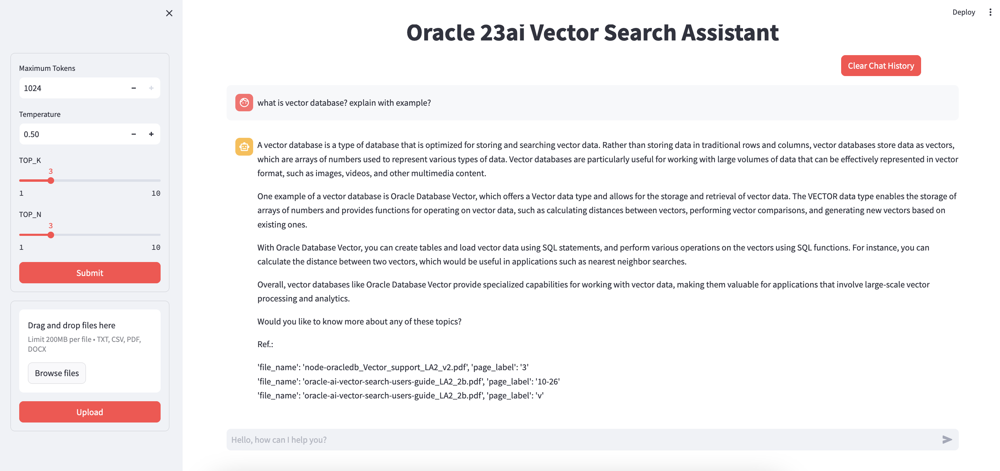

# Integrate Oracle 23ai Vector DB with OCI GenAI using Llama-index

[](https://www.python.org/downloads/release/python-3110/)

## Introduction

Accessing the right answers from vast data repositories is a challenge many organizations face. A **Retrieval-Augmented Generation (RAG)** based system can revolutionize how users interact with their data by making information easily accessible and up-to-date. In this workshop, we’ll build a RAG-based chatbot using **Oracle Database 23ai** and **OCI Generative AI** services, allowing users to chat with their unstructured data like PDF, CSV, and TXT files. This approach combines advanced retrieval techniques with generative AI, creating a powerful solution for intelligent and dynamic data interaction.


## What is RAG?

**Retrieval-Augmented Generation (RAG)** combines retrieval-based methods with generative AI to provide more accurate and contextually relevant responses by accessing and utilizing large datasets dynamically. [Learn more about RAG](https://www.oracle.com/artificial-intelligence/generative-ai/retrieval-augmented-generation-rag/).

## Prerequisites and Setup

Before you begin, ensure you have the following:

- **Oracle Cloud Account**  
  [Sign up here](https://www.oracle.com/cloud/free/)
  
- **Oracle Database 23AI**  
  [Learn more](https://www.oracle.com/database/23ai/)
  
- **Compute VM**  
  This will serve as your web app. Ensure the Compute VM can communicate with the Oracle Database by setting up the appropriate network configurations.
  
- **OCI Generative AI Services**  
  [Documentation](https://docs.oracle.com/en-us/iaas/Content/GenerativeAI/home.htm)
  
- **LlamaIndex**  
  [Documentation](https://pypi.org/project/llama-index/)
  
- **Python Dependencies**  
  Listed in the `requirements.txt` file in the repository.

## Setup

### 1. Clone the Repository in your web server (Compute VM)

```bash
sudo dnf install git

git clone https://github.com/SaurabhSalunkhe/Oracle-23ai-RAG-Chatbot.git
```

### 2. Update and Install Dependencies (Oracle Linux)
```
sudo yum update -y && sudo yum install -y git python3 && sudo yum groupinstall -y "Development Tools" && sudo yum install -y bzip2-devel openssl-devel libffi-devel zlib-devel wget libffi-devel openssl openssl-devel tk-devel xz-devel zlib-devel bzip2-devel readline-devel libuuid-devel ncurses-devel libaio

```

### 3. Install Python 3.11.x
Ensure Python version 3.11.x is installed.

```
mkdir -p $HOME/python
wget https://www.python.org/ftp/python/3.11.0/Python-3.11.0.tgz
tar -xvzf Python-3.11.0.tgz --strip-components=1 -C /home/$USER/python
cd $HOME/python
./configure --prefix=$HOME/python
./configure --enable-optimizations
make clean; make
make altinstall

export PYTHONHOME=$HOME/python
export PATH=$PYTHONHOME/bin:$PATH
export LD_LIBRARY_PATH=$PYTHONHOME/lib:$LD_LIBRARY_PATH

cd $HOME/python/bin
ln -s python3.11 python3
ln -s pip3.11 pip3

```

### 4. Create and Activate Virtual Environment
```
cd Oracle-23ai-RAG-Chatbot
python3.11 -m venv venv
source venv/bin/activate
```

### 5. Install Python Dependencies

```
pip install -r requirements.txt
```

### 6. Configure OCI Authentication
a. Create the .oci Directory

```
mkdir -p /home/opc/.oci
```

b. Generate OCI API Keys
Follow the OCI SDK Configuration Guide to generate your API keys.
https://docs.oracle.com/en-us/iaas/Content/API/Concepts/sdkconfig.htm 

https://docs.oracle.com/en-us/iaas/Content/API/Concepts/apisigningkey.htm#apisigningkey_topic_How_to_Generate_an_API_Signing_Key_Console 

### 7. Set Up Oracle Database 23ai
a. Run SQL Commands from create_tables.sql
Create the User and Grant Privileges

```
-- Create the user with a specified password
CREATE USER ai_user IDENTIFIED BY "EXamplepassword#_123";

-- Grant DBA privileges for full administrative access
GRANT DBA TO ai_user;

-- Grant specific roles and privileges needed for Oracle AI Vector Search
GRANT DB_DEVELOPER_ROLE TO ai_user;
GRANT CREATE MINING MODEL TO ai_user;
```

As ai_user, Create Tables with Vector Data Types


```
CREATE TABLE BOOKS (
    ID NUMBER NOT NULL,
    NAME VARCHAR2(100) NOT NULL,
    PRIMARY KEY (ID)
);

CREATE TABLE CHUNKS (
    ID VARCHAR2(64) NOT NULL,
    CHUNK CLOB,
    VEC VECTOR(1024, FLOAT64),
    PAGE_NUM VARCHAR2(10),
    BOOK_ID NUMBER,
    PRIMARY KEY (ID),
    CONSTRAINT fk_book
        FOREIGN KEY (BOOK_ID)
        REFERENCES BOOKS (ID)
);
```

8. Configure the Application
a. Edit config.py
Update the following parameters with your details:

```
# DB connections (Below are example credentials. Substitute with your credentials)
DB_USER = "ai_user"
DB_PWD = "EXamplepassword#_123"
DB_HOST_IP = "ip:1521"
DB_SERVICE = "example_PDB1.sub07260203110.vcnss.oraclevcn.com"

# GenAI configurations
COMPARTMENT_OCID = "ocid1.compartment.oc1..xxxxxxxxx"
ENDPOINT = "https://inference.generativeai.us-chicago-1.oci.oraclecloud.com"
COHERE_API_KEY = "xxxxxxxxxxx"  # Optional but recommended
```

### 8. Run the Streamlit Application

```
sudo systemctl stop firewalld
streamlit run app.py
```

### 9. To Run the App in the Background

```
nohup streamlit run app.py &
```

### 10. Access the Chatbot
Open your browser and navigate to http://<Your_VM_IP>:8501.

You should see the chatbot interface as shown below:



## Contributing
<!-- If your project has specific contribution requirements, update the
    CONTRIBUTING.md file to ensure those requirements are clearly explained. -->

This project welcomes contributions from the community. Before submitting a pull
request, please [review our contribution guide](./CONTRIBUTING.md).

## Security

Please consult the [security guide](./SECURITY.md) for our responsible security
vulnerability disclosure process.

## License
Copyright (c) 2024 Oracle and/or its affiliates.

Licensed under the Universal Permissive License (UPL), Version 1.0.

See [LICENSE](LICENSE.txt) for more details.

ORACLE AND ITS AFFILIATES DO NOT PROVIDE ANY WARRANTY WHATSOEVER, EXPRESS OR IMPLIED, FOR ANY SOFTWARE, MATERIAL OR CONTENT OF ANY KIND CONTAINED OR PRODUCED WITHIN THIS REPOSITORY, AND IN PARTICULAR SPECIFICALLY DISCLAIM ANY AND ALL IMPLIED WARRANTIES OF TITLE, NON-INFRINGEMENT, MERCHANTABILITY, AND FITNESS FOR A PARTICULAR PURPOSE.  FURTHERMORE, ORACLE AND ITS AFFILIATES DO NOT REPRESENT THAT ANY CUSTOMARY SECURITY REVIEW HAS BEEN PERFORMED WITH RESPECT TO ANY SOFTWARE, MATERIAL OR CONTENT CONTAINED OR PRODUCED WITHIN THIS REPOSITORY. IN ADDITION, AND WITHOUT LIMITING THE FOREGOING, THIRD PARTIES MAY HAVE POSTED SOFTWARE, MATERIAL OR CONTENT TO THIS REPOSITORY WITHOUT ANY REVIEW. USE AT YOUR OWN RISK. 
