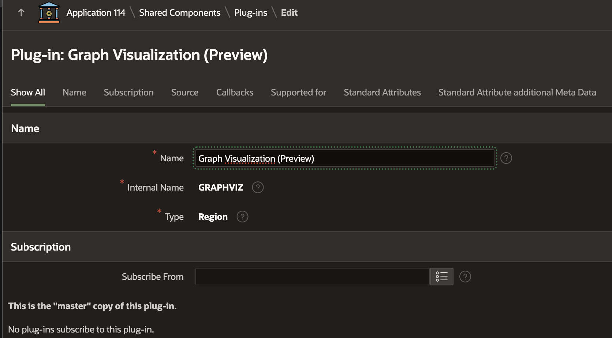
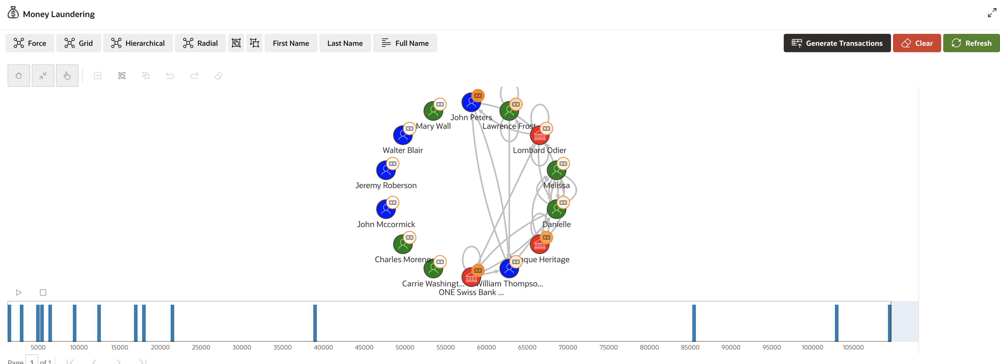
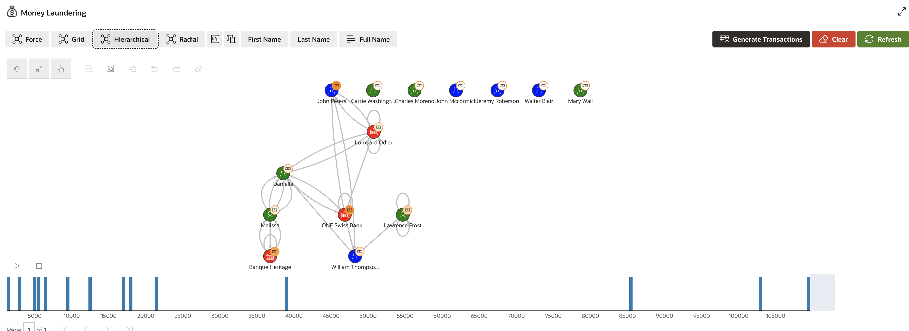
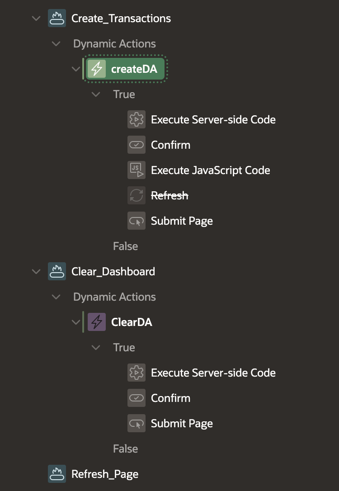
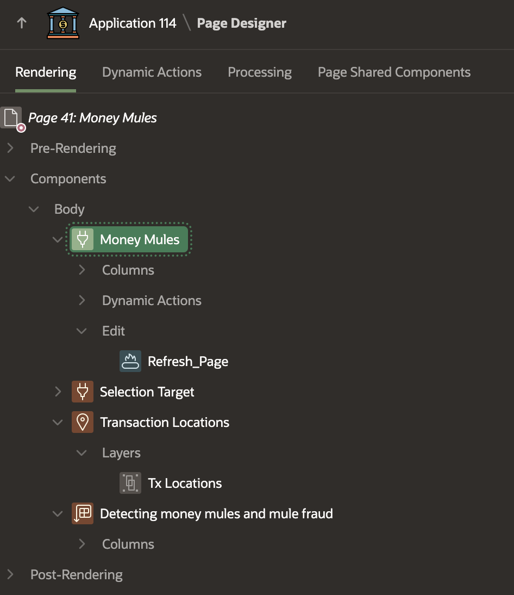
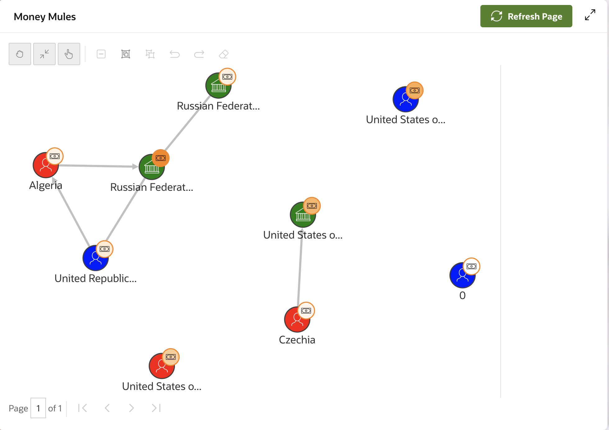
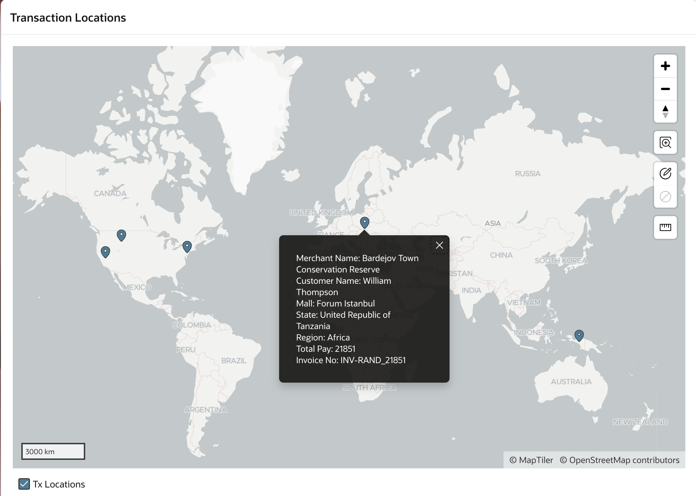
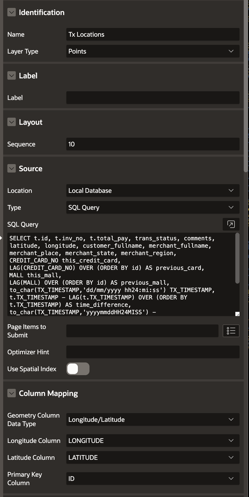
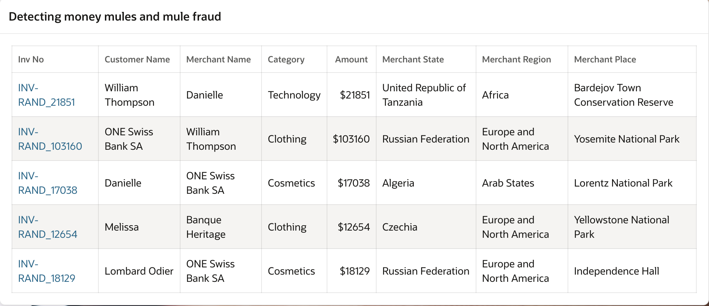

# Anti-Money Laundering and Money Mule Detection

## About this workshop

Welcome to this workshop on detecting money laundering and money mule activities! In this hands-on session, you'll learn how to design and develop a system to identify and visualize suspicious financial transactions. You'll gain practical experience in creating database tables, generating synthetic transactions, and using graph analytics to detect complex money laundering patterns.

Estimated Time: 60 minutes

---

### Objectives
 
By the end of this workshop, participants will be able to:

- Design and create database tables for money laundering and money mule detection.
- Develop business logic to generate synthetic money laundering transactions.
- Utilize graph plugins to visualize complex financial transactions.
- Create circular payment graphs to identify suspicious transaction patterns.
- Generate random money laundering transactions for testing and analysis.
- Develop graphs to detect money mule activities.
- Create transaction location maps to visualize money mule activity.

These objectives clearly outline what participants can expect to learn and achieve by the end of the workshop.

---

### Prerequisites

* A user with access to provision & manage core OCI services  
* Having completed common labs

--- 
 
### Introduction to this Lab

[Demo video on AI for Financial Services](youtube:o7hNanMVlnY:large) 

---
 
## Task 1: Database Design for Money Laundering and Money Mule Detection

1. Create database tables to support money laundering and money mule detection analytics.

2. Create **BANK\_TRANSFERS** Table

    ```sql 
        <copy>
        CREATE TABLE "BANK_TRANSFERS" 
        (	
          "TXN_ID" NUMBER, 
          "SRC_ACCT_ID" NUMBER, 
          "DST_ACCT_ID" NUMBER, 
          "DESCRIPTION" VARCHAR2(400), 
          "AMOUNT" NUMBER, 
          "PROFILE" VARCHAR2(20), 
          "INV_NO" VARCHAR2(50), 
          "MERCHANT_REGION" VARCHAR2(100), 
          "MERCHANT_STATE" VARCHAR2(100), 
          "MERCHANT_PLACE" VARCHAR2(100), 
          PRIMARY KEY ("TXN_ID")
          USING INDEX  ENABLE
        ) ;

        ALTER TABLE "BANK_TRANSFERS" ADD FOREIGN KEY ("SRC_ACCT_ID")
          REFERENCES "BANK_ACCOUNTS" ("ID") ENABLE;
        ALTER TABLE "BANK_TRANSFERS" ADD FOREIGN KEY ("DST_ACCT_ID")
          REFERENCES "BANK_ACCOUNTS" ("ID") ENABLE;
        </copy>
    ``` 

3. Create **FINBANK\_ACCOUNTS** Table

    ```sql 
        <copy>
        CREATE TABLE "FINBANK_ACCOUNTS" 
        (	
          "ID" NUMBER GENERATED BY DEFAULT ON NULL AS IDENTITY MINVALUE 1 MAXVALUE 999999999 
            INCREMENT BY 1 START WITH 1 CACHE 20 NOORDER  NOCYCLE  NOKEEP  NOSCALE  NOT NULL ENABLE,  
          "ACC_ID" NUMBER, 
          "FIRST_NAME" VARCHAR2(100), 
          "LAST_NAME" VARCHAR2(100), 
          "PHONE_NUMBER" VARCHAR2(50), 
          "ACC_DATE" DATE, 
          "JOB_ID" VARCHAR2(50), 
          "MANAGER_ID" NUMBER, 
          "DEPARTMENT_ID" NUMBER, 
          "IS_FRAUD" VARCHAR2(50), 
          "PROFILE" VARCHAR2(20), 
          "FULL_NAME" VARCHAR2(60), 
          "GENDER" VARCHAR2(20), 
          "AGE" NUMBER, 
          PRIMARY KEY ("ID")
          USING INDEX  ENABLE
        ) ;
        </copy>
    ``` 

4. Create **FD\_JOBS** Table

    ```sql 
        <copy>
        CREATE TABLE "FD_JOBS" 
        (	
          "JOB_ID" VARCHAR2(10), 
          "JOB_TITLE" VARCHAR2(35) CONSTRAINT "FD_JOB_TITLE_NN" NOT NULL ENABLE, 
          "MIN_SALARY" NUMBER(6,0), 
          "MAX_SALARY" NUMBER(6,0), 
          CONSTRAINT "FD_JOBS_ID_PK" PRIMARY KEY ("JOB_ID")
          USING INDEX  ENABLE
        ) ;
        </copy>
    ``` 

5. Insert records into **FD\_JOBS** Table

    ```sql 
        <copy>
        INSERT INTO FD_JOBS (JOB_ID,JOB_TITLE,MIN_SALARY,MAX_SALARY) VALUES ('AD_PRES','President',20000,40000); 
        INSERT INTO FD_JOBS (JOB_ID,JOB_TITLE,MIN_SALARY,MAX_SALARY) VALUES ('AD_ASST','Administration Assistant',3000,6000);
        INSERT INTO FD_JOBS (JOB_ID,JOB_TITLE,MIN_SALARY,MAX_SALARY) VALUES ('FI_MGR','Finance Manager',8200,16000);
        INSERT INTO FD_JOBS (JOB_ID,JOB_TITLE,MIN_SALARY,MAX_SALARY) VALUES ('FI_ACCOUNT','Accountant',4200,9000);
        INSERT INTO FD_JOBS (JOB_ID,JOB_TITLE,MIN_SALARY,MAX_SALARY) VALUES ('AC_MGR','Accounting Manager',8200,16000);
        INSERT INTO FD_JOBS (JOB_ID,JOB_TITLE,MIN_SALARY,MAX_SALARY) VALUES ('AC_ACCOUNT','Public Accountant',4200,9000);
        INSERT INTO FD_JOBS (JOB_ID,JOB_TITLE,MIN_SALARY,MAX_SALARY) VALUES ('SA_MAN','Sales Manager',10000,20000);
        INSERT INTO FD_JOBS (JOB_ID,JOB_TITLE,MIN_SALARY,MAX_SALARY) VALUES ('SA_REP','Sales Representative',6000,12000);
        INSERT INTO FD_JOBS (JOB_ID,JOB_TITLE,MIN_SALARY,MAX_SALARY) VALUES ('PU_MAN','Purchasing Manager',8000,15000);
        INSERT INTO FD_JOBS (JOB_ID,JOB_TITLE,MIN_SALARY,MAX_SALARY) VALUES ('PU_CLERK','Purchasing Clerk',2500,5500);
        INSERT INTO FD_JOBS (JOB_ID,JOB_TITLE,MIN_SALARY,MAX_SALARY) VALUES ('ST_MAN','Stock Manager',5500,8500);
        INSERT INTO FD_JOBS (JOB_ID,JOB_TITLE,MIN_SALARY,MAX_SALARY) VALUES ('ST_CLERK','Stock Clerk',2000,5000);
        INSERT INTO FD_JOBS (JOB_ID,JOB_TITLE,MIN_SALARY,MAX_SALARY) VALUES ('SH_CLERK','Shipping Clerk',2500,5500);
        INSERT INTO FD_JOBS (JOB_ID,JOB_TITLE,MIN_SALARY,MAX_SALARY) VALUES ('IT_PROG','Programmer',4000,10000);
        INSERT INTO FD_JOBS (JOB_ID,JOB_TITLE,MIN_SALARY,MAX_SALARY) VALUES ('MK_MAN','Marketing Manager',9000,15000);
        INSERT INTO FD_JOBS (JOB_ID,JOB_TITLE,MIN_SALARY,MAX_SALARY) VALUES ('MK_REP','Marketing Representative',4000,9000);
        INSERT INTO FD_JOBS (JOB_ID,JOB_TITLE,MIN_SALARY,MAX_SALARY) VALUES ('HR_REP','HR Representative',4000,9000);
        INSERT INTO FD_JOBS (JOB_ID,JOB_TITLE,MIN_SALARY,MAX_SALARY) VALUES ('PR_REP','PR Representative',4500,10500);
        </copy>
    ``` 

6. Create **CC_FD** Table, This will hold credit card details related to customer (customer id)

    ```sql 
      <copy>
        CREATE TABLE "CC_FD" 
        (	
          "ID" NUMBER GENERATED BY DEFAULT ON NULL AS IDENTITY MINVALUE 1 MAXVALUE 9999999999 
              INCREMENT BY 1 START WITH 1 CACHE 20 NOORDER  NOCYCLE  NOKEEP  NOSCALE  NOT NULL ENABLE, 
          "CUST_ID" NUMBER, 
          "CC_NO" NUMBER, 
          "STATUS" VARCHAR2(50), 
          "VALIDITY" DATE, 
          "FIRST_NAME" VARCHAR2(50), 
          "LAST_NAME" VARCHAR2(50), 
          "BANK_NAME" VARCHAR2(50), 
          "COMMENTS" VARCHAR2(100), 
          "CARD_TYPE" VARCHAR2(10), 
          PRIMARY KEY ("ID") USING INDEX  ENABLE
        ) ;
      </copy>
    ```  

7. Please Note: UNESCO Heritage sites dataset is not provided in this lab, you can [search and download](https://www.google.com/search?q=UNESCO+Heritage+sites+dataset) it from internet or generate your own. the DDL provided here for your reference.

    ```sql 
      <copy>
        CREATE TABLE "UNESCO_SITES" 
        (	
          "ID" NUMBER GENERATED BY DEFAULT ON NULL AS IDENTITY MINVALUE 1 MAXVALUE 9999999999 
          INCREMENT BY 1 START WITH 1 CACHE 20 NOORDER  NOCYCLE  NOKEEP  NOSCALE  NOT NULL ENABLE, 
          "CATEGORY" VARCHAR2(50), 
          "STATES_NAME_EN" VARCHAR2(255), 
          "REGION_EN" VARCHAR2(255),  
          "NAME_EN" VARCHAR2(255), 
          "SHORT_DESCRIPTION_EN" VARCHAR2(32767),  
          "LONGITUDE" NUMBER, 
          "LATITUDE" NUMBER, 
          "CATEGORY_SHORT" VARCHAR2(1), 
          "GEOMETRY" VARCHAR2(32767), 
          "TOP_10" VARCHAR2(50),  
          PRIMARY KEY ("ID")
          USING INDEX  ENABLE
        ) ; 
      </copy>
    ```  
   
## Task 2: Synthetic Transaction Generation - Business Logic to Generate Money Laundering Transactions

1. Develop business logic to generate simulated money laundering transactions for testing and analysis.

2. Write Business Logic to Generate Money Laundering Transactions

    ```sql 
        <copy>
        create or replace PROCEDURE FD_TX_INSERTS_ML  
        (v_MERCHANT_REGION IN RETAIL_SHOPPING_FD.MERCHANT_REGION%TYPE, v_MERCHANT_STATE IN RETAIL_SHOPPING_FD.MERCHANT_STATE%TYPE)
        AS  
            v_INV_NO RETAIL_SHOPPING_FD.INV_NO%TYPE;
            v_CATEGORY RETAIL_SHOPPING_FD.CATEGORY%TYPE;
            v_TOTAL_PAY RETAIL_SHOPPING_FD.TOTAL_PAY%TYPE; 
            v_CUST_ID RETAIL_SHOPPING_FD.CUST_ID%TYPE;
            v_MERCHANT_ID RETAIL_SHOPPING_FD.MERCHANT_ID%TYPE;
            v_CUSTOMER_FULLNAME RETAIL_SHOPPING_FD.CUSTOMER_FULLNAME%TYPE; 
            v_MERCHANT_FULLNAME RETAIL_SHOPPING_FD.MERCHANT_FULLNAME%TYPE;  
            v_MERCHANT_PLACE_ID   RETAIL_SHOPPING_FD.MERCHANT_PLACE_ID%TYPE; 
            v_MERCHANT_PLACE   RETAIL_SHOPPING_FD.MERCHANT_PLACE%TYPE; 
            v_LONGITUDE   RETAIL_SHOPPING_FD.LONGITUDE%TYPE;
            v_LATITUDE   RETAIL_SHOPPING_FD.LATITUDE%TYPE;  
            v_MALL  RETAIL_SHOPPING_FD.MALL%TYPE;
            v_CREDIT_CARD_NO   RETAIL_SHOPPING_FD.CREDIT_CARD_NO%TYPE; 
            v_TX_TIMESTAMP   RETAIL_SHOPPING_FD.TX_TIMESTAMP%TYPE; 
            v_rand_no number; 
            v2_MERCHANT_REGION   RETAIL_SHOPPING_FD.MERCHANT_REGION%TYPE;
            v2_MERCHANT_STATE   RETAIL_SHOPPING_FD.MERCHANT_STATE%TYPE;  

        BEGIN
           
            ------ 'BEGIN GENERATING RANDOMS Money Laundering ------------------------------- 
            v_TOTAL_PAY := round(DBMS_Random.Value(10000,110000),0); 
            v_INV_NO := 'INV-RAND_'||v_TOTAL_PAY;  
            v_CUST_ID := round(DBMS_Random.Value(1,10),0);
            v_MERCHANT_ID := round(DBMS_Random.Value(1,10),0);
            v_rand_no := round(DBMS_Random.Value(1,59),0);  
            v_TX_TIMESTAMP := current_timestamp + numToDSInterval( v_rand_no, 'second' ); 

            SELECT distinct FIRST_NAME||' '||LAST_NAME into v_CUSTOMER_FULLNAME from FINBANK_ACCOUNTS 
            where id = v_CUST_ID; 

            SELECT distinct FIRST_NAME||' '||LAST_NAME into v_MERCHANT_FULLNAME from FINBANK_ACCOUNTS 
            where id = v_MERCHANT_ID; 

            SELECT category into v_CATEGORY FROM 
              ( select distinct category  from RETAIL_SHOPPING  ORDER BY DBMS_RANDOM.RANDOM) 
            WHERE  rownum < 2; 
        
            IF v_MERCHANT_REGION = 'Europe and North America' then     
                SELECT  ID, NAME_EN, LONGITUDE, LATITUDE into v_MERCHANT_PLACE_ID,  v_MERCHANT_PLACE, v_LONGITUDE, v_LATITUDE
                from 
                  (select ID, NAME_EN, LONGITUDE, LATITUDE  from UNESCO_SITES 
                  where REGION_EN = 'Europe and North America' AND STATES_NAME_EN = 'United States of America' 
                  ORDER BY DBMS_RANDOM.RANDOM) 
                WHERE  rownum < 2; 
            ELSE  
                SELECT  ID, NAME_EN, LONGITUDE, LATITUDE  into v_MERCHANT_PLACE_ID,  v_MERCHANT_PLACE, v_LONGITUDE, v_LATITUDE  
                from 
                  (select ID, NAME_EN, LONGITUDE, LATITUDE, REGION_EN, STATES_NAME_EN  from UNESCO_SITES  ORDER BY DBMS_RANDOM.RANDOM) 
                WHERE  rownum < 2;  
            END IF;
        
            SELECT  mall into v_MALL from 
                (select distinct mall from RETAIL_SHOPPING where mall is not null ORDER BY DBMS_RANDOM.RANDOM) 
            WHERE  rownum < 2;

            SELECT  CC_NO into v_CREDIT_CARD_NO from 
              (select CC_NO from CC_FD  where STATUS = 'Active' ORDER BY DBMS_RANDOM.RANDOM)  
            WHERE  rownum < 2;
         
            -------- 'BEGIN INSERT into RETAIL_SHOPPING_FD Table         -------------------------------   
            INSERT INTO RETAIL_SHOPPING_FD 
              (
                INV_NO ,CATEGORY , TOTAL_PAY, MALL, CUST_ID , CREDIT_CARD_NO, 
                TX_TIMESTAMP,  MERCHANT_ID,  MERCHANT_REGION,  MERCHANT_STATE,  MERCHANT_PLACE, 
                LONGITUDE,  LATITUDE,  MERCHANT_PLACE_ID,  CUSTOMER_FULLNAME,  MERCHANT_FULLNAME,
                TX_TYPE
              ) 
              VALUES
              (
                v_INV_NO  , v_CATEGORY, v_TOTAL_PAY, v_MALL,  v_CUST_ID , v_CREDIT_CARD_NO, 
                v_TX_TIMESTAMP,  v_MERCHANT_ID,  v_MERCHANT_REGION,  v_MERCHANT_STATE,  v_MERCHANT_PLACE, 
                v_LONGITUDE,  v_LATITUDE,  v_MERCHANT_PLACE_ID,  v_CUSTOMER_FULLNAME,  v_MERCHANT_FULLNAME,
                'ML'
              ); 

            -------- 'BEGIN INSERT into BANK_TRANSFERS Table         ---------------------     
            -------- ML indicates these records are for Money Laundering and Money Mule related usecases
            INSERT INTO BANK_TRANSFERS 
              (TXN_ID, SRC_ACCT_ID, DST_ACCT_ID, AMOUNT, DESCRIPTION, 
              INV_NO, MERCHANT_REGION,  MERCHANT_STATE,  MERCHANT_PLACE ) 
            VALUES 
              (EMP_SEQ.NEXTVAL , v_CUST_ID, v_MERCHANT_ID, v_TOTAL_PAY, 'ML', 
              v_INV_NO ,  v_MERCHANT_REGION,  v_MERCHANT_STATE,  v_MERCHANT_PLACE  );
              
        END;
        /
        </copy>
    ```  

## Task 3: Graph Plugin Configuration

1.  Install and enable a graph plugin to facilitate visualization of complex financial transactions.
2.  Please read [Graph Installation Guide](https://docs.oracle.com/en/database/oracle/property-graph/25.1/spgdg/getting-started-apex-graph-visualization-plug.html)
    
    

3. Download, Install and Run [Graph Visualization App](https://github.com/oracle/apex/tree/24.2/plugins/region/graph-visualization), please follow readme document for installation help.

    
  
## Task 4: Circular Payment Graph Creation 
 
1.  Design a circular payment graph to identify suspicious transaction patterns.
    
    ```sql 
        <copy>
        WITH query AS (
          -- source and target constitutes the edge direction and thus 
          select  SRC_ACCT_ID as source ,  DST_ACCT_ID as target from BANK_TRANSFERS where DESCRIPTION = 'ML'  
        ),
        page AS (
            -- pagination
            SELECT * FROM query ORDER BY source, 
            target OFFSET :page_start ROWS FETCH NEXT :page_size ROWS ONLY 
        ),
        vertices AS (
          -- fetch customer details and construct JSON
          SELECT
              JSON_OBJECT(
                  --'id' VALUE FINBANK_ACCOUNTS.ID,
                  'id' VALUE FINBANK_ACCOUNTS.ID,
                  'properties' VALUE JSON_OBJECT(
                      'FirstName' VALUE FINBANK_ACCOUNTS.FIRST_NAME,
                      'LastName' VALUE FINBANK_ACCOUNTS.LAST_NAME, 
                      'Department' VALUE FINBANK_ACCOUNTS.DEPARTMENT_ID,
                      'Date' VALUE FINBANK_ACCOUNTS.ACC_DATE,
                      'TID' VALUE FINBANK_ACCOUNTS.JOB_ID,
                      'Title' VALUE jobs.JOB_TITLE,
                      'Amount' VALUE bank_transfers.Amount 
                  )
              ) AS vertex
          FROM 
              FINBANK_ACCOUNTS finbank_accounts 
              LEFT OUTER JOIN FD_JOBS jobs ON finbank_accounts.JOB_ID = jobs.JOB_ID
              LEFT OUTER JOIN BANK_TRANSFERS bank_transfers ON finbank_accounts.ID = bank_transfers.SRC_ACCT_ID   
          WHERE 
              bank_transfers.SRC_ACCT_ID in ( SELECT source from page ) or 
              bank_transfers.DST_ACCT_ID in ( SELECT target from page ) 
        ),
        edges AS (  SELECT JSON_OBJECT('source' VALUE source, 'target' VALUE target) AS edge FROM page )
        SELECT 
            JSON_OBJECT(
                'vertices' VALUE ( SELECT JSON_ARRAYAGG(vertex returning clob) FROM vertices
                ),
                'edges' VALUE ( SELECT JSON_ARRAYAGG(edge returning clob) FROM edges
                ),
                'numResults' VALUE ( SELECT COUNT(*) FROM query
                ) returning clob
            ) json
        FROM
            SYS.DUAL  
        </copy>
    ```  

     

    

## Task 5: Random Transaction Generation for Money Laundering Detection

1. Generate random money laundering transactions to test and refine detection models.

    ```sql 
        <copy>
        DECLARE    
        v_records number := 25; -- Number of Random transactions (This can also be taken from Page Items)
        v_MERCHANT_REGION RETAIL_SHOPPING_FD.MERCHANT_REGION%TYPE := 'Europe and North America';
        v_MERCHANT_STATE RETAIL_SHOPPING_FD.MERCHANT_STATE%TYPE := 'United States of America'; 
        v2_MERCHANT_REGION   RETAIL_SHOPPING_FD.MERCHANT_REGION%TYPE;
        v2_MERCHANT_STATE   RETAIL_SHOPPING_FD.MERCHANT_STATE%TYPE;  

        BEGIN  
          if v_records > 0 then 
            ------- clean data before insert --------
            delete from BANK_TRANSFERS WHERE DESCRIPTION = 'ML'; 
            delete from RETAIL_SHOPPING_FD WHERE TX_TYPE = 'ML';

            ------  Insert (25) Money Laundering records in US region only --------------
            FOR a in 1 .. v_records LOOP  
              FD_TX_INSERTS_ML (v_MERCHANT_REGION,  v_MERCHANT_STATE);
            END LOOP; 

            ------  Insert (5) Money Laundering records in any region  --------------
            FOR a in 1 .. 5 LOOP   
              SELECT REGION_EN, STATES_NAME_EN into v2_MERCHANT_REGION, v2_MERCHANT_STATE
                from 
                (select ID, NAME_EN, LONGITUDE, LATITUDE,  REGION_EN, STATES_NAME_EN  from UNESCO_SITES   
                ORDER BY DBMS_RANDOM.RANDOM) WHERE  rownum < 2; 

              FD_TX_INSERTS_ML (v2_MERCHANT_REGION,  v2_MERCHANT_STATE);
            END LOOP;

          end if;
        end;
        </copy>
    ``` 

  

## Task 6: Money Mule Graph Development 

1. Create a graph to detect and visualize money mule activities.

  

2. PL/SQL to generate and visualize money mules in Graphs

    ```sql 
        <copy>
         WITH query as ( 
            select 
            SRC_ACCT_ID as source , 
            DST_ACCT_ID as target  
            from bank_transfers where DESCRIPTION = 'ML'
            AND MERCHANT_STATE != 'United States of America'
        ),
        page AS (
            -- pagination
            SELECT
                *
            FROM
                query
            ORDER BY
                source,
                target OFFSET :page_start ROWS FETCH NEXT :page_size ROWS ONLY 
        ),
        vertices AS (
            -- fetch customer details and construct JSON
            SELECT
                JSON_OBJECT(
                    --'id' VALUE employees.EMPLOYEE_ID,
                    'id' VALUE FINBANK_ACCOUNTS.ID,
                    'properties' VALUE JSON_OBJECT(
                        'FirstName' VALUE FINBANK_ACCOUNTS.FIRST_NAME,
                        'LastName' VALUE FINBANK_ACCOUNTS.LAST_NAME, 
                        'Department' VALUE FINBANK_ACCOUNTS.DEPARTMENT_ID,
                        'Date' VALUE FINBANK_ACCOUNTS.ACC_DATE,
                        'JobId' VALUE FINBANK_ACCOUNTS.JOB_ID,
                        'JobTitle' VALUE jobs.JOB_TITLE,
                        'MERCHANT_STATE' VALUE bank_transfers.MERCHANT_STATE,
                        'Amount' VALUE bank_transfers.Amount
                      
                    )
                ) AS vertex
            FROM 
                FINBANK_ACCOUNTS finbank_accounts 
                LEFT OUTER JOIN FD_JOBS jobs ON finbank_accounts.JOB_ID = jobs.JOB_ID
                LEFT OUTER JOIN BANK_TRANSFERS bank_transfers ON finbank_accounts.ID = bank_transfers.SRC_ACCT_ID  
            WHERE 
                bank_transfers.SRC_ACCT_ID in (
                    SELECT
                        source
                    from
                        page
                )
                or bank_transfers.DST_ACCT_ID in (
                    SELECT
                        target
                    from
                        page
                ) 
        ),
        edges AS ( 
            SELECT
                JSON_OBJECT('source' VALUE source, 'target' VALUE target) AS edge
            FROM
                page
        )
        SELECT
            -- construct the final JSON that GVT accepts.
            JSON_OBJECT(
                'vertices' VALUE (
                    SELECT
                        JSON_ARRAYAGG(vertex returning clob)
                    FROM
                        vertices
                ),
                'edges' VALUE (
                    SELECT
                        JSON_ARRAYAGG(edge returning clob)
                    FROM
                        edges
                ),
                'numResults' VALUE (
                    SELECT
                        COUNT(*)
                    FROM
                        query
                ) returning clob
            ) json
        FROM
            SYS.DUAL 
        </copy>
    ``` 

3. Run graph page
   
  

## Task 7: Transaction Location Mapping

1. Develop a transaction location map to visualize money mule activity and identify potential hotspots.

  

2. Create Map from transaction locations using Latitude and Longitude Parameters to plot on Map

    ```sql 
        <copy>
        SELECT t.id, t.inv_no, t.total_pay, trans_status, comments, latitude, longitude, customer_fullname, merchant_fullname, merchant_place, merchant_state, merchant_region,CREDIT_CARD_NO this_credit_card, LAG(CREDIT_CARD_NO) OVER (ORDER BY id) AS previous_card, MALL this_mall, LAG(MALL) OVER (ORDER BY id) AS previous_mall, to_char(TX_TIMESTAMP,'dd/mm/yyyy hh24:mi:ss') TX_TIMESTAMP, t.TX_TIMESTAMP - LAG(t.TX_TIMESTAMP) OVER (ORDER BY t.TX_TIMESTAMP) AS time_difference, to_char(TX_TIMESTAMP,'yyyymmddHH24MISS') - LAG(to_char(TX_TIMESTAMP,'yyyymmddHH24MISS')) OVER (ORDER BY to_char(TX_TIMESTAMP,'yyyymmddHH24MISS')) AS time_diff_number 
        FROM RETAIL_SHOPPING_FD t 
        WHERE merchant_state != 'United States of America' AND TX_TYPE = 'ML'
        order by id  desc
        </copy>
    ``` 
  
  

1. View Grid of transaction locations
   
  
   
## Acknowledgements

* **Author** - Madhusudhan Rao B M, Principal Product Manager, Oracle Database
* **Last Updated By/Date** - April 21st, 2025

## Learn more
 
* [Oracle Digital Assistant Skills](https://docs.oracle.com/en/cloud/paas/digital-assistant/use-chatbot/create-configure-and-version-skills1.html)
