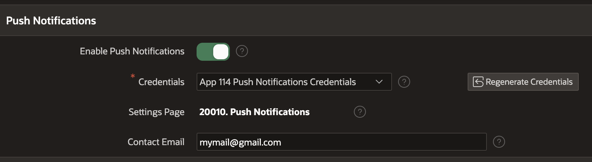
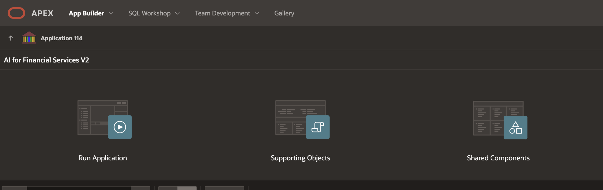
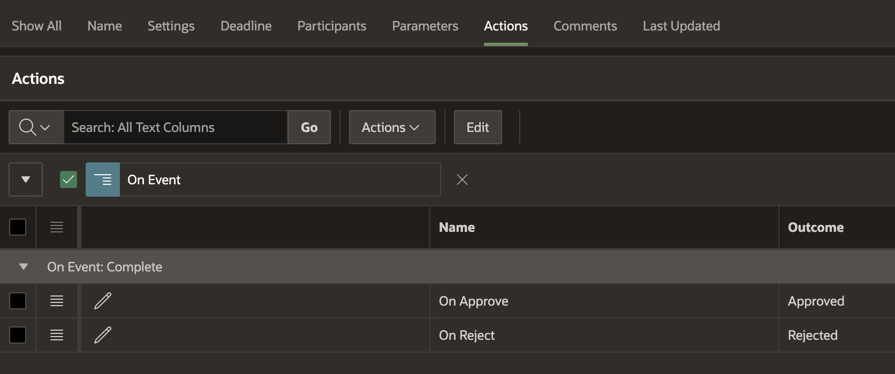
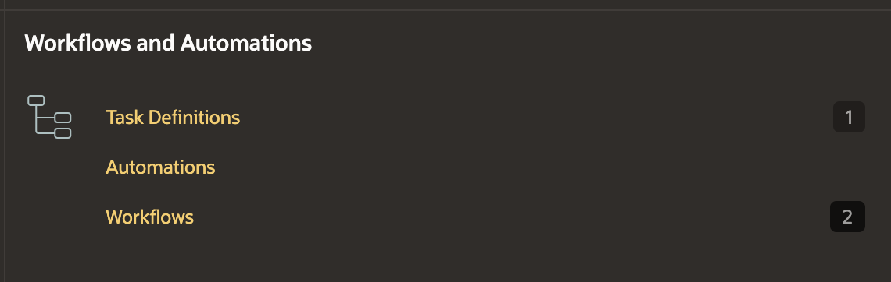
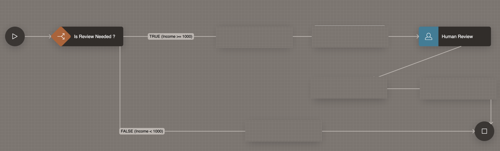
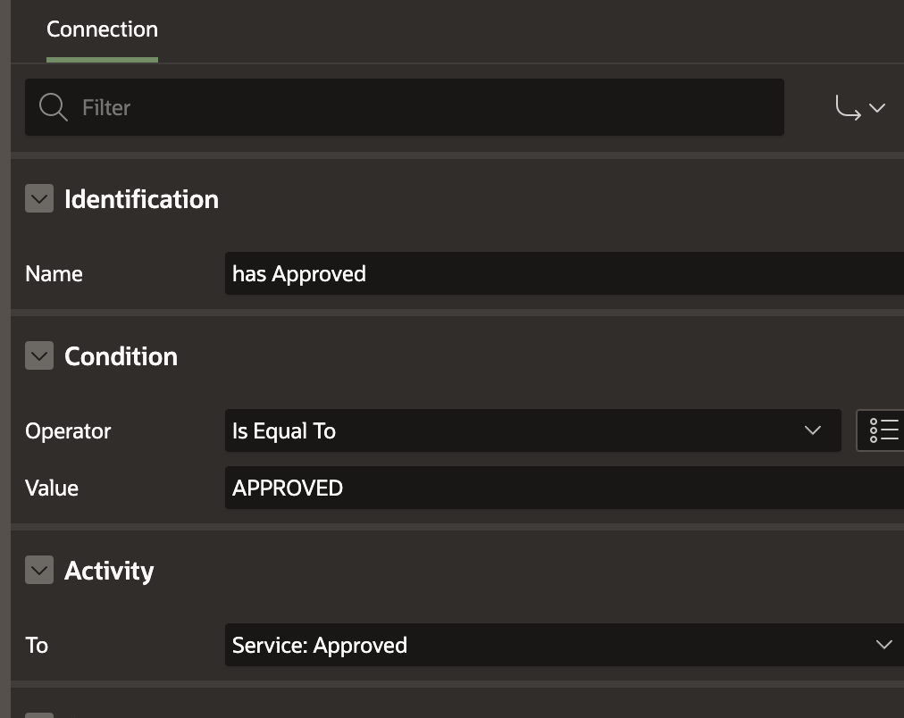
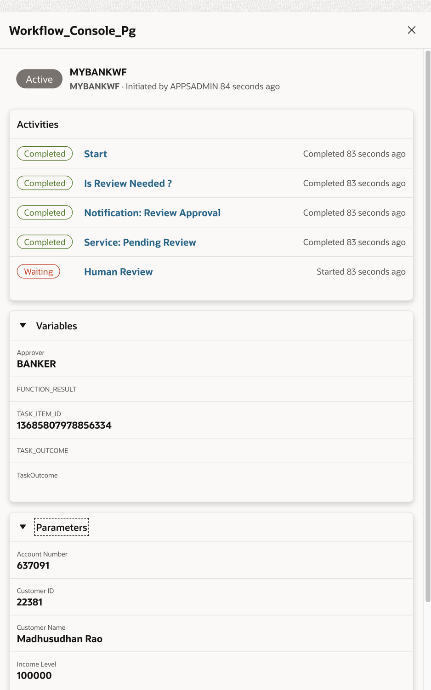

# Application Review Business Processes

## About this workshop

In today's fast-paced digital landscape, automating business processes has become essential for organisations seeking to enhance efficiency, reduce manual errors, and improve customer satisfaction. This article will delve into the automation of a business process, specifically the opening of a new premium bank account.
 
**Use Case: Opening a Premium Bank Account**

The process of opening a premium bank account involves a series of steps, which can be automated to streamline the experience for both the applicant and the bank. The use case is as follows:

- **Application Submission**: An individual interested in opening a premium bank account submits basic information, including:
-  Name and address, Work details or Profession, Education, Income details
- **Unique identifications**: (e.g., photo, driving license, AADHAR, and PAN number in India) 
- **Document Upload**: The applicant uploads supporting documents, such as a copy of their unique ID.
- **Application Review**: The business process checks the uploaded content for validity. If the information is incomplete or inaccurate, or if the income is below the required threshold, the application is rejected.
- **Application Status Update**: If the information is valid, the application status is updated from "Pending" to "Waiting for Approval."
- **Approval Process**: Bank officials review the application and approve or reject it based on the submitted profile and any existing data on the applicant.
- **Account Opening and Notification**: Upon successful completion of the application process, the applicant is notified and becomes a bank customer. They may be required to deposit an initial amount as part of the account opening process and will be provided with a debit or credit card in accordance with the bank's policies.

**Benefits of Automation**

Automating the business process of opening a premium bank account offers numerous benefits, including:

- **Improved Efficiency**: Automation reduces manual errors and streamlines the application process, resulting in faster processing times.
- **Enhanced Customer Experience**: Applicants can track the status of their application in real-time, reducing uncertainty and improving overall satisfaction.
- **Increased Accuracy**: Automated checks ensure that applications are complete and accurate, reducing the risk of errors and rejections.
- **Reduced Costs**: Automation minimizes the need for manual intervention, resulting in cost savings for the bank.

By automating the business process of opening a premium bank account, organizations can improve efficiency, enhance customer experience, and reduce costs. As technology continues to evolve, it is essential for businesses to leverage automation to stay competitive and meet the changing needs of their customers.
 
**Task Definitions within Business Processes**

- Task definitions can be viewed as integral components of a broader workflow or business process. In the context of customer onboarding for bank account creation, a single business process may encompass multiple task definitions, each with its own set of actions and automation.

**Importance of Task-Level Testing**

- Given the complexity and interdependence of these tasks, it is essential to conduct thorough testing of each task individually before proceeding to end-to-end workflow testing. This approach ensures that each task functions as intended, reducing the likelihood of errors and inefficiencies in the overall process.

**Multi-Level Approval Processes**

- A practical illustration of this concept can be seen in business processes requiring multiple levels of approval. For instance, in the customer onboarding process, a tiered approval system may be implemented, comprising:

Initial Verification: Review of documentation to ensure completeness and accuracy.

- Background Check: A secondary level of verification to assess the applicant's credibility.
Final Approval: The manager reviews recommendations from previous approvers, making an informed decision to approve or reject the application.
 

Estimated Time: 60 minutes

---

### Process Objectives

**Application Review and Approval Process**

- In our use case scenario, the designated application approver receives a notification on their device, prompting them to initiate the review process. Upon accessing the mobile app, the approver verifies the applicant's details and examines any existing customer data available, leveraging the provided information to inform their assessment.

**Task Claiming and Application Review**

- The banker assumes the role of task reviewer or application reviewer, empowered to claim the task based on the inputs provided. In a real-world business context, multiple application reviewers may be involved, ensuring a robust and collaborative evaluation process. Once the task is claimed, the reviewer can approve or reject the application, effectively determining the outcome of the premium bank account opening request.

**Workflow Management**

- Configuring Input Parameters for Application Processing. To facilitate efficient application processing, it is essential to establish the required input parameters. These parameters, integral to the application itself, enable the system to determine whether an application can be automatically rejected or requires review by a bank official.

**Automated Rejection Criteria**

- Specifically, the input parameters can be configured to trigger outright rejection or request updates and resubmission if the applicant fails to provide:

- Mandatory documentation, such as proof of income or employment details
  Accurate and valid unique identification information

- By defining these parameters, financial institutions can streamline the application review process, reduce manual intervention, and provide a more efficient and user-friendly experience for applicants.

---

### Prerequisites

* A user with access to provision & manage core OCI services  
* Having completed common labs

---

### Application Review Business Processes - Demo

[Demo Application Review Business Processes](youtube:iDlTZnCIGh8:large)  
 
## Task 1: Database Tables Creation

1. Initializing Customer Application Data

  To commence the process, we establish two fundamental tables: the Customer Application Table and the Card Information Table. The Customer Application Table serves as a centralized repository for storing comprehensive application data, while the Card Information Table is designed to store newly generated credit or debit card information.

2. Store applications in the **BANK\_CUSTOMERS** table, you can also create a table with different name such as bank application table or just applications table, it is your choice. please feel free to add or remove columns as per your application needs.  

    ```sql 
        <copy>
        CREATE TABLE "BANK_CUSTOMERS" 
        (	
            "ID" NUMBER GENERATED BY DEFAULT ON NULL AS IDENTITY MINVALUE 1 MAXVALUE 999999999999 
            INCREMENT BY 1 START WITH 1 CACHE 20 NOORDER  NOCYCLE  NOKEEP  NOSCALE  NOT NULL ENABLE, 
            "GENDER" VARCHAR2(1), 
            "CUST_YEAR_OF_BIRTH" NUMBER, 
            "MARITAL_STATUS" VARCHAR2(50), 
            "STREET_ADDRESS" VARCHAR2(255), 
            "CUST_POSTAL_CODE" NUMBER, 
            "CITY" VARCHAR2(50), 
            "STATE_PROVINCE" VARCHAR2(50), 
            "COUNTRY_ID" VARCHAR2(50), 
            "PHONE_NUMBER" VARCHAR2(50), 
            "CUST_INCOME_LEVEL" VARCHAR2(500), 
            "CREDIT_LIMIT" NUMBER, 
            "CUST_VALID" VARCHAR2(1), 
            "CUSTOMER_NAME" VARCHAR2(100),  
            "DOB" DATE, 
            "CUSTOMER_ID" VARCHAR2(20), 
            "ACCOUNT_NUMBER" NUMBER, 
            "ACCOUNT_TYPE" VARCHAR2(20),  
            "COUNTRY" VARCHAR2(50),  
            "OCCUPATION_TYPE" VARCHAR2(50), 
            "INCOME_SOURCE" VARCHAR2(500), 
            "EDUCATIONAL_QUALIFICATION" VARCHAR2(100), 
            "CURRENT_BALANCE" NUMBER, 
            "ACCOUNT_STATUS" VARCHAR2(100), 
            "BANK_NAME" VARCHAR2(100),  
            "REQUEST_CARD" VARCHAR2(10), 
            "EMAIL" VARCHAR2(128), 
            PRIMARY KEY ("ID")
            USING INDEX  ENABLE
        ) ;
        </copy>
    ``` 

3. Generate credit cards can be stored in **CC\_FD** table as shown below

    ```sql 
        <copy>
        CREATE TABLE "CC_FD" 
        (	
            "ID" NUMBER GENERATED BY DEFAULT ON NULL AS IDENTITY MINVALUE 1 MAXVALUE 99999999
            INCREMENT BY 1 START WITH 1 CACHE 20 NOORDER  NOCYCLE  NOKEEP  NOSCALE  NOT NULL ENABLE, 
            "CUST_ID" NUMBER, 
            "CC_NO" NUMBER, 
            "STATUS" VARCHAR2(50), 
            "VALIDITY" DATE, 
            "FIRST_NAME" VARCHAR2(50), 
            "LAST_NAME" VARCHAR2(50), 
            "BANK_NAME" VARCHAR2(50), 
            "COMMENTS" VARCHAR2(100), 
            "CARD_TYPE" VARCHAR2(10), 
            PRIMARY KEY ("ID")
            USING INDEX  ENABLE
        ) ;
        </copy>
    ``` 

## Task 2: Mobile App and Push Notification Services
 
1. Progressive Web Apps

  Oracle APEX provides developers with the ability to create Progressive Web Apps (PWAs) that can be easily installed on any desktop or mobile device, offering users a more native app experience. This application serves as a useful reference for developers looking to incorporate key PWA features into their own applications, helping them to create more engaging and user-friendly apps.
 
2. Enable Oracle APEX Push Notifications Service

  In the Application Builder, Select the Application and click on Edit Application Definition

   

  Enable Push Notifications, Generate Credentials

   

3. Enable Push Notifications in Device

  Install the application on Mobile or Desktop Device using Install icon on the application. in the settings enable push notifications.

   

  On iOS or Android devices you would need to enable notifications in settings as well. 

   

  View of push notification in a mobile device

   

  View of push notification in a wearable device (Watch)

   

## Task 3: Create Task Definition

1. Login to Oracle APEX workspace, access your application and click on **Shared Components**

   

2. Click on Task Definitions
   
   

3. Provide Task Name and Static ID
   
   

4. Create Task Definition
     
   

5. Provide Task Settings with a subject line, we can also auto-generate Task Details Page
   
   

6. Provide the required input parameters for this Task

   

7. Add Task Participants 
   
   

8. In this case, we are setting task participants based on a static value, but it can also be based on an SQL query, expression, or PL/SQL function.

  ***In the above screen we have set Process Owner is set as BANKER, its important to know that this is Group of users, to know how to create users and groups, please see "How to create Users and Groups section" of this article***

   

## Task 4: Task Action Configuration

1. The Task Action step is a critical component of the workflow, allowing for the definition of multiple actions that dictate the outcome of the task. Specifically, two key actions can be configured:

   - **On Approval**: Upon approval of the task, the outcome is automatically set to "Approved," triggering the execution of a designated code block.
   - **On Rejection**: Conversely, if the task is rejected, the outcome is updated to "Rejected," initiating the execution of a separate, predefined code block.

   This configurable task action framework enables seamless integration with downstream processes, ensuring a streamlined and automated workflow.
 
   

2. On Approve and On Reject, execute SQL code.
   
   

    ```sql 
        <copy>
        -- On Approval
        update BANK_CUSTOMERS set ACCOUNT_STATUS = 'Approved' WHERE ID = :APEX$TASK_PK;

        -- On Rejection
        update BANK_CUSTOMERS set ACCOUNT_STATUS = 'Rejected' WHERE ID = :APEX$TASK_PK;
        </copy>
    ``` 

  Save the Task. We can test the Task as shown below. 

## Task 5: Testing Tasks with Oracle APEX Page

1. Create Process as shown below

   
 
2. Add Task Details of Type = Human Task - Create, Select the Task Definition we have just created, provide the required parameters from APEX page items, and finally invoke the process through Dynamic Action of a Submit button.

   

3. Code snippet for testing tasks with PL/SQL

    ```sql 
        <copy> 
        l_task_id := apex_approval.create_task(
          p_application_id => 114, -- Replace 114 with your application ID
          p_task_def_static_id => 'NEW_CUSTOMER_ONBOARDING',
          p_subject => 'New Customer Approval for Customer ' || l_bank_customer || ' Account No: ' || l_account_number,
          p_initiator => l_user,
          p_parameters => apex_approval.t_task_parameters(
              1 => apex_approval.t_task_parameter(static_id => 'P_ACCOUNT_NUMBER', string_value => l_account_number),
              2 => apex_approval.t_task_parameter(static_id => 'P_CUSTOMER_NAME', string_value => l_bank_customer)),
          p_detail_pk => o_cust_id);   
        </copy>
    ``` 

4. The complete PL/SQL to Insert into BANK_CUSTOMERS table and Invoke workflow is shown below.

    ```sql 
        <copy> 
        DECLARE  

        l_bank_customer BANK_CUSTOMERS.CUSTOMER_NAME%TYPE := :P58_CUSTOMER_NAME;
        l_dob BANK_CUSTOMERS.DOB%TYPE := :P58_DOB;
        l_account_number BANK_CUSTOMERS.ACCOUNT_NUMBER%TYPE := round(DBMS_Random.Value(1,990000),0);  
        l_gender BANK_CUSTOMERS.GENDER%TYPE := :P58_GENDER;
        l_martial_status BANK_CUSTOMERS.MARITAL_STATUS%TYPE := :P58_MARITAL_STATUS;  
        l_edu_qualif BANK_CUSTOMERS.EDUCATIONAL_QUALIFICATION%TYPE := :P58_EDUCATIONAL_QUALIFICATION;
        l_occ_type BANK_CUSTOMERS.OCCUPATION_TYPE%TYPE := :P58_OCCUPATION_TYPE;
        l_income_level BANK_CUSTOMERS.CUST_INCOME_LEVEL%TYPE := :P58_CUST_INCOME_LEVEL;
        l_street BANK_CUSTOMERS.STREET_ADDRESS%TYPE := :P58_STREET_ADDRESS;
        l_city BANK_CUSTOMERS.CITY%TYPE := :P58_CITY;
        l_state BANK_CUSTOMERS.STATE_PROVINCE%TYPE := :P58_STATE; 
        l_postcode BANK_CUSTOMERS.CUST_POSTAL_CODE%TYPE := :P58_POSTAL_CODE; 
        l_country BANK_CUSTOMERS.COUNTRY%TYPE := :P58_COUNTRY; 
        l_bank BANK_CUSTOMERS.BANK_NAME%TYPE := :P58_BANK_NAME; 
        o_cust_id BANK_CUSTOMERS.ID%TYPE;

        l_task_id number;
        l_workflow_id number;
        l_user varchar2(100) := v('APP_USER');

        BEGIN
            INSERT INTO BANK_CUSTOMERS (CUSTOMER_NAME, DOB, ACCOUNT_TYPE, ACCOUNT_NUMBER, GENDER, MARITAL_STATUS,  
            EDUCATIONAL_QUALIFICATION, OCCUPATION_TYPE, CUST_INCOME_LEVEL, STREET_ADDRESS, CITY, STATE_PROVINCE, CUST_POSTAL_CODE, COUNTRY, CURRENT_BALANCE, BANK_NAME ) 
            VALUES 
            (l_bank_customer, l_dob, 'Savings Bank', l_account_number, l_gender, l_martial_status, l_edu_qualif, l_occ_type, l_income_level, l_street, l_city, l_state, l_postcode, l_country, 10000, l_bank)
            RETURNING ID INTO o_cust_id;  

            COMMIT;

            -- Invoke Task Definition (NEW_CUSTOMER_ONBOARDING)
            l_task_id := apex_approval.create_task(
                p_application_id => 114, -- Replace 114 with your application ID
                p_task_def_static_id => 'NEW_CUSTOMER_ONBOARDING',
                p_subject => 'New Customer Approval for Customer ' || l_bank_customer || ' Account No: ' || l_account_number,
                p_initiator => l_user,
                p_parameters => apex_approval.t_task_parameters(
                    1 => apex_approval.t_task_parameter(static_id => 'P_ACCOUNT_NUMBER', string_value => l_account_number),
                    2 => apex_approval.t_task_parameter(static_id => 'P_CUSTOMER_NAME', string_value => l_bank_customer)),
                p_detail_pk => o_cust_id);  
            :P58_ACCOUNT_NUMBER := l_account_number;
            :P58_CUST_ID := o_cust_id;
        END;
        </copy>
    ``` 
  
## Task 6: Create Oracle APEX Application Form

1. Create Oracle APEX Page, Create form to collect the form data as required to fill in BANK\_CUSTOMERS table, you can alternatively give a different name such as BANK\_CUSTOMER\_APPLICATIONS later move the applications record to customer table after final approval

   

  Save Application Data in a Table

## Task 7: Create Workflow

1. From Shared Components, under Workflows and Task Definitions, Click on Workflow

   

2. Create Initial Workflow would look like this with one path for TRUE and another path for FALSE case and test this to check if we are able to invoke the Workflow.
   
   

3. Provide Required Workflow Input parameters.
   
   

  There can be many pre-screening decisions, in our case we will start with Is Review Needed? where we will use an expression that the applicant has the minimum required income to open this account; those failing this criterion will be automatically rejected. For others, this will be routed to the review process.

4. Create Decision Task (Switch Task)

   

  The corresponding function body is as shown, where : P\_INCOME\_LEVEL is passed as the input parameter

    ```sql 
        <copy> 
        IF :P_INCOME_LEVEL >= 1000 THEN 
          RETURN TRUE; 
        ELSE 
          RETURN FALSE; 
        END IF; 
        </copy>
    ``` 

5. Auto Rejection Flow (Invoke API Activity)

  If Application is Rejected then update application status

   

6. Update Rejection Status is configured as shown 

   

7. Pass the required input parameters as shown below

   

8. For this we would need a Procedure or a Function as shown in the code below

   

    ```sql 
        <copy> 
        --- Specs -----------  
        create or replace PACKAGE "BANK_PKG" as
    
            function update_application_status(
                cust_id in varchar2,
                status              in varchar2 )
                return                  varchar2;

            function update_card_status(
                cc_no in varchar2,
                status in varchar2,
                comments in varchar2  ) return varchar2;

        end;
        / 
        ---- Package Body --------
        --- Accept input as temporary customer id (cust_id) and status = Reject or Approved
        create or replace PACKAGE BODY "BANK_PKG" as 
            c_app_id       constant varchar2(6) := 'APP_ID';


            -- Update application status  
            function update_application_status(
                        cust_id in varchar2,  
                        status in varchar2)
                        return varchar2
            is 
                l_ret varchar2(100) := 'TRUE';  
                l_current_user varchar2(200) := apex_application.g_user; 
                l_email varchar2(128);
            begin         
                -- since the income is less than 1000 by business rules they come under default rejection rule
                UPDATE BANK_CUSTOMERS SET ACCOUNT_STATUS = status WHERE ID = cust_id;

                -- if the application status is approved then change the role from user to bank customer
                -- Bank Customers will be in Role 2
                if status = 'Approved' then
                    SELECT EMAIL INTO l_email FROM BANK_CUSTOMERS WHERE ID = cust_id;
                    UPDATE COMMON_USERS SET ROLE_ID = 2 WHERE EMAIL = l_email;
                end if;
                

                return l_ret; 
            end update_application_status; 


            -- Update card status  
            function update_card_status(
                        cc_no in varchar2,  
                        status in varchar2,
                        comments in varchar2)
                        return varchar2
            is 
                l_ret varchar2(100) := 'TRUE';  
                --l_current_user varchar2(200) := apex_application.g_user; 
            begin         
                -- since the income is less than 1000 by business rules they come under default rejection rule
                UPDATE cc_fd SET status = status, comments = comments WHERE cc_no = cc_no;
                return l_ret; 
            end update_card_status; 
              
        end; 
        </copy>
    ```   

## Task 8: Send Push Notification to Application Reviewer (and/or Email)

1. Add Send Notification and/or Send Email Task, where we will notify the reviewer about this application.
 
   

## Task 9: Update Status to Pending Review (Invoke API)

1. This Step D. is similar to Step B; change the status input parameter value to "Pending Review."
   
   

## Task 10: Add Human Reviewer ( Human Task Create Activity)

1. We want the application to be reviewed by a human reviewer, who can approve or reject the application. This is where we will invoke the customer onboarding task, which was developed in Task 03 (03. Task Management)

   

  Task Activity
  V\_TASK\_OUTCOME, V\_TASK\_ITEM\_ID and APPROVER are user-defined variables

  please do not get confused with input parameters like P\_CUSTOMER\_ID

   

2. Add Human Review Activity and pass the required parameters on to our human reviewer task.

   
   

  This will create a Task for the Human Reviewer, in our case, the Banker responsible for reviewing the customer's application. The output of Approval or Rejection is stored in a variable V\_TASK\_OUTCOME.

## Task 11: Task Notifications and Approval on Mobile Device

1. At this stage, if we check the App on a mobile device, as a Banker, we will get a Task Notification

   

2. Let us click on the Notification Link and check the Tasks in the workflow.
   
   

3. Click on the Application Link and View the task details
   
   

4. Claim the task Approve or Reject based on input available.
   
     

## Task 12: Closing the process with Card Issue and Notifications

1. At this stage, we are at the end of our business process, but we might want to update the application status and issue a debit card to the applicant.

  Service: Approved and Service: Rejected: Basically update the record status fields based on the Outcome of the human task reviewer.

   

2. So, let's add Is Approved? (Switch Activity) after Human Review
  
   

3. If the reviewer has Approved the Task, we will update application status with approved flag (Service: Approved) and Issue a  Card (another service which we will talk about in the next section).

  Create a Connector "Has Approved" based on condition "Is Equal To" = "APPROVED" value

   

4. If the application is rejected, we will move the flow to the Rejection lane below
  Create a Connector "Has Rejected" based on condition "Is Equal To" = "REJECTED" value

   

## Task 13: Issue Card ORDS Service Integration

1. In our use case we wanted to issue a debit card such as master or visa, once the application has been successfully approved, let us also generate a credit card number.

  Click on SQL Workshop > RESTful Services.

  

2. We will need some PL/SQL to randomly generate a card and issue it to our new customer.
   
   

  PL/SQL to generate a random credit card 

    ```sql 
        <copy>
        DECLARE 
          card_number VARCHAR2(100) := ''; 
          card_number_begin number := '1'; 
          i NUMBER := 1; 
          l_status varchar2(10) := 'OnHold';
        BEGIN 
            
            card_number_begin :=  CASE 
                                  WHEN round(dbms_random.value(1,2)) = 1 THEN '4' -- Visa starts with 4
                                  WHEN round(dbms_random.value(1,2)) = 2 THEN '5' -- Mastercard starts with 2 or 5 
                            END;  
            if card_number_begin is null then
                card_number_begin := 2; -- Mastercard starts with 2 or 5
            end if;  
            
          -- Generate remaining digits 
            WHILE i < 16 LOOP  
                card_number :=  card_number ||  round(DBMS_Random.Value(0,9),0);    
                i := i + 1; 
            END LOOP;  
          
          -- Add the check digit 
          card_number := card_number_begin || card_number; 
          
          insert into CC_FD (CUST_ID, FIRST_NAME, CC_NO, STATUS ) values (:cust_id, :customer_name, card_number, l_status );
            
          commit;

        END; 
        </copy>
    ```

3. Now that we have our REST URL, we need to create a REST Data Source

  Under Shared Components, click on REST Data Sources and Create REST Data Source

   

4. Define REST Service URL and Operations (POST is required in our case)
   
   

5. Input Parameters for our REST Service
   
    
    
## Task 14: Invoke ORDS as Service API in our Workflow

1. Drag and Drop the Invoke API task on the workflow canvas, Select Type REST Source and Select our Data Source. 

   

2. This will automatically create a list of required parameters map to process input variables.

   
   
## Task 15: View Completed Workflow 

1. View Completed Workflow 

    

## Task 16: Create Workflow Administrative Console

1. To View Task Details as an Administrator, create Workflow Console page

    

  Select Workflow Console template

   

2. Review the flow as shown below by clicking on task
    
    

  View Task details

   

  View Workflow Diagram

    

## Acknowledgements

* **Author** - Madhusudhan Rao B M, Principal Product Manager, Oracle Database
* **Last Updated By/Date** - April 9th, 2025

## Learn more
 
* [How to Automate Business Process with Oracle APEX Workflows](https://www.linkedin.com/pulse/how-automate-business-process-oracle-apex-workflows-task-rao-9na6f)
