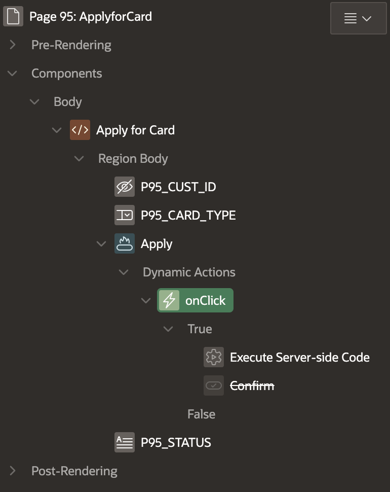
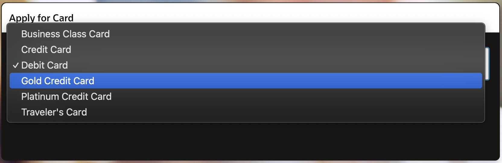
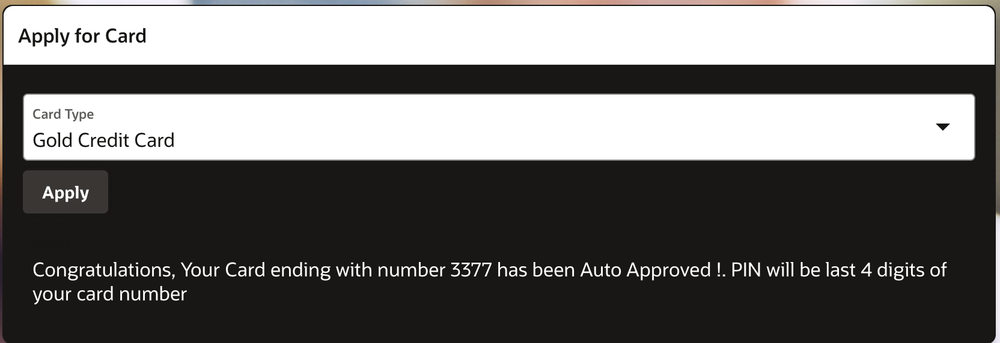

# Credit Card Applications: Applying for a New Credit Card

## About this workshop

Welcome to this workshop on premium bank account and card application! In this session, we'll explore the process of creating a seamless user experience for applying for premium bank accounts and associated card options. You'll learn how to design user interfaces for account applications, retrieve eligible card options, and apply for credit or debit cards.

Estimated Time: 30 minutes

---

### Objectives

Workshop Learning Outcomes: Upon completing this workshop, participants will have the skills and knowledge to:

- Create premium bank account application interfaces.
- Integrate card option retrieval and display functionality.
- Implement card application processes for premium account holders.
  
These objectives clearly outline what participants can expect to learn and achieve by the end of the workshop.

---

### Prerequisites

* Lab 5 & 6, Related to Opening Bank Account should be completed. As we need Bank Account to request for a credit or debit card.
* Having completed common labs
* A user with access to provision & manage core OCI services  
* Basic to Intermediate knowledge of Oracle APEX

---
 
## Task 1: Ensure that the Bank Account is created

1. Please ensure that Bank Account is Created and Approved by Banker, this is covered in **Lab 5 & 6**. As we need Bank Account to request for a credit or debit card.
2. During the Business process card number is already generated and is in onHold status, here in this lab we are just activating, printing and sending card to the customer along with PIN in separate courier.
  
      

## Task 2: Eligible Card Options
 
1.  Develop a user interface to apply for a premium bank account.
2.  Retrieve and display the list of eligible card options for the premium account holder.
 
      

3. The list of cards can be static or it can also be dynamic based on SQL query
   
      
     
## Task 2: Card Application
 
1.  Create a process for applying for a credit or debit card, allowing users to select their preferred card option.
2.  Click on Apply for card button, create **Dynamic Action** onClick of button
 
      

    ```sql 
        <copy>
        declare 
        l_cust_id number := TO_NUMBER(:P95_CUST_ID) ;
        l_card_no number := TO_NUMBER(:P95_CUST_ID) ;
        
        begin 

            update cc_fd set Status = 'Active',  CARD_TYPE = :P95_CARD_TYPE where CUST_ID =  l_cust_id returning CC_NO into l_card_no  ;
            -- PIN can be a random number, in this case we are using last 4 digits of card    
            l_card_no := SUBSTR(l_card_no, -4);
            -- Page Item name and number might vary. 
            :P95_STATUS := 'Congratulations, Your Card ending with number '||l_card_no||' has been Auto Approved !.
             PIN will be last 4 digits of your card number';

        end;
        </copy>
    ``` 
 
## Acknowledgements

* **Author** - Madhusudhan Rao B M, Principal Product Manager, Oracle Database
* **Last Updated By/Date** - April 17th, 2025

## Learn more
 
* [Oracle Digital Assistant Skills](https://docs.oracle.com/en/cloud/paas/digital-assistant/use-chatbot/create-configure-and-version-skills1.html)
