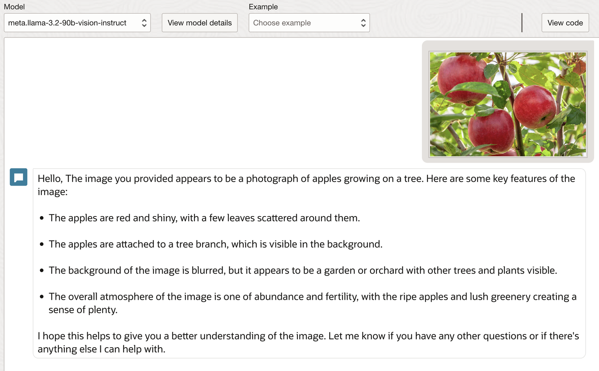

# Cash Withdrawal: Withdrawing Cash from an ATM

## About this workshop

This article explores the capabilities of Meta Llama models on Oracle Cloud and Oracle Database 23ai, demonstrating how to access and utilize these powerful AI tools for various applications. 

The article covers the following topics:

- Accessing and generating text using Meta Llama models, including creating job descriptions, product pitches, and emails. 
- Viewing and developing applications using the model's code.
- Leveraging the Meta Llama vision instruct model to read image contents.
- Integrating Oracle Database with Meta Llama models for enhanced functionality.
- Setting up Oracle APEX OCI web credentials to call Generative AI services.
- Converting text to audio input using OCI Speech (Text To Speech) services.

By following the steps outlined in this article, developers and users can unlock the full potential of Meta Llama models and Oracle Database 23ai on Oracle Cloud, enabling them to build innovative applications and solutions that harness the power of generative AI.

Oracle and Meta have a partnership that allows Meta to use Oracle Cloud Infrastructure (OCI) to train and deploy its Llama large language models (LLMs). Oracle also helps Meta develop AI agents based on Llama models. 

OCI Generative AI now supports the pretrained Meta Llama 3.1 70 billion-parameter and 405 billion-parameter large language models. These models support eight languages, including English, French, Hindi, Italian, Portuguese, Spanish, and Thai and have a context length of 128,000 tokens, which is 16 times more than their previous Meta Llama 3 models.

Llama 3.1 405B is the first openly available model that rivals the top AI models when it comes to state-of-the-art capabilities in general knowledge, steerability, math, tool use, and multilingual translation. With the release of the 405B model, we’re poised to supercharge innovation—with unprecedented opportunities for growth and exploration. We believe the latest generation of Llama will ignite new applications and modeling paradigms, including synthetic data generation to enable the improvement and training of smaller models, as well as model distillation—a capability that has never been achieved at this sc

Estimated Time: 60 minutes

---

### Objectives

Unlocking AI Potential with Meta Llama and Oracle Cloud
In this hands-on workshop, participants explored the integration of Meta Llama models with Oracle Cloud, leveraging cutting-edge AI capabilities to drive innovation. Key activities included:

- Accessing and testing Meta Llama models (3.1-70b-instruct and 3.2-90b-vision-instruct) on Oracle Cloud
- Generating job descriptions and extracting insights from images using Meta Llama's advanced language and vision capabilities
- Developing applications using Meta Llama models and Oracle Database
- Setting up Oracle APEX OCI Web credentials to call Generative AI services
- Converting text input to audio output using OCI Speech AI's Text-to-Speech technology

By the end of the workshop, attendees gained practical experience in harnessing the power of Meta Llama and Oracle Cloud to build intelligent applications and automate workflows.

---

### Prerequisites

* A user with access to provision & manage core OCI services  
* Having completed common labs

--- 
 
### Introduction to this Lab

[Demo video on AI for Financial Services](youtube:ELvtAU-dOMw:large) 

---
 
## Task 1: Access Meta.llama-3.1-70b-instruct on Oracle Cloud

1. Prompt the OCI Generative AI chat models to generate text. You can ask questions in natural language and optionally submit text such as documents, emails, and product reviews to the chat models. Each model reasons over the text and provides intelligent answers. 

2. Login to cloud.oracle.com, choose a region where Oracle Generative AI Services are available, for example Chicago region, and from the top Navigation, 

  Select Analytics & AI > AI Services > Generative AI as shown below 

    

  Click on chat to see all the available models. This list may vary depending upon available models, versions and services available

  
  
## Task 2: Test Meta Llama Model - Generate a Job Description 
 
1.  Select Meta llama 3.1 instruct. From the examples given, select a job description. 
   
  

  Input Prompt

    ```text 
        <copy>
        Generate a job description for an Oracle APEX developer with the following three qualifications only:

        1) At least 5 years of experience in web or mobile application development
        2) Knowledge of Oracle APEX, PL/SQL, Oracle Database, DevOps
        3) Ability to learn, innovate and develop next-generation applications
        </copy>
    ```

  Partial output response

  
    
## Task 3: View Code and Develop Application
 
1.  You can now view the code both in Java and Python, run it in your own environment, or use REST API invocation with PLSQL or any other technologies that you are familiar with

2. You can view auto-generated code under by clicking on the View code button 

  

    ```java 
        <copy>
        import oci

        # Setup basic variables
        # Auth Config
        # TODO: Please update config profile name and use the compartmentId that has policies grant permissions for using Generative AI Service
        compartment_id = "<Your-Compartment-OCID>"
        CONFIG_PROFILE = "DEFAULT"
        config = oci.config.from_file('~/.oci/config', CONFIG_PROFILE)

        # Service endpoint
        endpoint = "https://inference.generativeai.us-chicago-1.oci.oraclecloud.com"

        generative_ai_inference_client = oci.generative_ai_inference.GenerativeAiInferenceClient(config=config, service_endpoint=endpoint, retry_strategy=oci.retry.NoneRetryStrategy(), timeout=(10,240))
        chat_detail = oci.generative_ai_inference.models.ChatDetails()

        content = oci.generative_ai_inference.models.TextContent()
        content.text = "Generate a product pitch for a USB connected compact microphone that can record surround sound"
        message = oci.generative_ai_inference.models.Message()
        message.role = "USER"
        message.content = [content]
        chat_request = oci.generative_ai_inference.models.GenericChatRequest()
        chat_request.api_format = oci.generative_ai_inference.models.BaseChatRequest.API_FORMAT_GENERIC
        chat_request.messages = [message]
        chat_request.max_tokens = 600
        chat_request.temperature = 0.25
        chat_request.frequency_penalty = 1
        chat_request.presence_penalty = 0
        chat_request.top_p = 0.75
        chat_request.top_k = -1

        chat_detail.serving_mode = oci.generative_ai_inference.models.OnDemandServingMode(model_id="ocid1.generativeaimodel.oc1.us-chicago-1.<model-id>")
        chat_detail.chat_request = chat_request
        chat_detail.compartment_id = compartment_id
        chat_response = generative_ai_inference_client.chat(chat_detail)
        # Print result
        print("**************************Chat Result**************************")
        print(vars(chat_response))
        </copy>
    ```
     
## Task 4: Access Meta.llama-3.2-90b-vision-instruct on Oracle Cloud
 
1. For some models, you can submit images and ask questions about the image.
3. Select Meta.llama-3.2-90b-vision-instruct model, let us drag and drop an image of apple in the Gen AI playground. 
  
  
    
## Task 5: Read the contents of an Image
 
1.  Upload Image and also provide input prompt as shown below
    
    ```text 
        <copy>
        Prompt: What is the card number?
        </copy>
    ```  
2. Based on the Image uploaded and prompt, we can get card number printed
   
   

   Now that we know how to get information from an image, we can use this data to query from the Oracle Autonomous Database

## Task 6: How do you set up Oracle APEX OCI Web credentials and call Generative AI services?
 
1.  Please see Lab 2 and Task 7 on How to setup Oracle APEX OCI Web credentials
  
## Task 7: Leveraging Oracle Database with Meta Llama Models
 
1.  Let us take an example of how we can find customer information based on the card number read through the Meta Llama Vision model.
2.  The Response would be card number, Based on the card number card holder name and card status can be pulled from the Database. 
   
    

3. Create a Simple Cards table, to hold card and customer information

    ```sql 
      <copy>
    CREATE TABLE "CC_FD" 
      (	
          "ID" NUMBER GENERATED BY DEFAULT ON NULL AS IDENTITY MINVALUE 1 MAXVALUE 
          9999999 INCREMENT BY 1 START WITH 1 CACHE 20 NOORDER  NOCYCLE  NOKEEP  NOSCALE  NOT NULL ENABLE, 
          "CUST_ID" NUMBER,  -- Customer Id
          "CC_NO" NUMBER, -- Card Number
          "STATUS" VARCHAR2(50), 
          "VALIDITY" DATE, 
          "FIRST_NAME" VARCHAR2(50), 
          "LAST_NAME" VARCHAR2(50), 
          "BANK_NAME" VARCHAR2(50),  
          PRIMARY KEY ("ID")
          USING INDEX  ENABLE
      ) ;
      </copy>
    ```

4. PL/SQL reads card information from an image uploaded and gets the customer details from a database table, and generates Audio response

    ```sql 
      <copy>
      declare
        l_blob_content blob;
        l_mime_type varchar2(200);
        l_file_name varchar2(200);
        l_base64_content clob;
        l_response_text clob;
        l_request_body clob; 
        l_text varchar2(32000);
      
        l_api_url varchar2(2000) := 'https://inference.generativeai.us-chicago-1.oci.oraclecloud.com/20231130/actions/chat'; 
        l_compartment_id varchar2(1000) := 'ocid1.compartment.oc1..yourcompartmentid'; 
        l_model_id varchar2(100) := 'meta.llama-3.2-90b-vision-instruct'; 
        l_id number;
        l_cardno number;
        l_first_name varchar2(50);
        l_status varchar2(20);
        l_filename varchar2(50) ;
        l_custname varchar2(100);

    begin
      
        SELECT blob_content, mime_type, filename, id
          into l_blob_content,l_mime_type, l_file_name, l_id
          from apex_application_temp_files
          where name = :P48_IMAGE_UPLOAD;

        SELECT  
          first_name||' '|| last_name into l_first_name
          from COMMON_USERS where   upper(email) = upper(v('APP_USER')) ;
    
        :P48_ID := l_id; 
        dbms_lob.createtemporary(l_base64_content, true); 
      
        SELECT
          REPLACE(REPLACE(APEX_WEB_SERVICE.BLOB2CLOBBASE64(l_blob_content),
                          CHR(10),
                          ''),
                  CHR(13),
                  '')
          into l_base64_content
              from dual;

        -- Build JSON request body
        -- what is the number written on this image 
        l_request_body := ' 
        {
            "compartmentId": "'||l_compartment_id||'",
            "servingMode": {
                "servingType": "ON_DEMAND",
                "modelId": "meta.llama-3.2-90b-vision-instruct"
            },
            "chatRequest": {
              "messages": [
                {
                    "role": "USER",
                      "content": [
                        {
                            "type": "TEXT",
                            "text": "what is the number written on this image"
                        },
                        {
                            "type": "IMAGE",
                            "imageUrl": {
                                "url": "data:image/png;base64,'||l_base64_content||'"
                            }
                        }   
                    ]

                }
            ],
                "maxTokens": 2500,
                "isStream": false,
                "apiFormat": "GENERIC",
                "temperature": 0.75,
                "frequencyPenalty": 1,
                "presencePenalty": 0,
                "topP": 0.7,
                "topK": 1
            }
        }';

    
        apex_web_service.g_request_headers(1).name := 'Content-Type';
        apex_web_service.g_request_headers(1).value := 'application/json';

        -- Make the API call
        -- Ind_OCI_WebCred is Oracle APEX Web Credentials
        l_response_text := apex_web_service.make_rest_request(
            p_url => 'https://inference.generativeai.us-chicago-1.oci.oraclecloud.com/20231130/actions/chat',
            p_http_method => 'POST',
            p_body => l_request_body,
            p_credential_static_id => 'Ind_OCI_WebCred' 
        );
    

    SELECT jt.text INTO l_text FROM dual,
        JSON_TABLE(
            l_response_text,
            '$.chatResponse.choices[*].message.content[*]'
            COLUMNS (
                text CLOB PATH '$.text'
            )
        ) jt;

      -- get card number
      select regexp_replace(l_text, '[^[:digit:]]', '') into l_cardno from dual;
      -- convert text to speech
      l_filename := card2speech (l_first_name );
 
      -- Page numbers and Page Items will change according to your own settings
      :P48_CARDNO := l_cardno; 
      :P48_STATUS := l_status;
      :P48_FILENAME := l_filename;

        if (l_status = 'Blocked') then    
            :P48_CUSTNAME := 'Card has been Blocked..';    
        -- else  
            :P48_CUSTNAME := 'Welcome '||l_first_name;  
        end if;
 
        -- Add success message
        apex_application.g_notification := 'API called successfully!';
    
    end; 
      </copy>
    ```
 
## Task 8: How to Convert Text Input to Audio Output with OCI Speech AI (Text To Speech)
 
1.  On the Oracle Cloud Infrastructure Console Home page, click the Navigation Menu 
   
      ```sql 
      <copy>
       create or replace FUNCTION card2speech (custname IN VARCHAR2 )  RETURN VARCHAR2  
        AS  
            speech_endpoint  varchar2(500) := 'https://speech.aiservice.us-phoenix-1.oci.oraclecloud.com/20220101/actions/synthesizeSpeech'; 
            resp dbms_cloud_types.RESP; 
            request_json CLOB; 
            request_body BLOB;       
            p_file_blob    BLOB; 
            x_object_store_url  MACHINE_LEARNING_CONFIGS.GC_OCI_OBJ_STORE_BASE_URL%TYPE; 
            l_response            CLOB;  
            v_rand_no number; 
            v_filename varchar2(200); 
            v_compartment_id varchar2(1000) := 'ocid1.compartment.oc1..yourcompartmentid'; 
            --- GenAI variables -------------------------------- 
            l_genai_rest_url    VARCHAR2(4000) := 'https://inference.generativeai.us-chicago-1.oci.oraclecloud.com/20231130/actions/chat';    
            l_web_cred        CONSTANT VARCHAR2(50)   := 'Ind_OCI_WebCred';     
            l_response_json CLOB; 
            l_text varchar2(4000); 
            l_prompt varchar2(1000);   
            v_planetext varchar2(32000); 
            l_ocigabody varchar2(32000);  
            v_voice varchar2(20) := 'Cindy';  
            v_amount number;
        
            CURSOR C1  IS  
                    SELECT jt.*  
                    FROM   JSON_TABLE(l_response_json, '$'  COLUMNS (text VARCHAR2(32000)  PATH '$.chatResponse[0].text' )) jt;  
  
        BEGIN 
        
            v_rand_no := round(DBMS_Random.Value(1,10000),0);  
            v_filename := 'Audio'||v_rand_no||'.mp3';  
            x_object_store_url := 'https://objectstorage.us-phoenix-1.oraclecloud.com/n/your-tenancy/b/your-bucket/o/Speech/'||v_filename;   
  
            v_planetext := custname||'. Please collect your Cash before leaving the ATM. Thank you for Banking with us. Have a great day';
            request_json := to_clob( 
                '{ 
                  "audioConfig": { 
                    "configType": "BASE_AUDIO_CONFIG" 
                  }, 
                  "compartmentId": "'||v_compartment_id||'", 
                  "configuration": { 
                    "modelDetails": { 
                      "modelName": "TTS_2_NATURAL", 
                      "voiceId": "'||v_voice||'" 
                    }, 
                    "modelFamily": "ORACLE", 
                    "speechSettings": { 
                      "outputFormat": "MP3", 
                      "sampleRateInHz": 23600, 
                      "speechMarkTypes": ["WORD"], 
                      "textType": "TEXT" 
                    } 
                  }, 
                  "isStreamEnabled": true, 
                  "text": "'||v_planetext||'"            
                }' 
            ); 
            
            request_body := apex_util.clob_to_blob(p_clob => request_json,p_charset => 'AL32UTF8');  
            resp := dbms_cloud.send_request( 
                credential_name => 'GENAI_CRED', 
                uri => speech_endpoint, 
                method => dbms_cloud.METHOD_POST, 
                body => request_body 
            );    
            p_file_blob := dbms_cloud.get_response_raw(resp);   
            
            apex_web_service.g_request_headers.DELETE;  
            apex_web_service.g_request_headers(1).name  := 'Content-Type';  
            apex_web_service.g_request_headers(1).value := 'audio/mpeg';   
            -- Call Web Service to PUT file in OCI.  
            l_response := apex_web_service.make_rest_request  
            (p_url                  => UTL_URL.ESCAPE(x_object_store_url),  
            p_http_method          => 'PUT',  
            p_body_blob            => p_file_blob,   
            p_credential_static_id => l_web_cred);  
        
            IF apex_web_service.g_status_code != 200 then  
            raise_application_error(-20111,'Unable to Upload File to OCI.');  
            END IF;  
        
            RETURN v_filename;  
  
        END card2speech;
        /
      </copy>
      ```
 
## Task 9: Conclusion
 
1.  The ability to read image content, query the database on that content extracted, create alerts and push notifications, detect fraud in real time, make instant decisions, and run it in a multi-cloud environment opens tremendous opportunities in the world of enterprise business and AI itself. Looking forward to more of these emerging AI and Database innovations. 
 
## Acknowledgements

* **Author** - Madhusudhan Rao B M, Principal Product Manager, Oracle Database
* **Last Updated By/Date** - April 15th, 2025  

## Learn more
 
* [Unlocking the Power of Generative AI Meta Llama Instruct and Vision Models with Oracle Database 23ai](https://www.linkedin.com/pulse/unlocking-power-generative-ai-meta-llama-instruct-vision-rao-q0myf)
