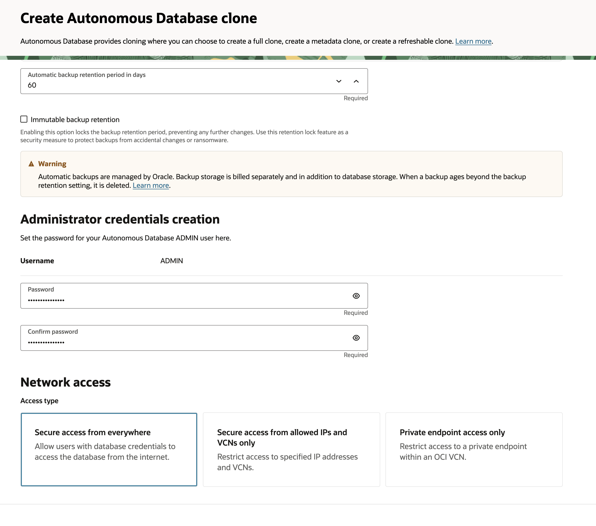

# Ensuring Business Continuity: High Availability and Disaster Recovery - Maximum Availability Architecture

## About this workshop

In this hands-on session, you'll learn how to ensure business continuity and data resilience by cloning an Oracle Database 23ai instance across different regions and setting up a robust disaster recovery solution using Autonomous Data Guard. You'll gain practical experience in implementing high availability and disaster recovery strategies for Oracle databases.

Autonomous Database provides cloning where you can choose to create a full clone, create a metadata clone, or create a refreshable clone. You can also move a database to a different compartment. By creating a clone you can upgrade an instance with Oracle Database 19c to create an Oracle Database 23ai clone (either a full clone or a refreshable clone).

Oracle Database 23ai is the latest Oracle Database version, providing unprecedented features and capabilities for developers and database administrators. In addition, this release focuses on delivering Oracle's exceptional high availability (HA), scalability, and disaster recovery (DR) features in a faster, more reliable, integrated, massively scalable, and efficient way, ensuring that easy access to high availability must never be an afterthought when using Oracle Database. 
 

Estimated Time: 30 minutes

---

### Objectives

By completing these tasks, participants will be able to:

- Clone an Oracle Database 23ai instance to a different region.
- Set up Autonomous Data Guard for disaster recovery.
- Ensure business continuity and data resilience through effective disaster recovery strategies.

These objectives clearly outline what participants can expect to learn and achieve by completing the tasks.

---

### Prerequisites

* A user with access to provision & manage core OCI services  
* Having completed common labs

---
 
### Introduction to this Lab
 
[Demo video on AI for Financial Services](youtube:svyaoQpZSnY:large) 

Data, one of any business's most valuable assets, expands rapidly. Companies use more databases and tools to integrate and protect their data in different pools and containers to manage the data sprawl. Oracle's Converged Database supports multiple workloads and various data types and has many built-in or addable HA features. Using Oracle Database will enable Oracle's customers to analyze their data more efficiently, develop and deploy applications faster, and grant them immediate access to various integrated HA features.

[Read more on: High Availability, Scalability, and Disaster Recovery with Oracle Database 23ai](https://blogs.oracle.com/maa/post/high-availability-scalability-and-disaster-recovery-with-oracle-database-23ai)

---
 
## Task 1: Cross-Region Database Cloning

1. Clone an Oracle Database 23ai instance to a different region, ensuring data consistency and integrity.
2. Under **More Actions** Menu, choose **Create Clone**
  
    

3. Choose Full Clone
    

4. Choose Workload type as Data Warehouse
    

5. Provide Database ADMIN password
    

6. Enable Tools which are required
    

## Task 2: Disaster Recovery with Autonomous Data Guard
 
1. Set up **Autonomous Data Guard** to provide a robust disaster recovery solution, ensuring high availability and data protection for Oracle databases.
2. Select **Disaster Recovery** Tab 
    

3. Add Peer Database
    

4. Choose License Type, This will be **Stand by** Database. Click on Create button
    

5. Click on Stand by Database and view information 
    
 
## Acknowledgements

* **Author** - Madhusudhan Rao B M, Principal Product Manager, Oracle Database
* **Last Updated By/Date** - April 25th, 2025

## Learn more
 
* [Clone, Move, or Upgrade an Autonomous Database Instance](https://docs.oracle.com/en/cloud/paas/autonomous-database/serverless/adbsb/clone-autonomous-database.html)
* [High Availability, Scalability, and Disaster Recovery with Oracle Database 23ai](https://blogs.oracle.com/maa/post/high-availability-scalability-and-disaster-recovery-with-oracle-database-23ai)
