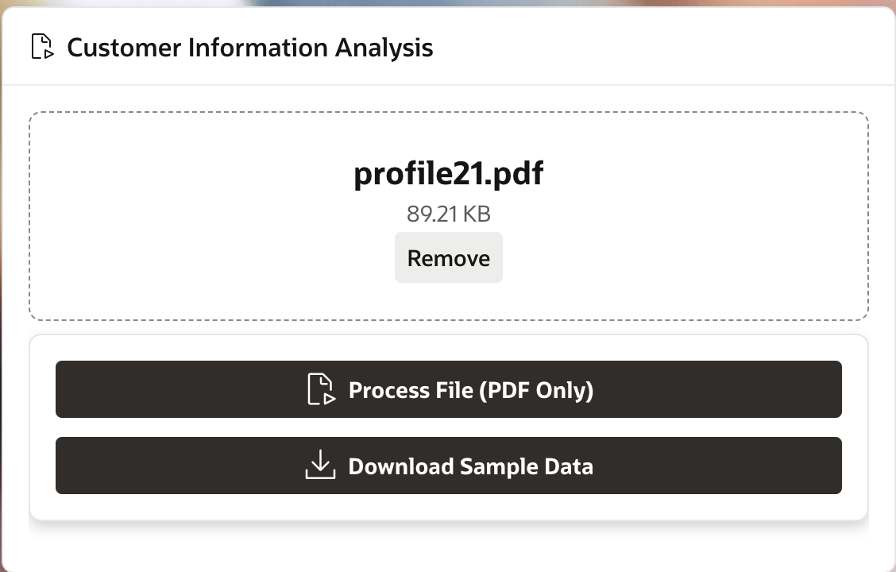
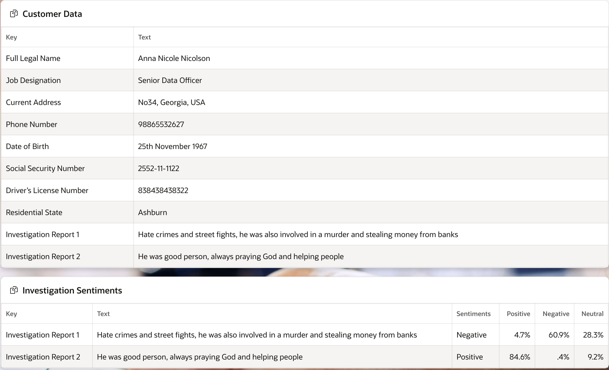
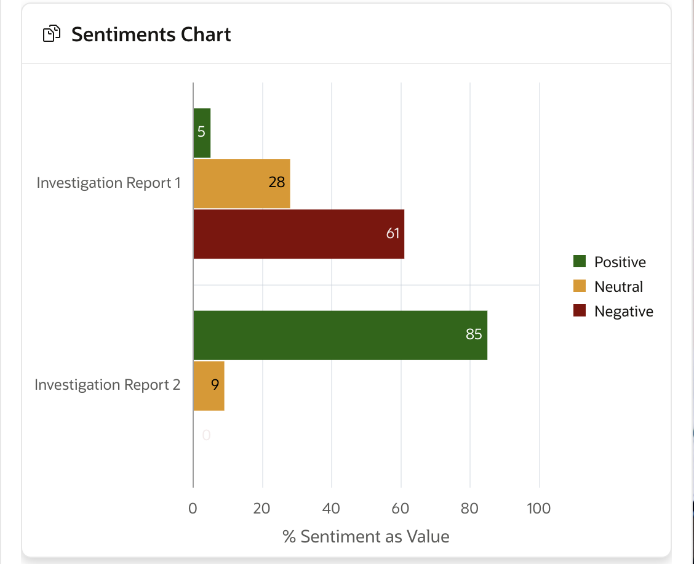

# Customer Analysis

## About this workshop

Welcome to this workshop on sentiment analysis and document understanding! In this hands-on session, you'll learn how to design a database and develop a system that can analyze customer sentiments and provide valuable insights for informed decision-making. You'll gain practical experience in creating a database, developing business logic, and designing a user-friendly interface.

Estimated Time: 60 minutes

---

### Objectives
 
By the end of this workshop, participants will be able to:

- Design a database schema for storing and analyzing sentiment data and document metadata.
- Develop business logic to extract document data and calculate sentiment scores.
- Create a user interface that provides actionable insights for customer decision-making.

These objectives clearly outline what participants can expect to learn and achieve by the end of the workshop, providing a clear direction for the training.

---

### Prerequisites

* A user with access to provision & manage core OCI services  
* Having completed common labs

---

## Task 1: Database Schema Design

1. Design a database schema to store and manage sentiment analysis data and document metadata.
2. Create table **DOCUMENT\_AI\_DOCS**

      ```sql 
      <copy>
      CREATE TABLE "DOCUMENT_AI_DOCS" 
      (	
      "DOCUMENT_ID" NUMBER GENERATED BY DEFAULT ON NULL AS IDENTITY MINVALUE 1 MAXVALUE 99999999999 
            INCREMENT BY 1 START WITH 1 CACHE 20 NOORDER  NOCYCLE  NOKEEP  NOSCALE  NOT NULL ENABLE, 
      "FILE_NAME" VARCHAR2(100) NOT NULL ENABLE, 
      "MIME_TYPE" VARCHAR2(100) NOT NULL ENABLE, 
      "OBJECT_STORE_URL" VARCHAR2(1000) NOT NULL ENABLE, 
      "DOC_AI_JSON" CLOB, 
      "LANGUAGE_CODE" VARCHAR2(10), 
      "LANGUAGE_SCORE" NUMBER, 
      "DOCUMENT_TYPE_CODE" VARCHAR2(50), 
      "DOCUMENT_TYPE_SCORE" NUMBER, 
      "PAGE_COUNT" NUMBER, 
      "STATUS_CODE" VARCHAR2(25) DEFAULT ON NULL 'WIP' NOT NULL ENABLE, 
      "CREATION_DATE" TIMESTAMP (6) WITH LOCAL TIME ZONE NOT NULL ENABLE, 
      "CREATED_BY" VARCHAR2(255) NOT NULL ENABLE, 
      "LAST_UPDATE_DATE" TIMESTAMP (6) WITH LOCAL TIME ZONE NOT NULL ENABLE, 
      "LAST_UPDATED_BY" VARCHAR2(255) NOT NULL ENABLE, 
      "LABEL1" VARCHAR2(100), 
      "LABEL1_SCORE" NUMBER, 
      "LABEL2" VARCHAR2(100), 
      "LABEL2_SCORE" NUMBER, 
      "AISPEECHTRANS_JOBID" VARCHAR2(1000), 
      "AISPEECH_PREFIX" VARCHAR2(1000), 
      "DOC_JSON" VARCHAR2(4000), 
      "SENTIMENTS" VARCHAR2(32000), 
      "AIRESPONSE" VARCHAR2(4000), 
      CONSTRAINT "DOCUMENT_AI_DOCS_PK" PRIMARY KEY ("DOCUMENT_ID") USING INDEX  ENABLE
      ) ;  
    </copy>
    ```
  
3. Create and Enable Trigger

    ```sql 
    <copy>
    CREATE OR REPLACE EDITIONABLE TRIGGER "DOCUMENT_AI_DOCS_BIU" 
    BEFORE INSERT OR UPDATE ON DOCUMENT_AI_DOCS FOR EACH ROW 
    BEGIN 
      IF INSERTING THEN 
        :new.created_by       := COALESCE(SYS_CONTEXT('APEX$SESSION','APP_USER'),SYS_CONTEXT('USERENV', 'SESSION_USER')); 
        :new.creation_date    := current_timestamp; 
        :new.last_updated_by  := COALESCE(SYS_CONTEXT('APEX$SESSION','APP_USER'),SYS_CONTEXT('USERENV', 'SESSION_USER')); 
        :new.last_update_date := current_timestamp; 
      ELSIF UPDATING THEN 
        :new.last_updated_by  := COALESCE(SYS_CONTEXT('APEX$SESSION','APP_USER'),USER); 
        :new.last_update_date := current_timestamp; 
      END IF; 
    END;  
    /
    ALTER TRIGGER "DOCUMENT_AI_DOCS_BIU" ENABLE;
    </copy>
    ``` 

## Task 2: Data Extraction and Sentiment Analysis

1. Develop business logic to extract relevant data from documents and calculate sentiment scores.
2. **SENTIMENTAL\_AI\_PK** Specs

    ```sql 
    <copy>
    create or replace PACKAGE SENTIMENTAL_AI_PK AS    
    GC_OCI_OBJ_STORE_BASE_URL  CONSTANT VARCHAR2(500)  
      := 'https://objectstorage.us-phoenix-1.oraclecloud.com/n/your-OCI-bucket/b/folder-name/o/KV/';   
    GC_OCI_DOC_AI_URL VARCHAR2(500) 
      := 'https://document.aiservice.us-phoenix-1.oci.oraclecloud.com/20221109/processorJobs';   
    GC_OCI_DOC_AI_TIMEOUT_SECS CONSTANT NUMBER         := 15;  
    GC_WC_CREDENTIAL_ID        CONSTANT VARCHAR2(50)   := 'Ind_OCI_WebCred'; --APEX_OCI_BLOG_CREDENTIAL    
    GC_OCY_DOC_AI_PAYLOAD      CONSTANT VARCHAR2(32000) := ' { 
      "processorConfig": { 
          "processorType": "GENERAL", 
          "features": [ 
              { 
                  "featureType": "TABLE_EXTRACTION" 
              } 
          ] 
      }, 
      "inputLocation": { 
          "sourceType": "OBJECT_STORAGE_LOCATIONS", 
          "objectLocations": [ 
              { 
                  "source": "OBJECT_STORAGE", 
                  "namespaceName": "namespace-name", 
                  "bucketName": "bucket-name", 
                  "objectName": "KV/#FILE_NAME#" 
              } 
          ] 
      }, 
      "outputLocation": { 
          "bucketName": "bucket-name", 
          "namespaceName": "namespace-name", 
          "prefix": "KV" 
      }, 
      "compartmentId": "ocid1.compartment.oc1..your-compartment-id" 
    } ';  

    PROCEDURE process_file  
      (p_apex_file_name  IN VARCHAR2,  
      x_document_id    OUT document_ai_docs.document_id%TYPE);  
      
    PROCEDURE render_document  
      (x_document_id  IN document_ai_docs.document_id%TYPE);   
    
    PROCEDURE upload_file  
      (p_apex_file_name    IN VARCHAR2,  
      x_file_name        OUT VARCHAR2,  
      x_object_store_url OUT VARCHAR2,  
      x_document_id      OUT document_ai_docs.document_id%TYPE);  
      
    PROCEDURE put_file  
    (p_mime_type         IN VARCHAR2,  
      p_file_blob         IN BLOB,  
      p_file_name         IN VARCHAR2,  
      x_object_store_url OUT VARCHAR2);  
      
    PROCEDURE sentiment_ai  
      (p_file_name   IN VARCHAR2,  
      p_document_id IN document_ai_docs.document_id%TYPE); 
    
    FUNCTION get_file (p_request_url IN VARCHAR2) RETURN BLOB ; 
        
    END SENTIMENTAL_AI_PK; 
    </copy>
    ```

3. **SENTIMENTAL\_AI\_PK** Body

    ```sql 
    <copy>
    create or replace PACKAGE BODY SENTIMENTAL_AI_PK   
    IS   
    ---------------Initial Method------------------------------- 
    PROCEDURE process_file (p_apex_file_name  IN VARCHAR2,  
      x_document_id    OUT document_ai_docs.document_id%TYPE) 
      IS   
      l_object_store_url    VARCHAR2(1000);  
      l_file_name           VARCHAR2(100);   
      BEGIN   
      -- Get file and upload to OCI Object Storage.  
      upload_file  
      (p_apex_file_name   => p_apex_file_name,   
        x_file_name        => l_file_name,  
        x_object_store_url => l_object_store_url,  
        x_document_id      => x_document_id);   
      -- Call OCI Document AI and parse the results.   
      sentiment_ai  
        (p_file_name   => l_file_name,  
        p_document_id => x_document_id);    
      EXCEPTION WHEN OTHERS THEN  
      RAISE;  
    END process_file;   
    -----------Get file and upload to OCI Object Storage-----------------------------  
    PROCEDURE upload_file  
      (p_apex_file_name    IN VARCHAR2,  
      x_file_name        OUT VARCHAR2,  
      x_object_store_url OUT VARCHAR2,  
      x_document_id      OUT document_ai_docs.document_id%TYPE) IS  
      
      CURSOR cr_file_info IS  
        SELECT filename  
        ,      blob_content  
        ,      mime_type  
        FROM   apex_application_temp_files  
        WHERE  name = p_apex_file_name;  
      
      lr_file_info          cr_file_info%ROWTYPE;   

      BEGIN   
      -- Get the File BLOB Content and File Name uploaded from APEX.  
      OPEN  cr_file_info;  
      FETCH cr_file_info INTO lr_file_info;  
      CLOSE cr_file_info;   
      x_file_name := lr_file_info.filename;  
        
      -- Post file to OCI Object Store.  
      put_file  
      (p_mime_type        => lr_file_info.mime_type,  
        p_file_blob        => lr_file_info.blob_content,  
        p_file_name        => lr_file_info.filename,  
        x_object_store_url => x_object_store_url);  
      
      -- Create Document Record  
      INSERT INTO document_ai_docs (file_name, mime_type, object_store_url)  
      VALUES (lr_file_info.filename, lr_file_info.mime_type, x_object_store_url)   
      RETURNING document_id INTO x_document_id;  
      
      EXCEPTION WHEN OTHERS THEN  
        RAISE;  
      END upload_file;  
      --------------------------------------------------------------------------------  
      -----------Get file and upload to OCI Object Storage-----------------------------   
      PROCEDURE put_file  
      (p_mime_type         IN VARCHAR2,  
        p_file_blob         IN BLOB,  
        p_file_name         IN VARCHAR2,  
        x_object_store_url OUT VARCHAR2) IS  
        
        l_response            CLOB;   
      BEGIN   
      -- Build the full Object Storage URL.  
      x_object_store_url := GC_OCI_OBJ_STORE_BASE_URL || p_file_name;  
      
      -- Set Mime Type of the file in the Request Header.  
      apex_web_service.g_request_headers.DELETE;  
      apex_web_service.g_request_headers(1).name  := 'Content-Type';  
      apex_web_service.g_request_headers(1).value := p_mime_type;  
      
      -- Call Web Service to PUT file in OCI.  
      l_response := apex_web_service.make_rest_request  
      (p_url                  => UTL_URL.ESCAPE(x_object_store_url),  
        p_http_method          => 'PUT',  
        p_body_blob            => p_file_blob,  
        --p_credential_static_id => GC_WC_CREDENTIAL_ID);  
        p_credential_static_id => GC_WC_CREDENTIAL_ID);  
      
      IF apex_web_service.g_status_code != 200 then  
        raise_application_error(-20111,'Unable to Upload File to OCI.');  
      END IF;  
      
    EXCEPTION WHEN OTHERS THEN  
      RAISE;  
    END put_file;  
    --------------------------------------------------------------------------------  
    --------------------------------------------------------------------------------  
    PROCEDURE render_document  
      (x_document_id  IN document_ai_docs.document_id%TYPE) IS  
      
      CURSOR cr_document IS  
        SELECT mime_type  
        ,      object_store_url  
        FROM   document_ai_docs  
        WHERE  document_id = x_document_id;  
      
      lr_document           cr_document%ROWTYPE;  
      l_file_blob           BLOB;  
      
    BEGIN  
      
      -- Get the OCI URL and Mimetytpe of the receipt file.  
      OPEN  cr_document;  
      FETCH cr_document INTO lr_document;  
      CLOSE cr_document;  
      
      -- Get the file BLOB from OCI Object Storage.  
      l_file_blob := get_file (p_request_url => lr_document.object_store_url);  
      
      -- Output the file so it shows in APEX.  
      owa_util.mime_header(lr_document.mime_type,false);  
      htp.p('Content-Length: ' || dbms_lob.getlength(l_file_blob));   
      owa_util.http_header_close;    
      wpg_docload.download_file(l_file_blob);  
      
    EXCEPTION WHEN OTHERS THEN  
      RAISE;  
    END render_document;   
    --------------------------------------------------------------------------------  
    --------------------------------------------------------------------------------  
    FUNCTION get_file (p_request_url IN VARCHAR2) RETURN BLOB IS   
      l_file_blob           BLOB;   
    BEGIN   
      -- Call OCI Web Service to get the requested file.  
      l_file_blob := apex_web_service.make_rest_request_b  
      (p_url                  => UTL_URL.ESCAPE(p_request_url),  
        p_http_method          => 'GET',  
        p_credential_static_id => GC_WC_CREDENTIAL_ID);  
      
      IF apex_web_service.g_status_code != 200 then  
        raise_application_error(-20112,'Unable to Get File.');  
      END IF;  
        
      RETURN l_file_blob;  
        
    EXCEPTION WHEN OTHERS THEN  
      RAISE;  
    END get_file;  
    --------------------------------------------------------------------------------  
    --------------------------------------------------------------------------------   
    PROCEDURE sentiment_ai  
      (p_file_name   IN VARCHAR2,  
      p_document_id IN document_ai_docs.document_id%TYPE) IS  
      
      CURSOR cr_document_data (cp_json IN CLOB) IS  
        SELECT jt.*  
        FROM   JSON_TABLE(cp_json, '$'  
                COLUMNS (label1val      VARCHAR2(200)  PATH '$.id' )) jt;  
    
      CURSOR C1 IS  
            select file_name from DOCUMENT_AI_DOCS where document_id = p_document_id; 
        
      l_request_json        VARCHAR2(32000);  
      l_response_json       CLOB;  
      lr_document_data      cr_document_data%ROWTYPE;  
      v_id varchar(100); 
      v_filename varchar(100); 
      l_obj_name varchar2(500); 
      l_docjob_json_url varchar2(4000) ; 
      l_json                CLOB; 
      cur sys_refcursor; 
      v_request_json        VARCHAR2(32000);   
      v_sentimental_api_url varchar2(200) 
      := 'https://language.aiservice.us-phoenix-1.oci.oraclecloud.com/20210101/actions/batchDetectLanguageSentiments?level=SENTENCE&level=SENTENCE'; 
      v_response_json       CLOB;  
      
    BEGIN   
      -- Replace the uploaded filename in the JSON payload to be sent to Document AI.  
      l_request_json := REPLACE(GC_OCY_DOC_AI_PAYLOAD, '#FILE_NAME#', p_file_name);   
      -- Set Content-Type in the Request Header. This is required by the Document AI REST Service.  
      apex_web_service.g_request_headers.DELETE;  
      apex_web_service.g_request_headers(1).name  := 'Content-Type';  
      apex_web_service.g_request_headers(1).value := 'application/json';  
      
      l_response_json := apex_web_service.make_rest_request  
      (p_url                  => GC_OCI_DOC_AI_URL,  
      p_http_method          => 'POST',  
      p_body                 => l_request_json,  
      p_credential_static_id => GC_WC_CREDENTIAL_ID); 

      apex_json.parse (l_response_json); 
      v_id := apex_json.get_varchar2 ('id'); 
    
      For row_1 In C1 Loop 
            v_filename := row_1.file_name;  
      End Loop; 

      l_obj_name   := 'KV/'||v_id||'/your-namespace_your-bucket/results/KV/'||v_filename||'.json'; 
      l_docjob_json_url   := 'https://objectstorage.us-phoenix-1.oraclecloud.com/n/your-namespace/b/your-bucket/o/'||l_obj_name; 
 
      l_json := apex_web_service.make_rest_request 
          (p_url => UTL_URL.ESCAPE(l_docjob_json_url), 
            p_http_method => 'GET', 
            p_credential_static_id => GC_WC_CREDENTIAL_ID); 

      open cur for  
          SELECT  jt.*  , 'en'  "languageCode"     
          FROM JSON_TABLE(l_json, '$.pages[0].tables[0].bodyRows[*]'  
                  COLUMNS ( 
                          "key"   VARCHAR2(200)  PATH '$.cells[0].text' ,   
                          "text"      VARCHAR2(200)  PATH '$.cells[1].text'   
                  ) ) jt;    

      apex_json.initialize_clob_output ( p_indent => 1 );  
      apex_json.open_object; 
      apex_json.write ( 'documents', cur ); 
      apex_json.close_object;  
      v_request_json := APEX_JSON.get_clob_output;  
      apex_web_service.g_request_headers.DELETE;  
      apex_web_service.g_request_headers(1).name  := 'Content-Type';  
      apex_web_service.g_request_headers(1).value := 'application/json';  

      v_response_json := apex_web_service.make_rest_request  
    
      (p_url                  => v_sentimental_api_url,  
      p_http_method          => 'POST',  
      p_body                 => v_request_json,  
      p_credential_static_id => GC_WC_CREDENTIAL_ID); 

      OPEN  cr_document_data (cp_json => l_response_json);  
      FETCH cr_document_data INTO lr_document_data;  
      CLOSE cr_document_data;  

      UPDATE document_ai_docs  
      SET    doc_ai_json         = l_response_json  , label1 = v_id , label2 = v_filename, 
      AISPEECHTRANS_JOBID = l_docjob_json_url, DOC_JSON = v_request_json, SENTIMENTS = v_response_json  
      WHERE  document_id         = p_document_id;   
    
      EXCEPTION WHEN OTHERS THEN  
        RAISE;  
      END sentiment_ai;   
      
    END; 
    /
    </copy>
    ```
  
## Task 3: Decision-Support Interface Design
 
1. Create a user-friendly interface that provides actionable insights and sentiment analysis results to inform customer decision-making.
2. Upload Customer Analysis PDF file, You can [download sample PDF](https://github.com/madhusudhanrao-ppm/code-assets/blob/main/AI-for-Financial-Services-Application/Chatbot/profile21.pdf) for data format.
   
       

3. Once the file is uploaded, Create a **Dynamic Action** to invoke the PL/SQL logic

    ```sql 
        <copy>
        BEGIN
          SENTIMENTAL_AI_PK.process_file (p_apex_file_name => :P20_RECEIPT_FILE, x_document_id => :P20_DOCUMENT_ID); 
        END;
        </copy>
    ```

4. This will insert record into **DOCUMENT\_AI\_DOCS** table.

5. View Customer Data from **DOCUMENT\_AI\_DOCS** table after upload and processing
   
     

    ```sql 
    <copy>
    select j.key, j.text   
    from   DOCUMENT_AI_DOCS d, json_table 
    (
            d.sentiments, '$' columns  
            ( nested documents[*] 
              columns ( 
                      key,  
                      text  PATH '$.sentences[0].text' ,  
                      documentSentiment , 
                      Neutral  number PATH '$.documentScores.Neutral' , 
                      Negative number PATH '$.documentScores.Negative' , 
                      Positive number PATH '$.documentScores.Positive'  
                      )     
            )    
    ) j
    where  d.document_id = :P20_DOCUMENT_ID  
    </copy>
    ```

6. View Investigation Sentiment Analysis report

    ```sql 
    <copy>
    select j.key, j.text , j.documentSentiment as Sentiments,  
    TO_CHAR(ROUND(Positive * 100 ,1),'fm999.0') || '%' Positive,
    TO_CHAR(ROUND(Negative * 100 ,1),'fm999.0') || '%' Negative,
    TO_CHAR(ROUND(Neutral * 100 ,1),'fm999.0') || '%' Neutral
    from   DOCUMENT_AI_DOCS d, json_table 
    (
            d.sentiments, '$' columns  
            ( nested documents[*] 
              columns ( 
                        key,  
                        text  PATH '$.sentences[0].text' ,  
                        documentSentiment , 
                        Neutral  number PATH '$.documentScores.Neutral' , 
                        Negative number PATH '$.documentScores.Negative' , 
                        Positive number PATH '$.documentScores.Positive'  
                      )     
            )    
    ) j
    where  d.document_id = :P20_DOCUMENT_ID AND 
    (j.key = 'Investigation Report 1' OR j.key = 'Investigation Report 2'); 
    </copy>
    ```

7. The same above query can be used to generate Sentiment Chart
   
      
  
## Acknowledgements

* **Author** - Madhusudhan Rao B M, Principal Product Manager, Oracle Database
* **Last Updated By/Date** - April 22nd, 2025

## Learn more
 
* [Sentiment Analysis](https://docs.oracle.com/en-us/iaas/language/using/sentment.htm)
* [Document Understanding](https://www.oracle.com/in/artificial-intelligence/document-understanding/)
