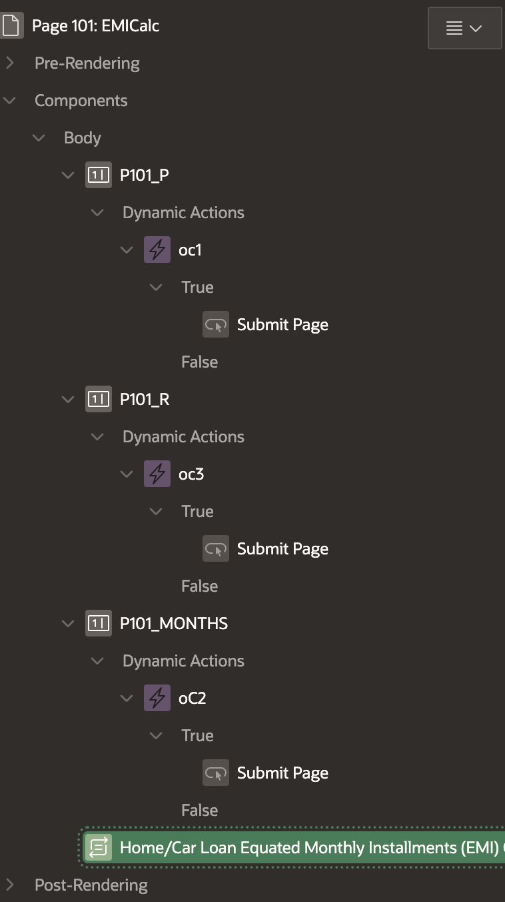
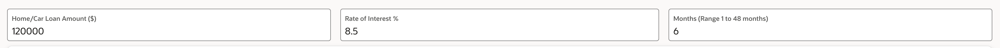
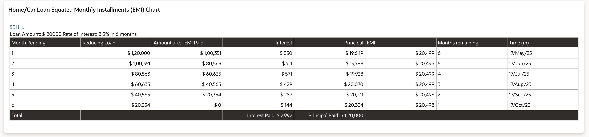
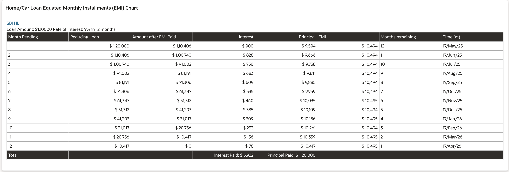

# Home Loan Planning: Calculating Equated Monthly Installments

## About this workshop

Welcome to this workshop on loan EMI calculation and visualization! In this session, we'll explore the process of creating a loan calculator that accepts key loan parameters and generates an EMI chart displaying the amortization schedule. You'll learn how to design a user interface for loan input and visualize the breakdown of principal and interest paid over the loan term

A Home Loan EMI, or Equated Monthly Installment, is the fixed amount a borrower pays each month to repay a home loan. It includes both the principal amount of the loan and the interest charged on it. The EMI is calculated based on the loan amount, interest rate, and the duration of the loan (tenure). 
 
Estimated Time: 30 minutes

---

### Objectives

Loan EMI Calculation and Visualization Workflow

- Loan Details Input: Create a user interface to input loan amount, repayment tenure, and interest rate.
- EMI Calculation and Visualization: Generate an EMI chart displaying the amortization schedule, including principal and interest paid over the loan term.

---

### Prerequisites

* A user with access to provision & manage core OCI services  
* Having completed common labs

---
 
## Task 1: Loan Input Interface

1. Design a user interface to accept key loan parameters:
   
- Loan Amount
- Repayment Tenure (Time to Repay)
- Rate of Interest
  
      

2. Create onChange event to submit page. 
      

## Task 2: EMI Chart Generation
 
1.  Calculate and generate an EMI (Equated Monthly Installment) chart based on the input parameters, including:

- Breakdown of principal and interest paid over the loan tenure
- Total interest paid over the loan term

2. Create a region of type **PL/SQL Dynamic Content** or create a **PL/SQL Function**
   
    ```sql 
        <copy>
        DECLARE
        l_body      CLOB;
        l_body_html CLOB;  
        -- Accept page inputs, Initiate these variable statically to avoid null pointer exception
        l_p number := to_number(:P101_P); -- Loan Amount
        l_Rate number := to_number(:P101_R);  -- Number of Months
        l_input_time number  := to_number(:P101_MONTHS); -- Rate of Interest
        l_t number  := 10;
        l_r number  := 10;   
        l_Time number := 10;
        emi number;
        l_upper number;
        l_lower number;
        l_ratio number; 
        l_intemi number;
        l_princemi number;
        l_intcomp number;
        l_totalemi number := 0;
        l_counter_max number := 10;
        l_counter number;
        l_currbalance number;  
        l_total_int number  := 0;
        sd date;
        fd date;
        ld date;
        sdd varchar2(200); 
        url1 varchar2(2000);
        l_total_principal number := 0; 

        BEGIN 
        l_t := l_input_time;  
        l_r := l_Rate/12/100;
        sd := sysdate;

        htp.p ('Loan Amount: $'||l_p||' Rate of Interest: '||l_Rate|| '% in '||l_input_time||' months ');
 
        l_body_html := '';
        l_body_html := '<table class="a-GV-table"  border=1 cellspacing=4 cellpadding=4  aria-live="polite" style="border-color:white;">';

        l_body_html := l_body_html ||' <tr   style="background-color:#302D29;color:white"  >
              <td>Month Pending </td>
              <td  > Reducing Loan </td>
              <td  > Amount after EMI Paid</td>
              <td align="right"> Interest   </td>
              <td align="right"> Principal   </td>
              <td  > EMI   </td> 
              <td  > Months remaining </td>
              <td  > Time (m) </td> 
              </tr> ';
        

        FOR l_counter in 1 .. l_t LOOP 
            
            l_upper := power((1+l_r), l_t);
            l_lower := power((1+l_r), l_t)-1;
            l_ratio := l_upper  / l_lower;  
            emi :=  round(l_p * l_r * l_ratio, 0)  ; 
            l_intcomp := round(l_p * l_r);
            l_princemi := round(emi - l_intcomp);
            l_currbalance := l_p - l_princemi; 
            sd := ADD_MONTHS(sd, 1);
            fd := last_day(add_months(sd,-1))+1;
            ld := last_day(add_months(sd,0));   
            sdd := to_char(sd,'DD/Mon/YY');

            l_total_int := l_total_int+l_intcomp;
            l_total_principal :=  l_total_principal +  l_princemi;

            l_body_html := l_body_html ||' <tr> 
                <td>'||l_counter||'</td> 
                <td align="right">'||unistr('\0024') ||TO_CHAR(l_p, '999,99,99,99,999')||' </td> 
                <td align="right">' ||unistr('\0024') ||TO_CHAR(l_currbalance, '999,99,99,99,999') ||' </td>  
                <td align="right"> '||unistr('\0024') ||TO_CHAR(l_intcomp, '999,99,99,99,999')||' </td> 
                <td align="right"> '||unistr('\0024') ||TO_CHAR(l_princemi, '999,99,99,99,999')||' </td> 
                <td align="right"> '||unistr('\0024') ||TO_CHAR(emi, '999,99,99,99,999') ||' </td>   
                <td>'||l_t||' </td> 
                <td>'||sdd||'  </td> 
                </tr>';
            
            l_totalemi := emi + l_totalemi;
            l_p := l_currbalance; 
            l_t := l_t - 1;
            
        END LOOP;  

        l_body_html := l_body_html ||'<tr   style="background-color:#302D29;color:white"  >
                    <td>Total </td>
                    <td colspan=2>   </td>
                    <td align="right"> Interest Paid: '||unistr('\0024') ||TO_CHAR(l_total_int, '999,99,99,99,999') ||' </td>
                    <td align="right"> Principal Paid: '||unistr('\0024') ||TO_CHAR(l_total_principal, '999,99,99,99,999')||'</td>
                    <td colspan=3> </td>
                    </tr>';
        l_body_html := l_body_html ||'</table>';
        l_body_html := l_body_html || '</html><br>';

        Htp.p(  l_body_html );


        END;
        </copy>
    ```

    

3. Change Loan Inputs, this will also refresh the EMI chart

   
 
## Acknowledgements

* **Author** - Madhusudhan Rao B M, Principal Product Manager, Oracle Database
* **Last Updated By/Date** - April 4th, 2025

## Learn more
 
* [Oracle Digital Assistant Skills](https://docs.oracle.com/en/cloud/paas/digital-assistant/use-chatbot/create-configure-and-version-skills1.html)
