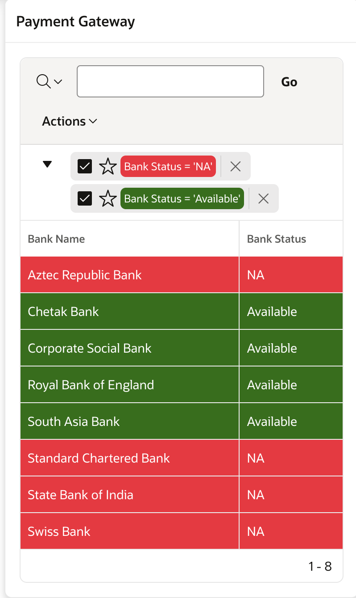
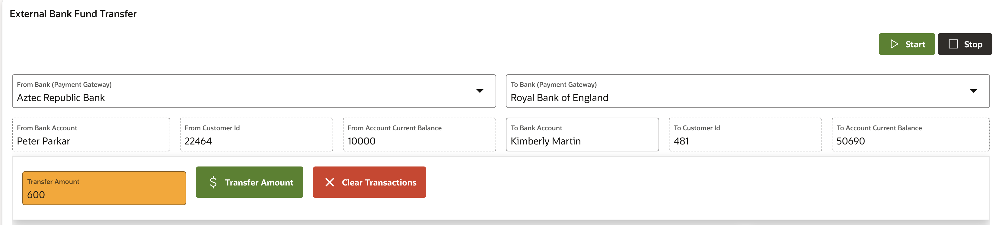
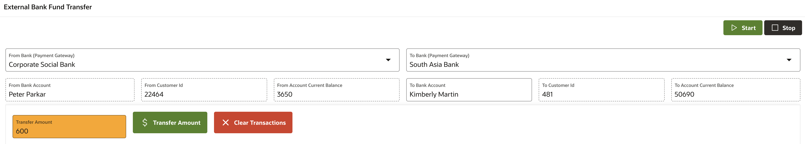
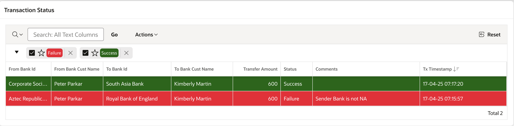

# External Fund Transfer: Transferring Money to an Internal Bank Account

## About this workshop

Welcome to this lab on external bank funds transfer processing! In this session, we'll explore the key tasks involved in facilitating secure and efficient fund transfers. We'll cover the essential steps, including verifying payment gateway status, selecting source and target bank accounts, executing fund transfers, and evaluating transaction integrity across various scenarios. By understanding these critical components, you'll gain valuable insights into the fund transfer process and be better equipped to manage transactions effectively.

Estimated Time: 30 minutes

---

### Objectives

Fund Transfer Process Tasks

- Payment Gateway Status Verification: Verify the status of bank payment gateways.
- Account Selection: Choose source and target bank accounts for fund transfer.
- Fund Transfer Execution: Execute the fund transfer between accounts.
- Transaction Integrity Evaluation: Evaluate transaction integrity across different scenarios.

---

### Prerequisites

* A user with access to provision & manage core OCI services  
* Having completed common labs

--- 
 
### Introduction to this Lab

[Demo video on AI for Financial Services](youtube:nRZlVtJj6d4:large)  

---
 
## Task 1: Payment Gateway Status Retrieval

1. Retrieve the current status of bank payment gateways to ensure seamless transaction processing. Red indicates Bank payment gateway not available, green means Bank payment gateway is available. 
  
      

2. Create table to hold bank names and status. this is a simulation of checking realtime banking gateways available during funds transfer externally.

    ```sql 
        <copy>
        CREATE TABLE "FD_BANK_NAMES" 
        (	
          "ID" NUMBER GENERATED BY DEFAULT ON NULL AS IDENTITY MINVALUE 1 MAXVALUE 9999999999 
          INCREMENT BY 1 START WITH 1 CACHE 20 NOORDER  NOCYCLE  NOKEEP  NOSCALE  NOT NULL ENABLE, 
          "BANK_NAME" VARCHAR2(50 CHAR), 
          "BANK_STATUS" VARCHAR2(10 CHAR), 
          CONSTRAINT "FD_BANK_NAMES_ID_PK" PRIMARY KEY ("ID")
          USING INDEX  ENABLE
        ) ;    
        </copy>
    ```
  Insert few sample records.

    ```sql 
        <copy>
        INSERT INTO FD_BANK_NAMES (ID,BANK_NAME,BANK_STATUS) VALUES (1,'Royal Bank of England','Available');
        INSERT INTO FD_BANK_NAMES (ID,BANK_NAME,BANK_STATUS) VALUES (5,'State Bank of India','NA');
        INSERT INTO FD_BANK_NAMES (ID,BANK_NAME,BANK_STATUS) VALUES (3,'Corporate Social Bank','Available');
        INSERT INTO FD_BANK_NAMES (ID,BANK_NAME,BANK_STATUS) VALUES (7,'Standard Chartered Bank','NA');
        INSERT INTO FD_BANK_NAMES (ID,BANK_NAME,BANK_STATUS) VALUES (2,'Chetak Bank','Available');
        INSERT INTO FD_BANK_NAMES (ID,BANK_NAME,BANK_STATUS) VALUES (4,'Swiss Bank','NA');
        INSERT INTO FD_BANK_NAMES (ID,BANK_NAME,BANK_STATUS) VALUES (8,'South Asia Bank','Available');
        INSERT INTO FD_BANK_NAMES (ID,BANK_NAME,BANK_STATUS) VALUES (6,'Aztec Republic Bank','NA');
        </copy>
    ```
  
## Task 2: Source and Target Account Selection
 
1.  Select the source bank account for fund origination and the target bank account for fund receipt. Case when one of the bank's payment gateway is inactive or not available.
   
     

2. Case when both the bank's payment gateway is active or in available state.
   
     
   
## Task 3: Fund Transfer Initiation
 
1.  Initiate a fund transfer between the selected source and target bank accounts.
2.  Verify transaction status
   
      
    
## Task 4: Transaction Integrity Analysis
 
1.  Analyze transaction integrity in various scenarios, including:
   
- Successful transactions
- Failed transactions
- Transactions with errors or exceptions
- Transactions involving multiple parties or intermediaries

2. When **Transfer Button** is clicked then following PL/SQL code is executed. 

    ```sql 
        <copy>
        declare
        -- grant execute on dbms_lock to docuser;
        v_from_custid FD_TRANSACTIONS_LOG.FROM_BANK_CUST_ID%TYPE := :P74_FROM_CUSTID;
        v_to_custid FD_TRANSACTIONS_LOG.TO_BANK_CUST_ID%TYPE := :P74_TO_CUSTID;
        v_amount FD_TRANSACTIONS_LOG.TRANSFER_AMOUNT%TYPE := :P74_TRANSFER_AMOUNT; 
        v_is_from_bank_active boolean  ;
        v_is_to_bank_active boolean  ; 
        v_from_bank_id FD_BANK_NAMES.ID%TYPE := :P74_FROM_BANK;
        v_to_bank_id  FD_BANK_NAMES.ID%TYPE := :P74_TO_BANK;  
        v_from_acc_balance BANK_CUSTOMERS.CURRENT_BALANCE%TYPE  ;
        v_to_acc_balance BANK_CUSTOMERS.CURRENT_BALANCE%TYPE  ; 
        v_new_id FD_TRANSACTIONS_LOG.ID%TYPE;

        v_reason varchar2(50);
        v_status varchar2(50);
        l_from_email varchar2(50) :=  upper(v('APP_USER'));
 
        begin 
        --------- Create Transaction Log
        insert into FD_TRANSACTIONS_LOG 
        (
            FROM_BANK_ID,   FROM_BANK_CUST_NAME, TRANSFER_AMOUNT, 
            TO_BANK_ID, TO_BANK_STATUS,  TO_BANK_CUST_NAME, STATUS, REASON, FROM_BANK_CUST_ID, TO_BANK_CUST_ID, TX_TIMESTAMP, FROM_EMAIL
        ) 
        values 
        (
            :P74_FROM_BANK,     :P74_FROM_ACCOUNT, v_amount,
            :P74_TO_BANK, :P74_TO_BANK,   :P74_TO_BANK_ACCOUNT, 'Pending', 'NA', v_from_custid, v_to_custid, CURRENT_TIMESTAMP, l_from_email
        ) RETURNING id INTO v_new_id ;

        COMMIT;
        ----------------------- Check if both bank account's internet banking is Active 
        SELECT EXISTS (select BANK_STATUS from FD_BANK_NAMES WHERE BANK_STATUS = 'Available' AND ID = v_from_bank_id)
          INTO v_is_from_bank_active
          FROM DUAL;

        SELECT EXISTS (select BANK_STATUS from FD_BANK_NAMES WHERE BANK_STATUS = 'Available' AND ID = v_to_bank_id)
          INTO v_is_to_bank_active
          FROM DUAL; 
        ---------------------- get Current Balances ------------- 
        select CURRENT_BALANCE into v_from_acc_balance from BANK_CUSTOMERS    WHERE ID = v_from_custid; 
        select CURRENT_BALANCE into v_to_acc_balance  from BANK_CUSTOMERS   WHERE ID = v_to_custid; 

        ---------------------- subtract money from Account 
        update BANK_CUSTOMERS set CURRENT_BALANCE = v_from_acc_balance - v_amount WHERE ID = v_from_custid; 

        --------------------- Add money to receiver's Account  
        update BANK_CUSTOMERS set CURRENT_BALANCE = v_to_acc_balance + v_amount WHERE ID = v_to_custid;

        if (NOT v_is_from_bank_active) then 
            v_reason := 'Sender Bank is not NA'; 
            v_status := 'Failure'; 
            GOTO label;
        elsif (NOT v_is_to_bank_active) then
            v_reason := 'Receiver Bank is not NA'; 
            v_status := 'Failure'; 
            GOTO label;
        elsif (v_amount > v_from_acc_balance) then
            v_reason := 'Insufficient Balance'; 
            v_status := 'Failure'; 
            GOTO label;
        else 
            v_status := 'Success'; 
        end if;
        
        ---------------------- Lets Commit or Rollback transactions
        <<label>>
        if (v_status = 'Success') then    
            COMMIT;  
        else   
            ROLLBACK;  
        end if;

        update FD_TRANSACTIONS_LOG set STATUS = v_status, REASON = v_reason WHERE ID = v_new_id; 
        select CURRENT_BALANCE into v_from_acc_balance from BANK_CUSTOMERS  WHERE ID = v_from_custid; 
        select CURRENT_BALANCE into v_to_acc_balance from BANK_CUSTOMERS  WHERE ID = v_to_custid;
        
        -- Page number and page item names can vary
        :P74_FROM_CURRENT_BALANCE := v_from_acc_balance;
        :P74_TO_CURRENT_BALANCE := v_to_acc_balance; 
         
        end;
        </copy>
    ```
  
## Acknowledgements

* **Author** - Madhusudhan Rao B M, Principal Product Manager, Oracle Database
* **Last Updated By/Date** - April 4th, 2025

## Learn more
 
* [Oracle Digital Assistant Skills](https://docs.oracle.com/en/cloud/paas/digital-assistant/use-chatbot/create-configure-and-version-skills1.html)
