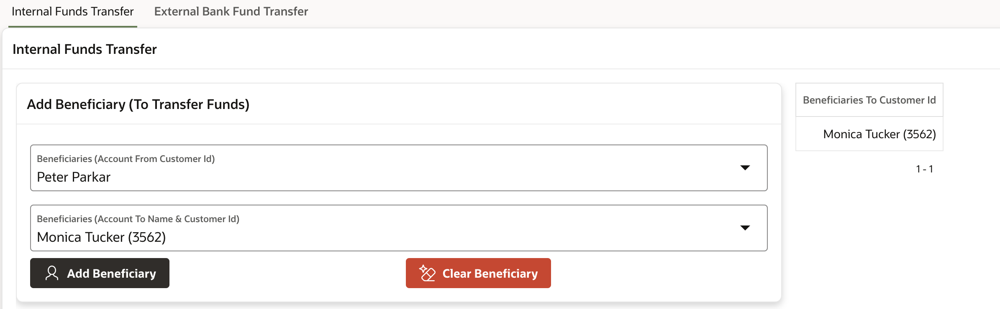
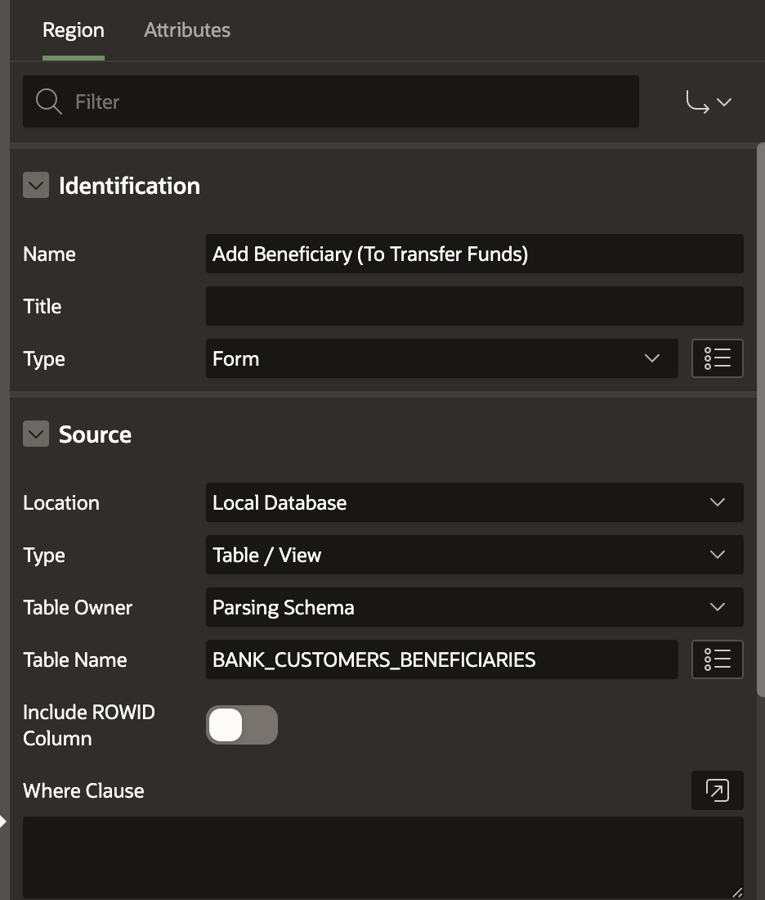
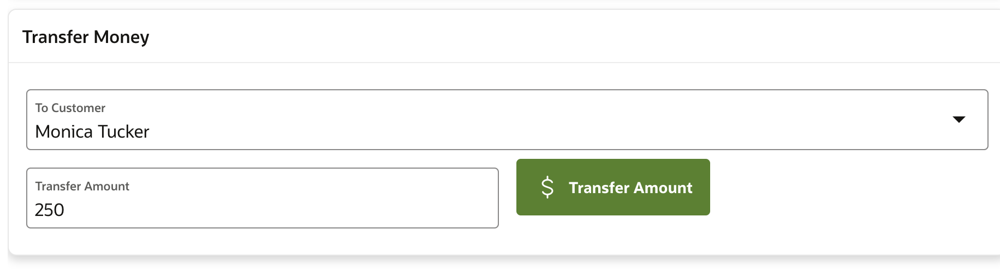
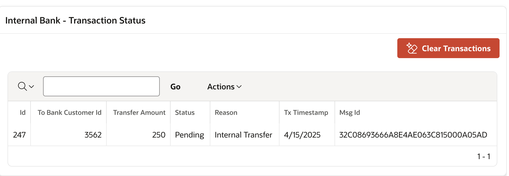
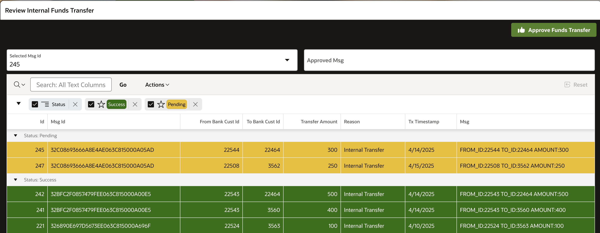

# Internal Fund Transfer: Transferring Funds Between Accounts in Same Bank

## About this workshop

Fund transfers can be categorized into two types: internal and external.

**Internal Funds Transfer:** This involves transferring funds between two accounts within the same bank. Internal transfers require review and approval by a banker prior to processing.

**External Funds Transfer:** This involves transferring funds from one bank account to another account in a different bank.

To manage fund transfer transactions efficiently, we employ a queuing system with two priority levels: high-priority for premium customers and normal priority for standard customers.

In the internal fund transfer use case, we will utilize enqueue and dequeue operations to facilitate transaction processing. This will be the focus of our current discussion.

We will explore external bank fund transfers in greater detail in our next lab.

Estimated Time: 60 minutes

---

### Objectives

The objective of this lab is to enable participants to:

*   Beneficiary Setup: 
    *   Add a beneficiary from available accounts. 
    *   Select a beneficiary from the list of existing beneficiaries. 
*   Queue Management: 
    *   Create a Enqueue to manage fund transfer transactions. 
*   Fund Transfer: 
    *   Enqueue a fund transfer message to initiate the transaction.
    *   Dequeue the fund transfer message to simulate banker approval and complete the transaction.
 
---

### Prerequisites

* A user with access to provision & manage core OCI services  
* Having completed common labs

--- 
 
### Introduction to this Lab

[Demo video on AI for Financial Services](youtube:Y5PziqsPcCI:large) 

---

## Task 1: Create Queue
 
1.  Login as Database Admin user and Grant execute to create Queues

    ```sql 
        <copy> 
        GRANT EXECUTE ON DBMS_AQADM TO DOCUSER;   
        GRANT EXECUTE ON DBMS_AQ TO DOCUSER;   
        GRANT AQ_ADMINISTRATOR_ROLE TO DOCUSER;  
        EXECUTE dbms_aqadm.grant_system_privilege('ENQUEUE_ANY','DOCUSER',FALSE); 
        EXECUTE dbms_aqadm.grant_system_privilege('DEQUEUE_ANY','DOCUSER',FALSE); 
        </copy>
    ```
2.  Create Type Object
   
    ```sql 
        <copy>
         CREATE TYPE banktransfer_q_payload AS OBJECT ( message VARCHAR2(4000) );
        </copy>
    ``` 

3. Set up a queue to manage fund transfer transactions.

    ```sql 
        <copy>
         ------- Create Single Queue ----------
          DECLARE
              v_qn varchar2(100) := 'fundstransfer_queue'; 
              v_qtab varchar2(100) := 'fundstransfer_queue_table';
              v_qcomm varchar2(1000) := 'Funds Transfer Queue';  
              v_payload varchar2(100) := 'banktransfer_q_payload';
              v_qtype_bool boolean := false;
              
          BEGIN 
          -- Create Queue Table --------------------------
            DBMS_AQADM.create_queue_table (
              queue_table          => v_qtab,
              queue_payload_type   => v_payload,
              multiple_consumers   => v_qtype_bool,
              comment              => v_qcomm,
              secure => false);

          -- Create Queue -----------------------------------
            DBMS_AQADM.create_queue (queue_name    => v_qn,
                                    queue_table   => v_qtab); 

          -- Start the Queue  ----------------------------------
            DBMS_AQADM.start_queue (queue_name => v_qn);  

          END;
        </copy>
    ``` 
 
## Task 2: Add Beneficiary

1. Select an account from the available options and add it as a beneficiary.
 
     

2. If you have not already created **BANK\_CUSTOMERS** table in previous labs then please use this script to create 

      ```sql 
        <copy>
        CREATE TABLE "BANK_CUSTOMERS" 
        (	
            "ID" NUMBER GENERATED BY DEFAULT ON NULL AS IDENTITY MINVALUE 1 MAXVALUE 999999999999 
            INCREMENT BY 1 START WITH 1 CACHE 20 NOORDER  NOCYCLE  NOKEEP  NOSCALE  NOT NULL ENABLE, 
            "GENDER" VARCHAR2(1), 
            "CUST_YEAR_OF_BIRTH" NUMBER, 
            "MARITAL_STATUS" VARCHAR2(50), 
            "STREET_ADDRESS" VARCHAR2(255), 
            "CUST_POSTAL_CODE" NUMBER, 
            "CITY" VARCHAR2(50), 
            "STATE_PROVINCE" VARCHAR2(50), 
            "COUNTRY_ID" VARCHAR2(50), 
            "PHONE_NUMBER" VARCHAR2(50), 
            "CUST_INCOME_LEVEL" VARCHAR2(500), 
            "CREDIT_LIMIT" NUMBER, 
            "CUST_VALID" VARCHAR2(1), 
            "CUSTOMER_NAME" VARCHAR2(100),  
            "DOB" DATE, 
            "CUSTOMER_ID" VARCHAR2(20), 
            "ACCOUNT_NUMBER" NUMBER, 
            "ACCOUNT_TYPE" VARCHAR2(20),  
            "COUNTRY" VARCHAR2(50),  
            "OCCUPATION_TYPE" VARCHAR2(50), 
            "INCOME_SOURCE" VARCHAR2(500), 
            "EDUCATIONAL_QUALIFICATION" VARCHAR2(100), 
            "CURRENT_BALANCE" NUMBER, 
            "ACCOUNT_STATUS" VARCHAR2(100), 
            "BANK_NAME" VARCHAR2(100),  
            "REQUEST_CARD" VARCHAR2(10), 
            "EMAIL" VARCHAR2(128), 
            PRIMARY KEY ("ID")
            USING INDEX  ENABLE
        ) ;
        </copy>
      ``` 
    
3. Create table **BANK\_CUSTOMERS\_BENEFICIARIES**

    ```sql 
        <copy>
          CREATE TABLE "BANK_CUSTOMERS_BENEFICIARIES" 
          (	
            "ID" NUMBER GENERATED BY DEFAULT ON NULL AS IDENTITY MINVALUE 1 MAXVALUE 9999999999 
            INCREMENT BY 1 START WITH 1 CACHE 20 NOORDER  NOCYCLE  NOKEEP  NOSCALE  NOT NULL ENABLE, 
            "BENEFICIARIES_NAME" VARCHAR2(128), 
            "BENEFICIARIES_TO_CUSTID" NUMBER, 
            "BENEFICIARIES_FROM_CUSTID" NUMBER, 
            CONSTRAINT "BANK_CUSTOMERS_BENEFICIARIES_ID_PK" PRIMARY KEY ("ID")
            USING INDEX  ENABLE
          ) ;

          ALTER TABLE "BANK_CUSTOMERS_BENEFICIARIES" ADD CONSTRAINT "BANK_CUSTOMERS_BENEFICIARIES_ID_FK" 
            FOREIGN KEY ("BENEFICIARIES_FROM_CUSTID")
            REFERENCES "BANK_CUSTOMERS" ("ID") ENABLE;

          CREATE INDEX "BANK_CUSTOMERS_BENEFICIARIES_I1" ON "BANK_CUSTOMERS_BENEFICIARIES" ("BENEFICIARIES_FROM_CUSTID") 
          ;
        end;
        </copy>
    ```
3. Create FORM in Oracle APEX as shown, this will add our new Beneficiary into **BANK\_CUSTOMERS\_BENEFICIARIES** table

  

## Task 3: Select Beneficiary
 
1.  Choose a beneficiary from the list of existing beneficiaries. Add beneficiaries from the selected list

    

2. Generate list of customers with their id internal to bank

    ```sql 
        <copy>
        select * from BANK_CUSTOMERS_BENEFICIARIES 
        WHERE BENEFICIARIES_FROM_CUSTID =  
        (select ID from bank_customers where upper(email) = upper(v('APP_USER')) AND rownum = 1);  
        </copy>
    ```

3. Click on **Transfer Amount** button, Create a **Dynamic Action** on button click as shown below, page item names and numbers might vary in your setup

    ```sql 
        <copy>
        declare 
        v_new_id number;
        l_enqueue_options      DBMS_AQ.ENQUEUE_OPTIONS_T;
        l_message_properties   DBMS_AQ.MESSAGE_PROPERTIES_T;
        l_message_handle       RAW (16);
        l_queue_msg            banktransfer_q_payload; 
        message_id varchar2(200); 
        l_msg varchar2(400);  

        -- DOCUSER is the schema that we are using, this might vary in your setup
        l_q_name varchar2(400) := 'DOCUSER.fundstransfer_queue'; 
        l_from_custid varchar2(50) := :P74_BENEFICIARIES_FROM_CUSTID;
        l_to_custid varchar2(50) := :P74_INT_TO_CUSTID;
        l_amount varchar2(50) := :P74_INT_AMOUNT;

        begin
            -- Generate Msg ----------------------
            l_msg   := 'FROM_ID:'||l_from_custid||' TO_ID:'||l_to_custid||' AMOUNT:'||l_amount;  


            ------------  Enque Message ---------- 
            l_queue_msg := banktransfer_q_payload (l_msg); 
            DBMS_AQ.ENQUEUE (queue_name           => l_q_name,
                          enqueue_options      => l_enqueue_options,
                          message_properties   => l_message_properties,
                          payload              => l_queue_msg,
                          msgid                => l_message_handle);

            SELECT MSG_ID INTO message_id
              FROM AQ$fundstransfer_queue_table
              WHERE ROWID = (SELECT MAX(ROWID)
                              FROM AQ$fundstransfer_queue_table); 
          

            ------------- Insert to DB --------------------------
            insert into FD_TRANSACTIONS_LOG 
            (
                  FROM_BANK_CUST_ID, TO_BANK_CUST_ID, TRANSFER_AMOUNT, 
                    STATUS, REASON,    TX_TIMESTAMP, MSG_ID, MSG
            ) 
            values 
            (
                  l_from_custid, l_to_custid, l_amount,
                  'Pending', 'Internal Transfer',   CURRENT_TIMESTAMP, message_id, l_msg
            ) RETURNING id INTO v_new_id ;
 
        COMMIT;
        EXCEPTION 
        WHEN OTHERS
        THEN DBMS_OUTPUT.put_line ( SQLERRM || ' - ' || DBMS_UTILITY.FORMAT_ERROR_BACKTRACE);
  
        end;
        </copy>
    ``` 
 
## Task 4: Initiate Fund Transfer (Enqueue)
 
1.  Enqueue a fund transfer message to initiate the transaction.
      
2. View Transfer Status

  

## Task 5: Approve Fund Transfer (Dequeue)
 
1.  Simulate banker approval by dequeuing the fund transfer message, thereby completing the transaction.
   
    

2. View list of Pending transactions, we can generate list of ids as shown below.

    ```sql 
        <copy>
        select id as d, id as v from FD_TRANSACTIONS_LOG 
        where MSG_ID is not null and STATUS = 'Pending';
        </copy>
    ``` 

3. Based on Message Id, Fund transfer can be Approved by Dequeue operation  by clicking on **Approve Fund Transfer** button **Dynamic Action**

    ```sql 
        <copy>
        DECLARE 
          r_dequeue_options    DBMS_AQ.DEQUEUE_OPTIONS_T;
          r_message_properties DBMS_AQ.MESSAGE_PROPERTIES_T;
          v_message_handle     RAW(16) := :P64_SELECTED_MSG_ID;
          o_payload            banktransfer_q_payload;    
          -- DOCUSER is the schema that we are using, this might vary in your setup
          v_qname varchar2(100) := 'DOCUSER.fundstransfer_queue'; 
      
        BEGIN 
          if v_message_handle is not null then 
            DBMS_AQ.DEQUEUE(
            queue_name         => v_qname,
            dequeue_options    => r_dequeue_options,
            message_properties => r_message_properties,
            payload            => o_payload, 
            msgid              => v_message_handle
            ); 
         
            -- lets update the status of this transaction
            update FD_TRANSACTIONS_LOG set STATUS = 'Success' where MSG = o_payload.message;
          
            COMMIT;
            -- Page Item name and number might vary in your setup
            :P64_APPROVED_MSG := o_payload.message;
          end if;
        
      
        END;
        </copy>
    ```
 
## Acknowledgements

* **Author** - Madhusudhan Rao B M, Principal Product Manager, Oracle Database
* **Last Updated By/Date** - April 16th, 2025

## Learn more
 
* [AI for Aviation - Create Realtime Passenger Dashboard with Transactional Event Queues, Advanced Queuing](https://www.linkedin.com/pulse/ai-aviation-create-realtime-passenger-dashboard-event-rao-6iqaf)
