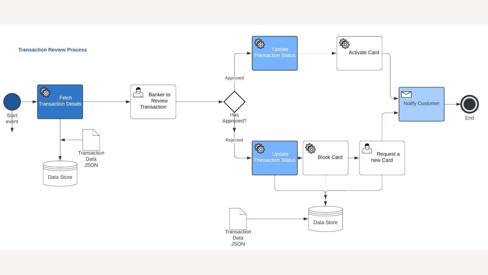
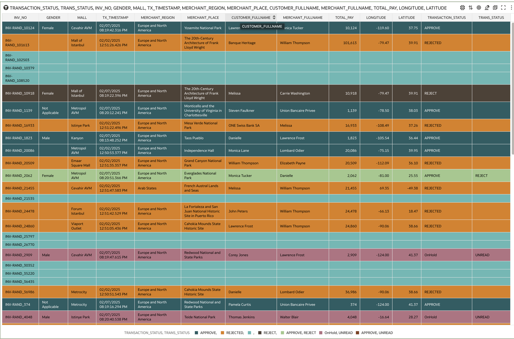

# Building a Robust Suspected Transaction Review Business Process & Analytics

## About this workshop

Designing a Suspected Transaction Review Process: A Step-by-Step Guide

This article provides a comprehensive, step-by-step guide on designing a business process to manually review suspected transactions by a bank official. The process enables informed decision-making regarding transaction approval or rejection, based on a thorough analysis of key parameters, including:

- Customer and merchant details
- Transaction location, time, and amount
- Transaction history
- Product purchased versus cost

The suspected transaction review process ensures efficient and effective transaction validation, minimizing the risk of fraudulent activity. Upon validation:

Legitimate transactions trigger the reactivation of the associated card.
Confirmed fraudulent transactions initiate an immediate block on the compromised card.

This solution leverages the cutting-edge capabilities of Oracle's integrated suite, including:

- Oracle Integration Cloud
- Oracle Process Automation
- Oracle Database 23ai
- Oracle Analytics Cloud with Machine Learning and Auto Insights

These advanced technologies utilize algorithms to automatically analyze data sets, generate visual insights, and provide an automated way to discover patterns and trends within your data, without requiring extensive user input.

Transaction Review Process - Use Case Background:
In the financial services sector, credit and debit card transactions are categorized into three distinct buckets:

1. **Approved**: Valid transactions that meet predetermined criteria.
2. **Rejected**: Transactions declined based on specific business rules, such as: Transaction value, Time interval between transactions, Location of consecutive transactions. Suspected transactions are automatically rejected, and the associated card is temporarily blocked to prevent potential misuse.
3. **OnHold**: Transactions flagged as potential fraud, but requiring manual review due to insufficient evidence from machine learning algorithms or pre-existing models.

For OnHold transactions, a manual review business process is initiated, wherein a banker examines the transaction and makes an informed decision to either approve or reject it. The outcome of this review determines the subsequent action:

- Rejected: The card used for the transaction is blocked to prevent further unauthorized activity.
- Approved: The card is whitelisted, enabling its continued use for legitimate transactions.

When designing a process-centric application centered around a database, with minimal integration requirements and built using Oracle APEX, Oracle APEX Workflows and Reporting are the preferred choice. [please see this article](https://www.linkedin.com/pulse/how-automate-business-process-oracle-apex-workflows-task-rao-9na6f/).

However, for enterprise-grade applications and business processes that necessitate integration with multiple services, such as:

- Retrieving customer data from CRM systems
- Conducting AI-powered background checks on customers
- Writing data to external applications running on disparate databases or systems

A more comprehensive approach is required. In such scenarios, Oracle Integration Cloud, Oracle Process Automation, and Oracle Analytics Cloud are leveraged in tandem to provide a robust and integrated solution.

The selection of technology should ultimately align with the organization's end-to-end business objectives. In this article, we will demonstrate the combined use of Oracle Process Automation, Oracle Integration Cloud, and Oracle Analytics Cloud to achieve a seamless and integrated workflow.
  
Estimated Time: 120 minutes

---

### Objectives

By completing these tasks, participants will be able to:

- Set up and configure cloud infrastructure for integration.
- Establish database connections for seamless data exchange.
- Understand Oracle Integration Cloud (OIC) use cases and applications.
- Design and implement specific integration use cases, including:
- Retrieving transaction details
- Updating transaction data
- Activating or blocking credit cards
- Model business processes using process diagrams.
- Automate transaction review processes using integration services.
- Integrate services into business processes.
- Deploy, activate, and run integrated processes.
- Test and validate transaction review business processes.
- Audit and monitor individual process workflows.
- Implement process governance best practices.

---

### Prerequisites

* A user with access to provision & manage core OCI services  
* Having completed common labs

--- 
 
### Introduction to this Lab
 
Business Process
[Demo video on AI for Financial Services](youtube:xCXb7kOWdqo:large)  

Analytics
[Demo video on AI for Financial Services](youtube:wGfyGYAtz8A:large)  

---
 
## Task 1: Set up Cloud Infrastructure

1. We would need the following in our cloud Infrastructure.

- Oracle Database 23ai (Oracle Autonomous Database)
- Oracle Integration Cloud (OIC)
- Oracle Process Automation (OPA)
- Oracle Analytics Cloud (Optional)

Login to your OCI tenancy and create an OIC Instance. Ensure that the process is enabled; this will automatically create a process instance and attach it to OIC. 
  
    
   

## Task 2: Create a Database Connection
 
1.  In Integration Cloud Console > Design > Connections, Create a new Database Connection, as shown below. To test the connection, download the Oracle Autonomous Database wallet and upload the waller under the connection tab.
  
    
    
    

## Task 3: Oracle Integration Cloud Use Cases:
 
The following three integrations are required to support the transaction review process:

- Retrieve Transaction Details: Integrate with the database to fetch transaction details based on a specific transaction ID or periodically poll the database at predefined intervals (e.g., every few seconds). For this example, we will utilize the transaction ID-based approach.
- Update Transaction Data: Integrate with the database to update transaction data based on the outcome of the manual reviewer's assessment. This includes approving or rejecting transactions that were previously on hold or rejected.
- Activate or Block Credit Card: Integrate with the credit card management system to activate or block a credit card based on the outcome of the transaction review process. This ensures that fraudulent transactions are prevented, and legitimate transactions are processed efficiently.

## Task 4: Use case 1: Retrieve Transaction Details
 
1.  Create an Application, for example Select Transaction Record
   
    

2. The Integration will start with a REST Trigger and will have a Table Operation to Select a Record from a Table. Parameters are mapped from the REST Input to the Database Invoke Input, and The Database Response Output is captured in a JSON Schema, as shown below.
   
    

3. If we break this a little more step by step. 
   
    
    

4. JSON Format (Schema available in code samples of this article)
   
     

5. Add Inline Schema, as shown above, which basically shows a database record format for transaction data in a table. 
   
     
     

6. Lets look at the Database Adapter configuration

     

7. Please note the condition of this table, where ID = #ID is the input parameter accepted from the application front end.

    
    

8. The next most important task to do is to put two mappers in between and connect the REST Input to the Database Input and Database Output to the JSON response
9. Map Query Parameter to ADW Request ID

    

10. Map ADW Response Collection to REST Wrapper
    
    
    

11. Monitor real-time transactions with Oracle APEX Application AI for Financial Services or any other application for transaction monitoring. 
    
    

12. Activate our Integration and Test the Integration by passing one of the transactions, we can see that based on ID submitted, we get the entire transaction record in JSON format.
    
     
     
## Task 5: Use case 2: Update Transaction Data
 
1.  Complete Integration Flow for Update
 
     

2. This is similar to use case 1. Here, we will UPDATE instead of SELECT operation

3. REST Trigger configurations.
   
     
     
    
    

4. Update Database Adapter
   
    
    

5. Update Mapper
   
    

6. Activate and Test the update Integration. 
   
    

7. Now, when we see the Transaction Dashboard, we can see that the 3rd record has been approved, which has changed the status from OnHold to Approved.
   
      
    

## Task 6: Use Case 3: Activate or Block Credit Card
 
1.  This is similar to the second use case, where we just update a different table that holds customers' card information. If the card has been temporarily blocked based on human review, we might want to unblock it or leave it blocked. Since we are testing integration alone without the process, we will just update the record based on the transaction row ID of the card table.
 
     

2. If we look at our transaction monitoring system, then we will be able to see the blocked card has been added to our dashboard, in a real-life scenario the card number would be masked
   
     

3. Now that we have completed writing and testing our three integrations, we will move towards setting up the business process which will use these integrations. 
    

## Task 7: Process Use Case Diagram
 
1. The following process flow illustrates the transaction review and approval workflow:

- User Input: The user provides a transaction ID as input.
- Retrieve Transaction Details: The system fetches transaction details from a database table based on the input transaction ID.
- Task Assignment: The task is assigned to a human reviewer, typically a banker.
- Manual Review: The human reviewer examines the transaction details and makes a decision to either approve or reject the transaction.
- Approval/Rejection: Based on the reviewer's decision:

 **Approved**: The transaction status is updated to "Approved," and the associated credit card is activated.

 **Rejected**: The transaction status is updated to "Rejected," and the associated credit card is blocked. New card request is initiated

6. Notification: Customer is notified through email or SMS

This process ensures that transactions are thoroughly reviewed and verified, minimizing the risk of fraudulent activity."
 
   

The corresponding Business Process in Oracle Process Automation would look as shown below

   

## Task 8: Transaction Review Process - Process Automation
 
1. The following workflow outlines the transaction review process:

- Step 1: Retrieve Transaction Details Invoke Oracle Integration Cloud to retrieve transaction details based on the provided transaction ID. Alternatively, database polling can be utilized to fetch on-hold transactions.

- Step 2: Review Transaction Details The human reviewer examines the retrieved transaction details to make an informed decision.

- Step 3: Approve or Reject Transaction The reviewer approves or rejects the transaction, triggering a decision flow.

2. Decision Flow: Based on the reviewer's decision:

Rejected: Update the corresponding transaction status to reflect the rejection.
Approved: Update the transaction status and unblock the associated credit card.

- Draft: You might want to add a few activities or integrations as Drafts for later implementation. 
     
## Task 9: Wiring up Integration Services into Business Process
 
1.  From the Integration Cloud console left navigation, access Oracle Process Automation as shown below
 
    

2. Create a Process Application App
   
    
    

3. Add Integration Connector Components: Here, we would need all three integrations that we created earlier. If an integration changes, then the corresponding service should be updated here.
   
    

4. Add Roles: In Business process management notation (BPMN), various activities are managed by groups of people in various roles within the organization, so basically, we will have to create a process swim lane and add various roles and people into those roles. 
   
    

5. Add UI: we would need a web or mobile user interface to input data or retrieve and view data, so create a user interface as shown below. 
   
     

6. We can also preview this UI on various devices.
   
     

7. Create a Structured Business Process
 
     

8. Add Groups to the Swim lane on the left side and drag and drop Integrations or other activities on the canvas as shown below.
   
     

9. Connect to our required integration services under the Properties inspector
    
    

10. Similarly, Data Association is required to move data from one task to another as shown below for both the Input and Output tabs.
    
    

11. Drag and Drop Human review task to view details of a given transaction; based on the outcome of a Human task review, update the status of a transaction that is Approved or Rejected.
    
    

12. Add Decision Tree; if Approved, we will Activate the card (if it's already blocked); if Rejected, we will block the card.

    

13. At the end of the process, there may always be some activities in draft mode, which can be implemented once the Integration service is ready.
    
    
     
## Task 10: Save, Activate and Run Process
 
1.  We would need to Deactivate the older version to deploy a new version of Process, click on Test in Workspace
 
    
    
## Task 11: Test the Transaction review Business Process 
 
1.  Click on the process name, an App can have multiple process running.
 
     

2. Let us check one of our transactions, which is OnHold status; in this example, its an Orange row with ID 1173
   
    

3. Provide process input ID as 1173, click on Submit.
   
     

4. Open the Task under Actionable Activities.
   
     

5. Update the comment and Approve or Reject the task. In this case, we will approve the task.

    

6. Now, in our Transaction Dashboard, the task has changed from Orange (OnHold) to Green (Approved) status. and comments have also been updated
   
    

7. This will also trigger the card unblocking process activity. You can also see that blocked cards have been changed from 2 to 1.
    
    

    This completes end of the process.
  
## Task 12: Audit Individual Process Workflow
 
1.  We can audit individual process workflows by tracking the process audit, as shown below. We can see who approved what and when. 

    
    
     

## Task 13: Process Governance
 
1.  We can also audit all the process instances, those which is pending and those that have been completed or, faulted or terminated. This gives a better Governance
 
     

## Task 14: Create Analytics Cloud Instance
 
1.  Create Analytics cloud instance and choose your compartment
    
    

2. Create Oracle Autonomous Database 23ai connection by uploading wallet file
   
    
     
## Task 15: Create Transaction Dataset from the Transaction Tables
 
1.  Create Transaction Dataset from the Transaction Tables as shown below
   
    

2. In the workbook tab, we can easily drag and drop table columns, add filters, and create visualizations. Here, we can see the category of purchase v/s average amount paid.
   
    

3. Tabular Data Visualization of Transactions
   
    
    
## Task 16: Machine Learning - Auto Insights
 
1.  Oracle Analytics Cloud's "Auto Insights" feature is based on machine learning (ML), utilizing algorithms to automatically analyze data sets and generate visual insights without requiring extensive user input, essentially providing an automated way to discover patterns and trends within your data.  
   
    

2. Let us keep some of the visualizations that make sense for an executive presentation
   
    

3. Location Map, Category Map etc.
   
    
 
## Acknowledgements

* **Author** - Madhusudhan Rao B M, Principal Product Manager, Oracle Database
* **Last Updated By/Date** - April 24th, 2025

## Learn more
 
* [Building a Robust Suspected Transaction Review Business Process with Oracle Integration, Process Automation, Machine Learning and Analytics Cloud](https://www.linkedin.com/pulse/building-robust-suspected-transaction-review-business-madhusudhan-rao-w6k2f)
