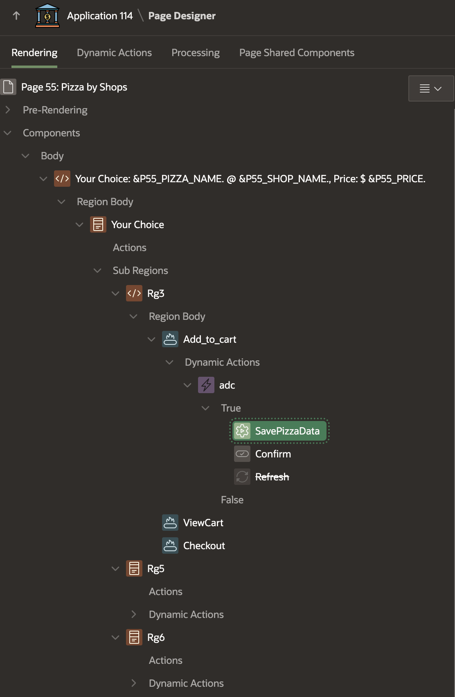
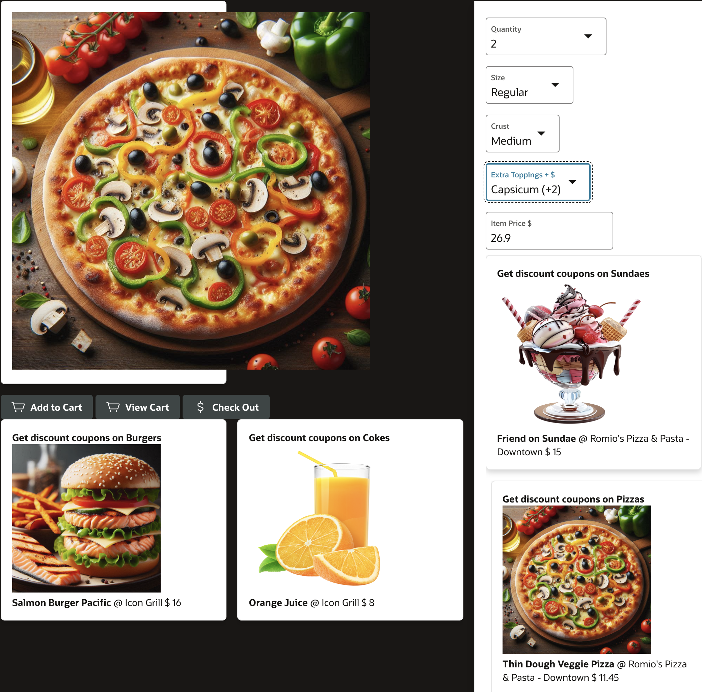
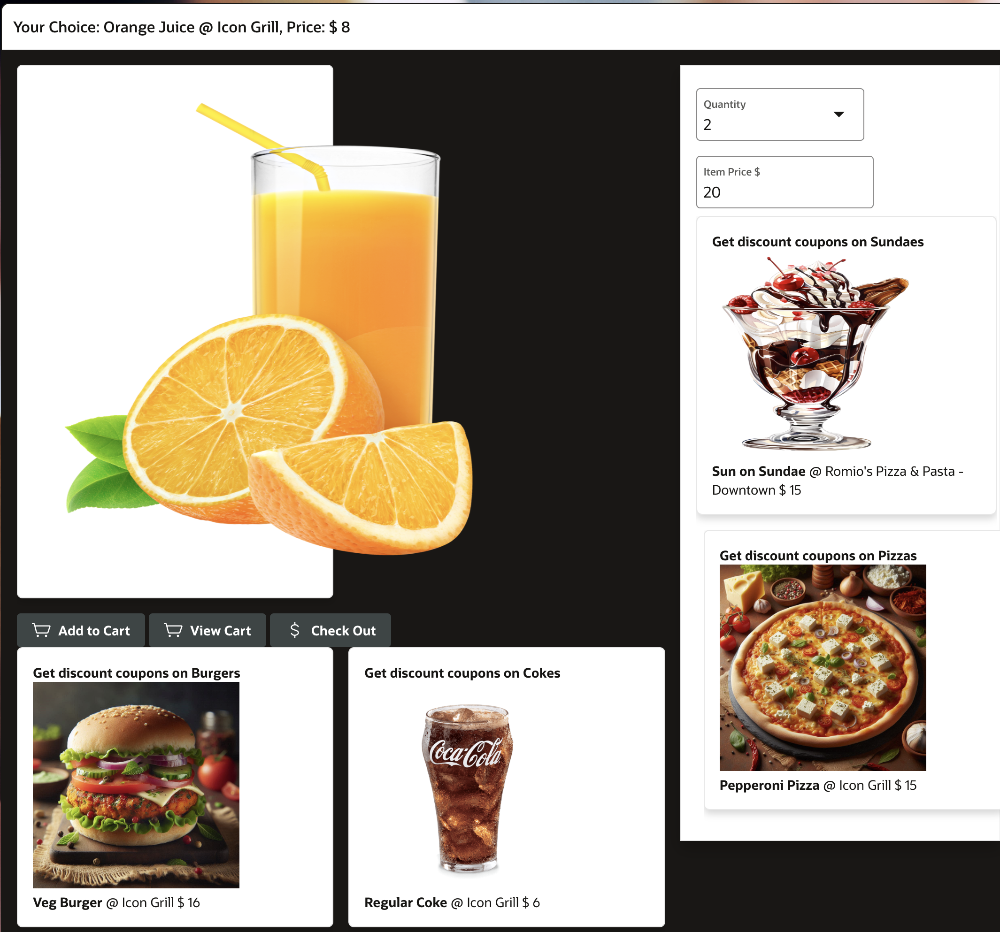
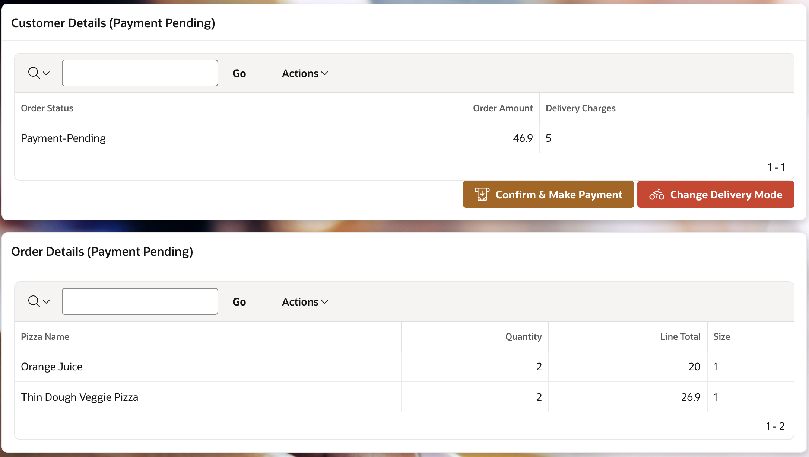
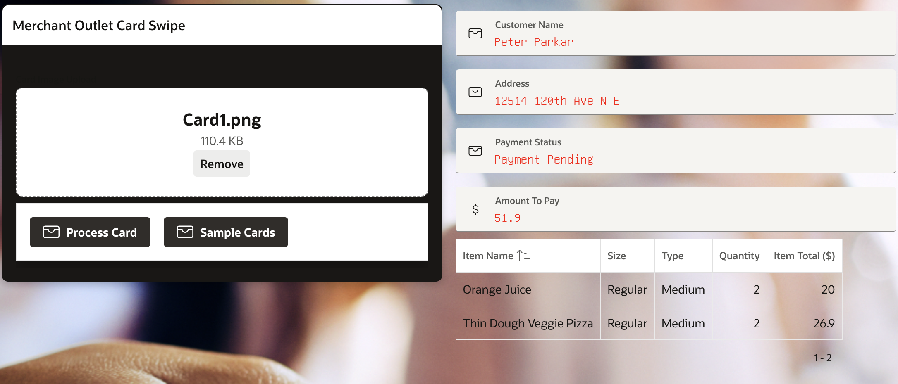
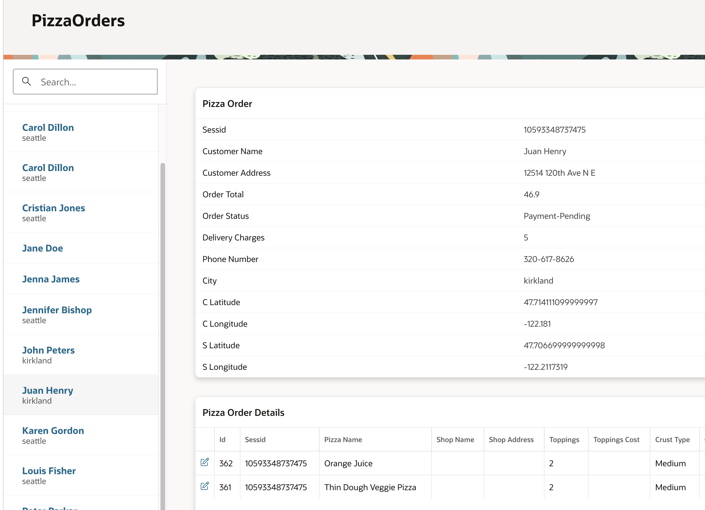

# E-commerce Food Ordering System

## About this workshop

Welcome to this workshop on building an e-commerce food ordering system! In this hands-on session, you'll learn how to design and develop a system that allows customers to browse and order their favorite food items, customize their orders, and make payments seamlessly. You'll gain practical experience in creating a user-friendly interface and implementing key features.

Estimated Time: 60 minutes

---

### Objectives

By the end of this workshop, participants will be able to:

- Design and display a shopping cart with various food items.
- Implement functionality for customers to add items, customize orders, and select delivery options.
- Develop a checkout and payment process.
- Create a feature for bulk order uploads.

These objectives clearly outline what participants can expect to learn and achieve by the end of the workshop.

---

### Prerequisites

* A user with access to provision & manage core OCI services  
* Having completed common labs

--- 
 
### Introduction to this Lab

[Demo video on AI for Financial Services](youtube:jMg_G-r6wIA:large)  

In this hands-on lab, you'll design and develop a comprehensive e-commerce food ordering system that allows customers to browse menu items, customize orders, select delivery options, and make payments seamlessly. You'll gain practical experience in database design, user interface development, and implementing key features using JSON Relational Duality Views for bulk order uploads. By completing this lab, you'll be able to build a robust and scalable food ordering system that meets the needs of customers and businesses alike.
 
---

## Task 1: Database Design for E-commerce Food Ordering System 

1. Design Database for Pizza Items, Pizza Orders and Pizza Order Items
2. Create table **PIZZASHOPS** will all food items, Image column is used to save image location url
  
    ```sql 
        <copy>
        CREATE TABLE "PIZZASHOPS" 
        (	
          "ID" NUMBER GENERATED BY DEFAULT ON NULL AS IDENTITY MINVALUE 1 MAXVALUE 99999999999 
          INCREMENT BY 1 START WITH 1 CACHE 20 NOORDER  NOCYCLE  NOKEEP  NOSCALE  NOT NULL ENABLE, 
          "ADDRESS" VARCHAR2(255), 
          "CITY" VARCHAR2(50), 
          "LATITUDE" NUMBER, 
          "LONGITUDE" NUMBER, 
          "PRICE" NUMBER, 
          "DESCRIPTION" VARCHAR2(2000), 
          "PIZZA_NAME" VARCHAR2(255), 
          "SHOP" VARCHAR2(255), 
          "IMAGE" VARCHAR2(200), 
          "QUANTITY_AVAILABLE" NUMBER, 
          "UNIT_TYPE" VARCHAR2(50), 
          "SDO_GEOM" "SDO_GEOMETRY", 
          PRIMARY KEY ("ID")
          USING INDEX  ENABLE
        ) 
          VARRAY "SDO_GEOM"."SDO_ELEM_INFO" STORE AS SECUREFILE LOB 
          VARRAY "SDO_GEOM"."SDO_ORDINATES" STORE AS SECUREFILE LOB ;
        </copy>
    ```

3. Create Table **PIZZA\_ORDER** (Master Table) used to store order in a given session.

    ```sql 
        <copy>
        CREATE TABLE "PIZZA_ORDER" 
        (	
          "ID" NUMBER GENERATED BY DEFAULT ON NULL AS IDENTITY MINVALUE 1 MAXVALUE 999999999999 
          INCREMENT BY 1 START WITH 1 CACHE 20 NOORDER  NOCYCLE  NOKEEP  NOSCALE  NOT NULL ENABLE, 
          "SESSID" VARCHAR2(4000 CHAR), 
          "CUSTOMER_NAME" VARCHAR2(255 CHAR), 
          "CUSTOMER_ADDRESS" VARCHAR2(4000 CHAR), 
          "CUSTOMER_INSTRUCTIONS" VARCHAR2(4000 CHAR), 
          "ORDER_TOTAL" NUMBER, 
          "ORDER_STATUS" VARCHAR2(4000 CHAR), 
          "MODE" VARCHAR2(100), 
          "DELIVERY_CHARGES" NUMBER, 
          "PHONE_NUMBER" VARCHAR2(100), 
          "CITY" VARCHAR2(100), 
          "C_LATITUDE" NUMBER, 
          "C_LONGITUDE" NUMBER, 
          "S_LATITUDE" NUMBER, 
          "S_LONGITUDE" NUMBER, 
          CONSTRAINT "PIZZA_ORDER_ID_PK" PRIMARY KEY ("ID")
          USING INDEX  ENABLE
        ) ;
        </copy>
    ``` 

4. Create Table **PIZZA\_ORDER\_DETAILS** (Detail Table) used to store each order line item for a given order.

    ```sql 
        <copy>
        CREATE TABLE "PIZZA_ORDER_DETAILS" 
        (	
          "ID" NUMBER GENERATED BY DEFAULT ON NULL AS IDENTITY MINVALUE 1 MAXVALUE 99999999999 
          INCREMENT BY 1 START WITH 1 CACHE 20 NOORDER  NOCYCLE  NOKEEP  NOSCALE  NOT NULL ENABLE, 
          "PIZZA_ORDER_ID" NUMBER, 
          "SESSID" VARCHAR2(200 CHAR), 
          "PIZZA_NAME" VARCHAR2(255 CHAR), 
          "SHOP_NAME" VARCHAR2(255 CHAR), 
          "SHOP_ADDRESS" VARCHAR2(200 CHAR), 
          "TOPPINGS" VARCHAR2(200 CHAR), 
          "TOPPINGS_COST" NUMBER, 
          "CRUST_TYPE" VARCHAR2(4000 CHAR), 
          "CUST_COST" NUMBER, 
          "GIFT_WRAP" VARCHAR2(4000 CHAR), 
          "GIFT_WRAP_COST" NUMBER, 
          "QUANTITY" NUMBER, 
          "DELIVERY_MODE" VARCHAR2(200 CHAR), 
          "DISCOUNT_COUPON" VARCHAR2(200 CHAR), 
          "DISCOUNT_AMOUNT" NUMBER, 
          "LINE_TOTAL" NUMBER, 
          "SIZE" VARCHAR2(50), 
          "IMAGE" VARCHAR2(200), 
          "PIZZASHOPS_ID" NUMBER, 
          CONSTRAINT "PIZZA_ORDER_DETAILS_ID_PK" PRIMARY KEY ("ID")
          USING INDEX  ENABLE
        ) ;

        ALTER TABLE "PIZZA_ORDER_DETAILS" ADD CONSTRAINT "PIZZA_ORDER_DETAILS_PIZZA_ORDER_ID_FK" 
        FOREIGN KEY ("PIZZA_ORDER_ID") REFERENCES "PIZZA_ORDER" ("ID") ENABLE;

        CREATE INDEX "PIZZA_ORDER_DETAILS_I1" ON "PIZZA_ORDER_DETAILS" ("PIZZA_ORDER_ID");
        </copy>
    ```
 
5. PL/SQL to save orders, that is Order and Order Items every time when user adds an item to cart

    ```sql 
        <copy>
        create or replace PROCEDURE PIZZA_CART_INSERTS 
        (
            v_pizza_name IN PIZZASHOPS.PIZZA_NAME%TYPE,
            v_sessid IN varchar2,  
            v_order_status IN PIZZA_ORDER.ORDER_STATUS%TYPE,
            v_size IN  PIZZA_ORDER_DETAILS."SIZE"%TYPE,
            v_crust  IN  PIZZA_ORDER_DETAILS.CRUST_TYPE%TYPE,
            v_toppings IN  PIZZA_ORDER_DETAILS.TOPPINGS%TYPE,
            v_unit_price IN  PIZZA_ORDER_DETAILS.LINE_TOTAL%TYPE,
            v_qty IN  PIZZA_ORDER_DETAILS.QUANTITY%TYPE,  
            v_pizza_id IN PIZZA_ORDER_DETAILS.ID%TYPE 
        )
        AS   
            v_rand_no number; 
            v_any_rows_found number := 0; 
            v_master_pk number;
            v_customer_name varchar2(200);
            v_phone_number varchar2(200);
            v_address varchar2(200);
            v_city varchar2(200);
            c_latitude number;
            c_longitude number;
            v_shop varchar2(200);
            s_latitude number;
            s_longitude number;
            v_order_total number := 0; 
        BEGIN  
                ---- Check if Master Records already exists? ---------
                select count(*) into  v_any_rows_found from  pizza_order where sessid = v_sessid; 
                ------ get random data ----------
                select  customer_name, phone_number into v_customer_name, v_phone_number from 
                  (select customer_name, phone_number  from  customers where country_id = 'US' ORDER BY DBMS_RANDOM.RANDOM) WHERE  rownum < 2;
                -- Get Customer Location ------------
                -- Assumption Customers are based out in location seattle or kirkland (which can be based on user profile information)
                select  address, city, latitude, longitude into v_address, v_city, c_latitude, c_longitude from 
                  (select address, city, latitude, longitude from pizzashops 
                  where city = 'seattle' or city = 'kirkland' ORDER BY DBMS_RANDOM.RANDOM) WHERE  rownum < 2; 
                -- Get Shop Location ------------
                -- Assumption pizza shops are based out in location seattle or kirkland (which can be based on "near by" user profile information)
                select  shop, latitude, longitude into v_shop, s_latitude, s_longitude from 
                  (select shop, latitude, longitude from pizzashops 
                  where city = 'seattle' or  city = 'kirkland' ORDER BY DBMS_RANDOM.RANDOM) WHERE  rownum < 2;  
                --------------------------------------------- 
                if v_any_rows_found > 0 then 
                    ---- Check if Master Records exists? Get PK of Master table ---------
                    select ID into v_master_pk from  PIZZA_ORDER where sessid = v_sessid; 
                    -- Insert into Detail table
                    INSERT INTO PIZZA_ORDER_DETAILS (SESSID, PIZZA_NAME, PIZZA_ORDER_ID, "SIZE",CRUST_TYPE, TOPPINGS, LINE_TOTAL, QUANTITY ) 
                    VALUES (v_sessid, v_pizza_name, v_master_pk, v_size, v_crust, v_toppings, v_unit_price, v_qty ); 
                    select sum(line_total) into  v_order_total from  pizza_order_details where sessid = v_sessid; 
                    UPDATE PIZZA_ORDER SET ORDER_STATUS = v_order_status, ORDER_TOTAL = v_order_total WHERE sessid = v_sessid; 
                else  
                    -- Insert into Master table
                    INSERT INTO PIZZA_ORDER (SESSID, CUSTOMER_NAME, ORDER_STATUS,   
                    CUSTOMER_ADDRESS, PHONE_NUMBER, C_LATITUDE, C_LONGITUDE,  S_LATITUDE, S_LONGITUDE, CITY, ORDER_TOTAL)  
                    VALUES (v_sessid, v_customer_name, v_order_status,  
                    v_address, v_phone_number, c_latitude, c_longitude ,s_latitude, s_longitude , v_city ,v_unit_price ) 
                    RETURNING ID INTO v_master_pk; 
                    -- Insert into Detail table  
                    INSERT INTO PIZZA_ORDER_DETAILS (SESSID, PIZZA_NAME, PIZZA_ORDER_ID, "SIZE",CRUST_TYPE, TOPPINGS, LINE_TOTAL, QUANTITY  ) 
                    VALUES (v_sessid, v_pizza_name, v_master_pk, v_size, v_crust, v_toppings, v_unit_price, v_qty ); 
                end if; 
                --------------------------------------------- 
            COMMIT; 
        END;
        /
        </copy>
    ```
 
## Task 2: Menu Item Display

1. Design and display a shopping cart with a variety of food items, including pizzas, sundaes, burgers, and cold drinks. 
2. Pizza images are stored in Oracle APEX **Application files** and the corresponding Image URL is stored in **PIZZASHOPS** table Image column
3. Create Oracle APEX **Card Layout** with the following Query to choose our shopping items. 
 
      

4. Corresponding PL/SQL to generate Cart Layout

    ```sql 
        <copy>
        -- Scope is reduced to city='seattle' however this can be based on user location
        -- Items available in our shopping site is restricted to Pizza, Burger, Coke and Sundae
        SELECT * FROM   (
          SELECT ID, ADDRESS, CITY, 
            PRICE, DESCRIPTION, PIZZA_NAME,
            SHOP, IMAGE, QUANTITY_AVAILABLE, UNIT_TYPE 
            from PIZZASHOPS
              where city='seattle' and Unit_type = 'Pizza' 
              ORDER BY DBMS_RANDOM.RANDOM) 
              -- Generate 3 Random items, we dont want to show all items in our home page 
              where rownum < 3
        UNION
        SELECT * FROM   (
          SELECT ID, ADDRESS, CITY, 
            PRICE, DESCRIPTION, PIZZA_NAME,
            SHOP, IMAGE, QUANTITY_AVAILABLE, UNIT_TYPE 
            from PIZZASHOPS
              where city='seattle' and Unit_type = 'Burger' 
              ORDER BY DBMS_RANDOM.RANDOM) 
              where rownum < 3
        UNION
        SELECT * FROM   (
          SELECT ID, ADDRESS, CITY, 
            PRICE, DESCRIPTION, PIZZA_NAME,
            SHOP, IMAGE, QUANTITY_AVAILABLE, UNIT_TYPE 
            from PIZZASHOPS
              where city='seattle' and Unit_type = 'Coke' 
              ORDER BY DBMS_RANDOM.RANDOM) 
              where rownum < 3
        UNION
        SELECT * FROM   (
          SELECT ID, ADDRESS, CITY, 
            PRICE, DESCRIPTION, PIZZA_NAME,
            SHOP, IMAGE, QUANTITY_AVAILABLE, UNIT_TYPE 
            from PIZZASHOPS
              where city='seattle' and Unit_type = 'Sundae' 
              ORDER BY DBMS_RANDOM.RANDOM) 
              where rownum < 3
        </copy>
    ```

5. Select and Add Items to cart

    
    

    ```sql 
        <copy>
        BEGIN 
            -- Page numbers and Page items can vary
            PIZZA_CART_INSERTS(:P55_PIZZA_NAME, V('SESSION'), 'Payment-Pending', :P55_SIZE, 
            :P55_CRUST, :P55_TOPPINGS, :P55_UNIT_PRICE, :P55_QTY, :P55_PIZZA_ID);  
        END;
        </copy>
    ``` 
 
## Task 3: Order Customization
 
1. Implement functionality for customers to add items to their cart, select toppings or extras, and choose the quantity of items.
 
2. Add more items and recommend other items

    
 
## Task 4: Delivery Option Selection
 
1.  Develop a feature for customers to select their preferred delivery method, such as in-person pickup, home delivery, or bike delivery.
2.  Create a Card Layout with various delivery option, each option such as delivery by bike or truck or in-person takeaway or served by someone will have different charges added to the total of bill. 
  
  
   
## Task 5: Checkout and Payment Processing
 
1.  Create a secure checkout process that allows customers to review their orders and make payments.
2.  Get Pizza Order Details
 
    ```sql 
        <copy>
        select ID, SESSID, CUSTOMER_NAME, CUSTOMER_ADDRESS,
            CUSTOMER_INSTRUCTIONS, ORDER_TOTAL,  "MODE",
            ORDER_STATUS, DELIVERY_CHARGES 
        from PIZZA_ORDER
        where SESSID = V('SESSION') 
        </copy>
    ```
3. Get Pizza Order Items 
   
    ```sql 
        <copy>
        select ID, PIZZA_ORDER_ID, SESSID, PIZZA_NAME,  TOPPINGS,
          TOPPINGS_COST, CRUST_TYPE, CUST_COST,  
          QUANTITY, DELIVERY_MODE, DISCOUNT_COUPON, DISCOUNT_AMOUNT,
          LINE_TOTAL, "SIZE"
        from PIZZA_ORDER_DETAILS
        where SESSID = V('SESSION')
        </copy>
    ```
   
  

7. Upload Card and Enter PIN
   
8. **Please Note:** Handling card transaction and accepting PIN is covered in [Lab 11: Cash Withdrawal: Withdrawing Cash from an ATM](../workshops/tenancy/index.html?lab=ai-fs-cash-withdrawal) so this is not repeated here in this Lab.
   
  

9. Card is Validated with PIN
    
  

1. If PIN is valid then the shopping cart items are delivered to customer location based on delivery method selected
   
  
 
## Task 6: Bulk Order Upload with JSON Relational Duality Views
 
1.  Develop a feature for bulk order uploads, enabling customers to easily place large orders.
 
2. Create JSON Relational Duality View for the Master Detail table **pizzaorders\_pizzaorderdetails\_jdv**
   
    ```sql 
        <copy>
        create or replace json relational duality view pizzaorders_pizzaorderdetails_jdv as
        select json {
                '_id' : po.id,
                'customer_name'   : po.customer_name,
                'customer_address' : po.customer_address, 
                'order_total' : po.order_total, 
                'delivery_charges' : po.delivery_charges, 
                'order_status' : po.order_status, 
                'pizza_order_details' :
                        [ 
                            select json {
                                'id' : pod.id,  
                                'pizza_name'   : pod.pizza_name,
                                'toppings' : pod.toppings,
                                'quantity' : pod.quantity,
                                'line_total' : pod.line_total 
                                }
                                from pizza_order_details pod with insert update delete 
                                where  po.id = pod.pizza_order_id 
                            ]
                  }
        from pizza_order po with insert update delete;
        </copy>
    ```

3. Run various JSON SQL queries on **pizzaorders\_pizzaorderdetails\_jdv** view

    ```sql 
        <copy>
        SELECT * from pizzaorders_pizzaorderdetails_jdv; 
        SELECT JSON_SERIALIZE (data pretty) from pizzaorders_pizzaorderdetails_jdv; 
        SELECT JSON_SERIALIZE (data pretty) from pizzaorders_pizzaorderdetails_jdv WHERE json_value(data, '$.customer_name') = 'Karen Gordon' 
        SELECT JSON_SERIALIZE (data pretty) from pizzaorders_pizzaorderdetails_jdv WHERE json_value(data, '$.pizza_order_details.line_total') > 10
        </copy>
    ```

4. Inserting a single Order with single Order Item example

    ```sql 
        <copy>
        ------------------- Insert Single Record ---------------- 
        insert into pizzaorders_pizzaorderdetails_jdv d (data) values 
        ('
            {     
                "customer_name"   : "Jane Doe",
                "customer_address" : "Address 1", 
                "order_total" : 100, 
                "delivery_charges" : 10, 
                "order_status" : "Pending-Payment", 
                "pizza_order_details" : 
                [ 
                    {    
                        "pizza_name"   : "Pizza1",
                        "toppings" : "Paneer",
                        "quantity" : 1,
                        "line_total" : 30 
                    } 
                ] 
            }
        ')
        </copy>
    ```

5. Inserting a single Order with multiple Order Items example

    ```sql 
        <copy>
        ------- Multiple records Buck Order Upload------------
        insert into pizzaorders_pizzaorderdetails_jdv d (data) values 
        ('
            {     
                "customer_name"   : "Peter Parkar",
                "customer_address" : "Address 13", 
                "order_total" : 100, 
                "delivery_charges" : 10, 
                "order_status" : "Pending-Payment", 
                "pizza_order_details" : 
                [ 
                    {    
                        "pizza_name"   : "Pizza1",
                        "toppings" : "Paneer",
                        "quantity" : 1,
                        "line_total" : 30 
                    } ,
                    {    
                        "pizza_name"   : "Pizza2",
                        "toppings" : "Chicken",
                        "quantity" : 1,
                        "line_total" : 30 
                    } 
                ] 
            } 
        ')
        </copy>
    ```
6. View Bulk orders uploaded
   
    
 
## Acknowledgements

* **Author** - Madhusudhan Rao B M, Principal Product Manager, Oracle Database
* **Last Updated By/Date** - April 23rd, 2025

## Learn more
 
* [Working with JSON-Relational Duality Views and Oracle APEX](https://www.linkedin.com/pulse/working-json-relational-duality-views-oracle-apex-madhusudhan-rao-a2izf)
