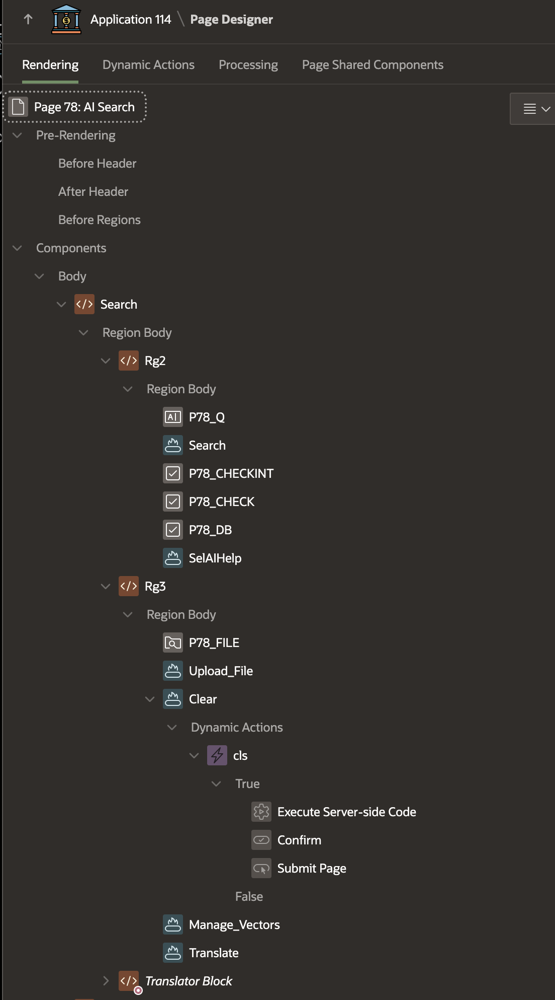
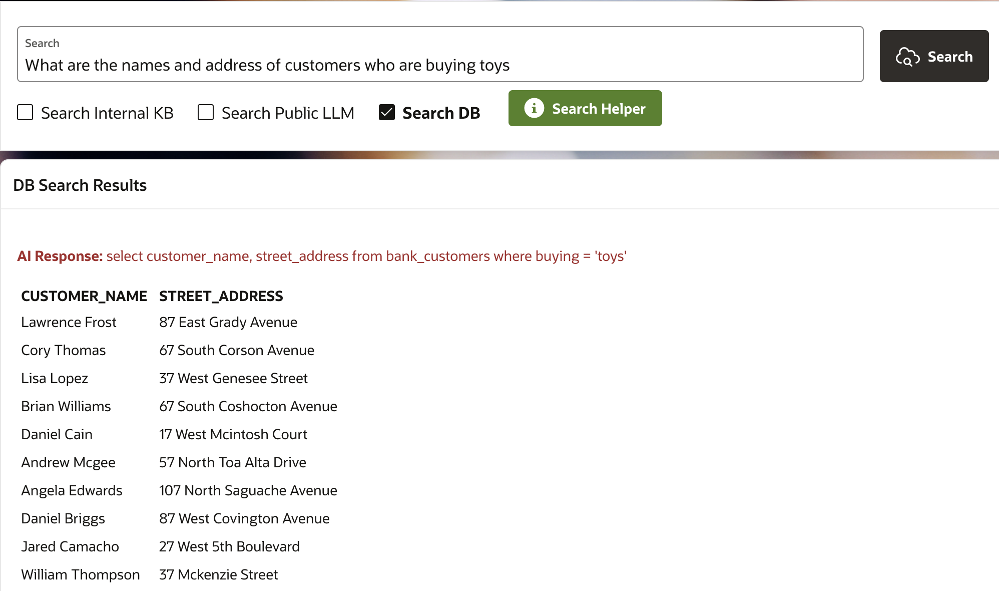

# AI Search and Knowledge Repository

## About this workshop

In this hands-on lab, you'll learn how to design and develop an intelligent search application using Oracle APEX, leveraging the power of Artificial Intelligence (AI) and Natural Language Processing (NLP). You'll explore the integration of Oracle Generative AI, AI Vector Search, Select AI and AI Translation capabilities to deliver accurate and multilingual search results.

Estimated Time: 30 minutes

---

### Objectives

By the end of this lab, participants will be able to:

- Design and create an Oracle APEX user interface for search functionality.
- Configure search settings to optimize search results.
- Integrate Generative AI and Public LLM Search to enhance search capabilities.
- Translate AI responses into multiple languages for global accessibility.
- Implement AI Vector Search for advanced search functionality.
- Enable file uploads for AI Vector Search to expand search scope.
- Utilize Natural Language Processing (NLP) with Select AI Database Search for intelligent search results.

---

### Prerequisites

* A user with access to provision & manage core OCI services  
* Having completed common labs

--- 
 
### Introduction to this Lab
 
[Demo video on AI for Financial Services](youtube:-BHcxAGalqE:large)  

In this workshop, you'll embark on a comprehensive journey to build an intelligent search application using Oracle APEX, Generative AI, and Natural Language Processing (NLP). Through a series of hands-on tasks, you'll design a user-friendly search interface, configure search settings, and leverage cutting-edge AI technologies to deliver precise and multilingual search results. By integrating Generative AI, AI Vector Search, and NLP, you'll create a powerful search application that can understand and respond to complex queries, making it an invaluable tool for users.
 
---
 
## Task 1: Designing Search UI with Oracle APEX

1. Create a user-friendly search interface using Oracle APEX.

     
  
2. We will be using several process to handle button click and what to search, alternatively you can implement the name logic as a PL/SQL Function
    
     
  
## Task 2: Configuring Search Settings
 
1.  Define search configurations to optimize search results and relevance.
2.  Create table **AICHAT** to save conversation, this is Optional
   
    ```sql 
    <copy> 
    CREATE TABLE "AICHAT" 
    (	
      "ID" NUMBER GENERATED BY DEFAULT ON NULL AS IDENTITY MINVALUE 1 MAXVALUE 999999999 
      INCREMENT BY 1 START WITH 1 CACHE 20 NOORDER  NOCYCLE  NOKEEP  NOSCALE  NOT NULL ENABLE, 
      "PROMPT" VARCHAR2(1000), 
      "CTIMESTAMP" TIMESTAMP (6), 
      "ACTION" VARCHAR2(50), 
      "IS_VALID" VARCHAR2(1), 
      "AISQL" VARCHAR2(32000), 
      "AIRESPONSE" VARCHAR2(32000), 
      "SESSID" VARCHAR2(100), 
      "VOICE" VARCHAR2(20), 
      "GENDATE" DATE DEFAULT sysdate, 
      "AUDIOURL" VARCHAR2(1000), 
      PRIMARY KEY ("ID")
      USING INDEX  ENABLE
    ) ;
    </copy>
    ``` 

3. Create table **PDF\_BOOKS** for AI Vector Search - PDF upload

    ```sql 
    <copy> 
    CREATE TABLE "PDF_BOOKS" 
    (	
      "ID" NUMBER(*,0) GENERATED BY DEFAULT ON NULL AS IDENTITY MINVALUE 1 MAXVALUE 9999999999 
      INCREMENT BY 1 START WITH 1 CACHE 20 NOORDER  NOCYCLE  NOKEEP  NOSCALE  NOT NULL ENABLE, 
      "FILE_NAME" VARCHAR2(900), 
      "FILE_SIZE" NUMBER(*,0), 
      "FILE_TYPE" VARCHAR2(100), 
      "FILE_CONTENT" BLOB, 
      PRIMARY KEY ("ID")
      USING INDEX  ENABLE
    ) ;
    </copy>
    ``` 

4. Create trigger on **PDF\_BOOKS**

    ```sql 
    <copy> 
    REATE OR REPLACE EDITIONABLE TRIGGER "TRG_PDF_BOOKS_VECTOR_STORE_COMPOUND" 
    FOR INSERT ON PDF_BOOKS 
    COMPOUND TRIGGER 
 
    TYPE t_id_tab IS TABLE OF PDF_BOOKS.id%TYPE INDEX BY PLS_INTEGER; 
    v_ids t_id_tab; 
 
    AFTER EACH ROW IS 
    BEGIN 
        v_ids(v_ids.COUNT + 1) := :NEW.id; 
    END AFTER EACH ROW; 
 
    AFTER STATEMENT IS 
    BEGIN 
        FOR i IN 1 .. v_ids.COUNT LOOP 
            INSERT INTO vector_store (doc_id, embed_id, embed_data, embed_vector) 
            SELECT dt.id AS doc_id,  
                  et.embed_id,  
                  et.embed_data,  
                  to_vector(et.embed_vector) AS embed_vector 
            FROM PDF_BOOKS dt  
            CROSS JOIN TABLE( 
                dbms_vector_chain.utl_to_embeddings( 
                    dbms_vector_chain.utl_to_chunks( 
                        dbms_vector_chain.utl_to_text(dt.file_content),   
                        json('{"normalize":"all"}') 
                    ), 
                    json('{"provider":"database", "model":"doc_model"}') 
                ) 
            )  t 
            CROSS JOIN JSON_TABLE( 
                t.column_value,  
                '$[*]' COLUMNS ( 
                    embed_id NUMBER PATH '$.embed_id', 
                    embed_data VARCHAR2(4000) PATH '$.embed_data', 
                    embed_vector CLOB PATH '$.embed_vector' 
                ) 
            ) AS et 
            WHERE dt.id = v_ids(i); 
        END LOOP; 
    END AFTER STATEMENT; 
 
    END TRG_PDF_BOOKS_VECTOR_STORE_COMPOUND;
    /
    ALTER TRIGGER "TRG_PDF_BOOKS_VECTOR_STORE_COMPOUND" ENABLE;
    </copy>
    ``` 
 
## Task 3: Integrating Generative AI for Search
 
1. Implement Public LLM Search using Generative AI for advanced search capabilities. 

    ```sql 
    <copy> 
    DECLARE 
    l_genai_rest_url    VARCHAR2(4000) := 'https://inference.generativeai.us-chicago-1.oci.oraclecloud.com/20231130/actions/chat';  
    l_web_cred        CONSTANT VARCHAR2(50)   := 'Ind_OCI_WebCred';   
    l_input varchar2(4000) := :P78_Q;
    l_check varchar2(50) := :P78_CHECK;
    l_response_json CLOB;
    l_text varchar2(32000); 
    l_ocigabody varchar2(32000) := ' 
    {
      "compartmentId": "ocid1.compartment.oc1..your-compartment-id",
      "servingMode": {
          "servingType": "ON_DEMAND",
          "modelId": "cohere.command-r-08-2024"
      },
      "chatRequest": {
          "message": "'||l_input||'",
          "maxTokens": 500,
          "isStream": false,
          "apiFormat": "COHERE",
          "temperature": 0.75,
          "frequencyPenalty": 1,
          "presencePenalty": 0,
          "topP": 0.7,
          "topK": 1
      }
    }
    ';  

    CURSOR C1  IS 
      SELECT jt.* 
      FROM   JSON_TABLE(l_response_json, '$'  COLUMNS (text VARCHAR2(32000)  PATH '$.chatResponse[0].text' )) jt;   

    BEGIN 
      if l_input is not null and l_check = 'Y' then 
        apex_web_service.g_request_headers.DELETE; 
        apex_web_service.g_request_headers(1).name  := 'Content-Type'; 
        apex_web_service.g_request_headers(1).value := 'application/json';  
        l_response_json := apex_web_service.make_rest_request 
          (p_url                  => l_genai_rest_url, 
            p_http_method          => 'POST', 
            p_body                 => l_ocigabody, 
            p_credential_static_id => l_web_cred); 

        For row_1 In C1 Loop
              l_text := row_1.text; 
              -- Print Gen AI Search Response on Richtext page item
              :P78_GA := l_text;
              -- Print Gen AI Search Response on Text page item
              -- We will use this Input for Translation purposes
              :P78_OP_TEXT := l_text; 
        End Loop; 
      end if; 
    END;
    </copy>
    ``` 
 
2. Search Oracle Gen AI Public LLM using **cohere.command-r-08-2024** MODEL, 
3. Please Note: some of the [models might retire](https://docs.oracle.com/en-us/iaas/Content/generative-ai/deprecating.htm) so its important to update with latest Model available
       
     

## Task 4: Multilingual Support for AI Responses
 
1.  Develop a feature to translate AI-generated responses into various languages.
2.  Choose any language in this case **Simplified Chinese** language is selected

    ```sql 
    <copy> 
    declare 
        l_rest_url    VARCHAR2(4000) := 'https://language.aiservice.us-phoenix-1.oci.oraclecloud.com/20221001/actions/batchLanguageTranslation';  
        -- Ind_OCI_WebCred is Oracle APEX OCI Web Credentials
        l_web_cred        CONSTANT VARCHAR2(50)   := 'Ind_OCI_WebCred';    
        l_input varchar2(4000) := :P78_OP_TEXT;
        -- Target Language is Language Code
        l_target_lang varchar2(20) := :P78_TRG_LANG;
        -- Source Input Language 
        l_src_lang varchar2(10);  
        l_response_json CLOB;
        l_text varchar2(32000);  
        l_body varchar2(4000) :='{   
          "documents": [  { 
            "key": "1x",
            "text": "'||l_input||'",
            "languageCode": "auto"  
          } ],
          "targetLanguageCode": "'||l_target_lang||'" ,
            "compartmentId": "ocid1.compartment.oc1..your-compartment-ocid" 
        }';    
         
        CURSOR C1  IS 
          SELECT jt.* 
          FROM   JSON_TABLE(l_response_json, '$' 
          COLUMNS (
                    text VARCHAR2(4000)  
                    PATH '$.documents[0].translatedText',
                    src_lang VARCHAR2(20)  
                    PATH '$.documents[0].sourceLanguageCode', 
                    target_lang VARCHAR2(20)  
                    PATH '$.documents[0].targetLanguageCode'
                  )) jt; 
                       
        BEGIN  

          apex_web_service.g_request_headers.DELETE; 
          apex_web_service.g_request_headers(1).name  := 'Content-Type'; 
          apex_web_service.g_request_headers(1).value := 'application/json';  
          l_response_json := apex_web_service.make_rest_request 
            (p_url                  => l_rest_url, 
              p_http_method          => 'POST', 
              p_body                 => l_body, 
              p_credential_static_id => l_web_cred); 

          For row_1 In C1 Loop
                    l_text := row_1.text;
                    l_src_lang := row_1.src_lang;
                    l_target_lang := row_1.target_lang;   
                    -- Target Language is Language Code
                    :P78_TRG_LANG := l_target_lang; 
                    -- Translated Text will be updating Richtext box value
                    :P78_TRANSLATED_OP := row_1.text; 
          End Loop; 
                
        end;
    </copy>
    ``` 
   
     
  
3. Choose Different language, in this case **German** language translation is shown
   
     

## Task 5: Implementing AI Vector Search
 
1.  Create an AI-powered vector search functionality for precise results.
2.  Create RAG Function to leverage VECTOR_DISTANCE of AI Vector Search 
    ```sql 
    <copy> 
    create or replace Function rag_function ( rag_input IN varchar2 )  
    RETURN varchar2 IS    
        query_vector CLOB; 
        text_variable VARCHAR2(1000) := rag_input; 
        l_doc_id VARCHAR2(100);  
        l_answer varchar2(32000) := 'Querying ...'; 
        cursor c1 is 
          SELECT *  
          FROM vector_store  
          ORDER BY VECTOR_DISTANCE( EMBED_VECTOR, query_vector, EUCLIDEAN_SQUARED)  
          FETCH FIRST 1 ROWS ONLY WITH TARGET ACCURACY 90;   
    BEGIN  
        -- select vector_embedding into query_vector based on  
        SELECT vector_embedding(doc_model using text_variable as data) into query_vector;  
        For row_1 In C1 Loop     
              l_answer := row_1.embed_data;  
              l_answer := TRANSLATE(l_answer, '~!@#$%^&*()_+=\{}[]:”;’<,>./?',' ');  
        End Loop;  
        return (l_answer);  
    END;
    /
    </copy>
    ``` 

3. Invoke RAG function to search and display results

    ```sql 
    <copy> 
    DECLARE
    l_input varchar2(32000) := :P78_Q;
    -- Checkbox to look up if Internal Knowledge Base is to be searched
    l_checkint varchar2(50) := :P78_CHECKINT;
    v_response varchar2(32000) := '- - -';
    BEGIN  
        if l_input is not null and l_checkint = 'Y' then
            v_response := rag_function ( l_input ); 
            -- Response to be printed on Richtext page item
            :P78_A := v_response;
        end if;
    END;
    </copy>
    ``` 
    
      

3. Type in a different question
   
     

## Task 6: Enabling File Uploads for Vector Search
 
1.  Allow file uploads to enhance AI Vector Search capabilities.
2.  These PDF files are uploaded internal Knowledge Repository, that is files stored in OCI Object Storage Bucket which are accessible only with in the Organization.
   
    ```sql 
      <copy> 
      DECLARE
      l_url         VARCHAR2(1000);
      l_length      NUMBER;
      l_response    CLOB;    
      failed_upload EXCEPTION;
      l_bucket_url varchar2(4000) := 'https://namespace-name.objectstorage.us-phoenix-1.oci.customer-oci.com/n/namespace-name/b/bucket-name/o/KB/';
      BEGIN
      FOR lr_files in (SELECT * FROM apex_application_temp_files WHERE name = :P78_FILE) 
      LOOP 
        l_url := l_bucket_url||apex_util.url_encode(lr_files.filename);
        apex_web_service.g_request_headers(1).name := 'Content-Type';
        apex_web_service.g_request_headers(1).value := lr_files.mime_type;
        -- Ind_OCI_WebCred is Oracle APEX Web Credentials 
        l_response := apex_web_service.make_rest_request(p_url                  => l_url,
                                                        p_http_method          => 'PUT',
                                                        p_body_blob            => lr_files.blob_content,
                                                        p_credential_static_id => 'Ind_OCI_WebCred');  
        ------ store in db
        INSERT INTO MY_BOOKS (FILE_NAME, file_type,FILE_CONTENT,FILE_SIZE)
            SELECT filename, mime_type,blob_content, dbms_lob.getlength(blob_content) FROM apex_application_temp_files
            WHERE name = :P78_FILE;
        ------ store in db
        IF apex_web_service.g_status_code != 200 then
          RAISE failed_upload;
        END IF;
        
      END LOOP;
      END;
      </copy>
      ``` 
 
    

3. Upload file or Delete uploaded file
   
    
   
## Task 7: Natural Language Processing for Database Search
 
1.  Utilize NLP with Select AI Database Search for intelligent and context-aware search results.
   
    ```sql 
      <copy> 
      declare 
      l_input varchar2(100) := :P78_Q;
      l_input_upper varchar2(4000) := upper(l_input);
      l_sess varchar2(100) := V('SESSION');
      l_action varchar2(10) := 'chat';
      l_qry varchar2(4000);
      l_ai_resp varchar2(32000);
      l_db_check varchar2(20) := :P78_DB;

      CURSOR C1  IS 
        SELECT DBMS_CLOUD_AI.GENERATE(prompt  => l_input,
                                  profile_name => 'COHERE',
                                  action       => l_action ) as qry
        FROM dual;  

      begin 

        if 
        l_input_upper like 'SHOW%' or  
        l_input_upper like 'LIST%' or 
        l_input_upper like 'HOW MANY%' or 
        l_input_upper like 'WHAT IS THE NAME%' or 
        l_input_upper like 'WHAT ARE THE NAME%'
        then
            l_action := 'showsql';
        end if; 
        ---------------- Insert into AI CHAT Table, This is Optional to save conversation ----------
        if l_input is not null and l_db_check = 'Y' then
            For row_1 In C1 Loop
                l_qry := row_1.qry; 
            End Loop;  
            if l_action = 'showsql' then  
                l_qry := lower(l_qry); 
                insert into AICHAT (PROMPT, SESSID, ACTION, AISQL) values 
                  (:P66_INPUT, l_sess, l_action, l_qry);
                else  
                insert into AICHAT (PROMPT, SESSID, ACTION, AIRESPONSE) values 
                  (:P66_INPUT, l_sess, l_action, l_qry);
            end if; 
        end if; 

      end;
      </copy>
      ``` 

2. Let us build **Dynamic HTML table** from Select AI Response as shown below

    ```sql 
    <copy> 
    create or replace function viewchat ( name_in IN varchar2 ) RETURN number 
    IS 
      
    l_prompt AICHAT.PROMPT%TYPE; 
    l_action AICHAT.ACTION%TYPE;  
    l_aisql AICHAT.AISQL%TYPE; 
    l_airesponse AICHAT.AIRESPONSE%TYPE; 
    l_qry varchar2(32000);      
    CUR1 SYS_REFCURSOR;   
    l_rc              SYS_REFCURSOR;  
    l_cursor_number   INTEGER; 
    l_col_cnt         INTEGER; 
    l_desc_tab        DBMS_SQL.desc_tab; 
    l_col_num         INTEGER; 
    
    TYPE myrec1 IS RECORD ( col1 VARCHAR(100) );  
    myrecord1 myrec1;  
    
    TYPE myrec2 IS RECORD ( col1 VARCHAR(100), col2 VARCHAR(100) );  
    myrecord2 myrec2;  
        
    TYPE myrec3 IS RECORD ( col1 VARCHAR(100),  col2 VARCHAR(100), col3 VARCHAR(100) );  
    myrecord3 myrec3;  
     
    l_colcount number; 
       
    CURSOR C1 IS SELECT PROMPT, ACTION, replace(AISQL,'"','') AISQL, 
      AIRESPONSE FROM AICHAT WHERE SESSID = V('SESSION') ORDER BY ID DESC; 
    
    BEGIN  
      For row_1 In C1 Loop 
          l_prompt := row_1.PROMPT;  
          l_action := row_1.ACTION;  
          l_aisql := row_1.AISQL; 
          l_airesponse := row_1.AIRESPONSE;   
            
        if l_aisql is not null then  
          Htp.p('<p/><br/><font color=brown> <b>AI Response:</b>  '||l_aisql||' </font><br/> '); --<b>AI Response:</b> 
        end if; 

        if l_airesponse is not null then  
          Htp.p('<p/><br/><font color=brown> <b>AI Response:</b>    '||l_airesponse||'  </font><br/> '); --<b>AI Response:</b> 
        end if; 

        if l_aisql like 'select%' then 
          l_colcount := 0;  
          l_qry := trim(l_aisql);  
          Htp.p('<table border=0 cellspacing=2 cellpadding=2>');   
          OPEN l_rc FOR l_qry;  
            l_cursor_number   := DBMS_SQL.to_cursor_number (l_rc);  
            DBMS_SQL.describe_columns (l_cursor_number, l_col_cnt, l_desc_tab);  
            l_col_num         := l_desc_tab.FIRST;  
            IF (l_col_num IS NOT NULL) THEN 
              Htp.p('<tr>');  
              LOOP  
                Htp.p(' <td><b>  '||l_desc_tab (l_col_num).col_name||'  </b> <td>   '); 
                l_colcount :=l_colcount+1; 
                l_col_num   := l_desc_tab.NEXT (l_col_num); 
                EXIT WHEN (l_col_num IS NULL); 
              END LOOP; 
              Htp.p('</tr>');  
            END IF;  
            DBMS_SQL.close_cursor (l_cursor_number);  

            if (l_colcount = 1) then  
              OPEN CUR1 FOR l_qry;  
              LOOP 
                      FETCH CUR1 INTO myrecord1;   
                          Htp.p('<tr><td>   '||myrecord1.col1||'   <td><tr>'); 
                      EXIT WHEN CUR1%NOTFOUND;  
              END LOOP;  
              CLOSE cur1;  
            end if;   

            if (l_colcount = 2) then  
                  OPEN CUR1 FOR l_qry;  
                  LOOP 
                  FETCH CUR1 INTO myrecord2;   
                      Htp.p('<tr><td>   '||myrecord2.col1||'    <td> 
                                <td>   '||myrecord2.col2||'  <td><tr>'); 
                  EXIT WHEN CUR1%NOTFOUND;  
                  END LOOP; 
                  Htp.p('</table>');        
                  CLOSE cur1;  
              end if;     

              if (l_colcount = 3) then  
                  OPEN CUR1 FOR l_qry;  
                  LOOP 
                  FETCH CUR1 INTO myrecord3;   
                      Htp.p('<tr><td>   '||myrecord3.col1||'    <td> 
                                <td>  '||myrecord3.col2||'  <td> 
                                <td>  '||myrecord3.col3||'  <td><tr>'); 
                  EXIT WHEN CUR1%NOTFOUND;  
                  END LOOP; 
                  Htp.p('</table>');        
                  CLOSE cur1;  
              end if;      

              Htp.p('</table>');   

        end if;   
        Htp.p('<hr/>');      

      End Loop;  
      return (1); 
    END; 
    /
    </copy>
    ``` 

3. Render UI on Oracle APEX PL/SQL Dynamic Content
   
   

    ```sql 
    <copy> 
    DECLARE 
    v_ip varchar2(20) := '';
    v_dbcheck varchar2(20) := :P78_DB;
    v_n number; 
    BEGIN 
          if v_dbcheck is not null then
            v_n := viewchat ( v_ip ); 
          end if;
    END;
    </copy>
    ``` 
   
   

1. Try different natural language prompt for a database search using Select AI
   
   

3. Changing prompt will also change the database columns fetched
   
   

## Acknowledgements

* **Author** - Madhusudhan Rao B M, Principal Product Manager, Oracle Database
* **Last Updated By/Date** - April 24th, 2025

## Learn more
 
* [LangChain4j LLM framework with Oracle Database 23ai Vector Embedding Store - Fruit Search Java App](https://www.linkedin.com/pulse/langchain4j-llm-framework-oracle-database-23ai-vector-madhusudhan-rao-jwvuf/)
* [Oracle Database 23ai - How to create a RAG-based chatbot with internal PDFs and Oracle Database Tables and train the AI model.](https://www.linkedin.com/pulse/oracle-database-23ai-how-create-rag-based-chatbot-internal-rao-bb95f)
* [Oracle Database 23ai - Building Generative AI Applications with Oracle APEX 24.1](https://www.linkedin.com/pulse/oracle-database-23ai-ai-vector-search-retrieval-augmented-rao-bqkcf)
* [How to build intelligent applications using Oracle Generative AI and Oracle APEX](https://www.linkedin.com/pulse/how-build-intelligent-apps-oracle-generative-ai-apex-madhusudhan-rao-z423f)
* [How to Translate text using OCI AI Language and Oracle APEX](https://www.linkedin.com/pulse/how-translate-text-using-oci-ai-language-oracle-apex-madhusudhan-rao-seq0f)
* [How to work with LangChain and Oracle Generative AI](https://www.linkedin.com/pulse/how-work-langchain-oracle-generative-ai-madhusudhan-rao-8efgf)
