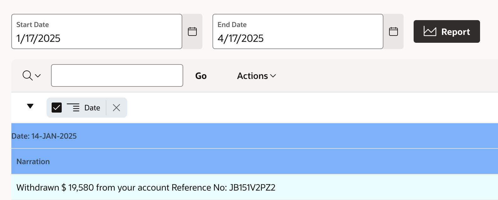

# Statement Generation: Accessing Bank Statements

## About this workshop

Welcome to this workshop on bank statement generation! In this session, we'll explore the key tasks involved in creating a bank statement generation workflow. We'll cover designing a user interface for date range selection, generating and displaying bank statements based on the selected dates, and providing export and download options for the generated statements.

Estimated Time: 30 minutes

---

### Objectives

Bank Statement Generation Workflow

- Define Date Range: Create a user interface to input "From Date" and "To Date" for bank statement generation.
- Generate Statement: Generate and display a bank statement based on the selected date range.
- Export Statement: Offer export and download options for the generated bank statement.

---

### Prerequisites

* A user with access to provision & manage core OCI services  
* Having completed common labs

--- 
 
### Introduction to this Lab

[Demo video on AI for Financial Services](youtube:0VbID5UUQ9w:large) 

---
 
## Task 1: Date Range Selection Interface

1. Design a user interface to select a date range (**From Date** to **To Date**) for generating a random bank statement.
  
    

2. Create two Date page items, create corresponding **Dynamic Actions** for onChange event.

3. Create PL/SQL Procedure to generate transactions. In reality the statement will be based on actual transaction for a given date range
   
    ```sql 
        <copy>
        create or replace PROCEDURE FD_BANK_TXS_INSERTS (v_start_date IN DATE, v_end_date IN DATE)
        AS 
              v_random_number NUMBER;
              v_transaction_type VARCHAR2(20);
              v_initial_balance number := 1000000;
              v_amount number;
              v_random_description VARCHAR2(50);
              v_random_transfer_to VARCHAR2(50); 
              v_random_sentence VARCHAR2(100);
              v_months NUMBER;
              v_no_of_trans NUMBER;
              v_no_of_transactions_pm NUMBER := 20;
              v_no_of_transactions_perday NUMBER;
              v_days NUMBER;
              v_transaction_date DATE;
              v_transaction_id NUMBER := 1;

        BEGIN
            -- clean up previous data 
            delete from FD_BANK_TRANSACTIONS;
            -- insert new data
            insert into FD_BANK_TRANSACTIONS (TXDATE, BALANCE, TRANSACTIONTYPE ) 
                  values (v_start_date,  v_initial_balance, 'Carry Forward'   );
            ------  BEGIN GENERATING FD_BANK_TRANSACTIONS RANDOMS ------------------------------- 
            v_months := (EXTRACT(YEAR FROM v_end_date) - EXTRACT(YEAR FROM v_start_date)) * 12
                      + EXTRACT(MONTH FROM v_end_date) - EXTRACT(MONTH FROM v_start_date);
            
            v_no_of_trans := v_no_of_transactions_pm * (v_months + 1);
            v_days := TRUNC(v_end_date) - TRUNC(v_start_date);

              v_transaction_date := v_start_date;
              WHILE v_transaction_date <= v_end_date LOOP
                -- Get Random Number of Transactions for a given day 1 to 4
                v_no_of_transactions_perday := FLOOR(DBMS_RANDOM.VALUE(1, 4));
                FOR i IN 1..v_no_of_transactions_perday LOOP
                  
                  v_amount := FLOOR(DBMS_RANDOM.VALUE(1, 20000)); 
                  v_random_description := DBMS_RANDOM.STRING('X', 10); 
                  v_random_transfer_to := DBMS_RANDOM.STRING('Y', 10);  
                  v_random_number := FLOOR(DBMS_RANDOM.VALUE(1, 4));

                CASE v_random_number
                WHEN 1 THEN
                    v_transaction_type := 'deposited with ';
                    v_random_sentence := 'Your account has been ' || v_transaction_type || CONCAT('$', TO_CHAR(v_amount, '9,999,999')) || ' Reference No: ' || v_random_description || '';
                    v_initial_balance := v_initial_balance + v_amount;
                    insert into FD_BANK_TRANSACTIONS (TXDATE, TRANSACTIONTYPE, CREDIT, BALANCE, TXID) values (v_transaction_date, v_random_sentence, v_amount, v_initial_balance, v_random_description);
                WHEN 2 THEN
                    v_transaction_type := 'Withdrawn ';
                    v_random_sentence := '' || v_transaction_type || CONCAT('$', TO_CHAR(v_amount, '9,999,999')) || ' from your account Reference No: ' || v_random_description || '';
                    v_initial_balance := v_initial_balance - v_amount;
                  insert into FD_BANK_TRANSACTIONS (TXDATE, TRANSACTIONTYPE, DEBIT, BALANCE, TXID) values (v_transaction_date, v_random_sentence, v_amount, v_initial_balance, v_random_description);
                WHEN 3 THEN
                    v_transaction_type := 'transferrred ';
                    v_random_sentence := 'Amount ' || CONCAT('$', TO_CHAR(v_amount, '9,999,999')) || ' has been ' ||v_transaction_type|| ' to ' || v_random_transfer_to || ' Reference No: ' || v_random_description || '';
                    v_initial_balance := v_initial_balance - v_amount; 
                  insert into FD_BANK_TRANSACTIONS (TXDATE, TRANSACTIONTYPE, DEBIT, BALANCE, TXID) values (v_transaction_date, v_random_sentence, v_amount, v_initial_balance, v_random_description);
                END CASE; 

              
                  v_transaction_id := v_transaction_id + 1;
                END LOOP;
                v_transaction_date := v_transaction_date + 1;
              END LOOP;
        
                
        END;
        /
        </copy>
    ``` 
1. In the corresponding PL/SQL code in the **Dynamic Actions** is shown below, 

    ```sql 
        <copy>
        BEGIN 
            -- Call procedure to generate random transactions between date range
            -- Page numbers and Page item names will vary as per your setup
            FD_BANK_TXS_INSERTS(  :P85_START , :P85_END);
        END;
        </copy>
    ``` 

## Task 2: Bank Statement Generation and Display

1. Generate a bank statement based on the selected date range and display it to the user.
  
    

2. View Generated Transactions from **FD\_BANK\_TRANSACTIONS**
   
  

## Task 3: Export and Download Options

1. Provide options for users to export and download the generated bank statement in various formats (e.g., PDF, CSV, Excel).
2. Click on **Actions** Menu of **Interactive Report** and **Download**
   
  
 
## Acknowledgements

* **Author** - Madhusudhan Rao B M, Principal Product Manager, Oracle Database
* **Last Updated By/Date** - April 4th, 2025

## Learn more
 
* [Oracle Digital Assistant Skills](https://docs.oracle.com/en/cloud/paas/digital-assistant/use-chatbot/create-configure-and-version-skills1.html)
