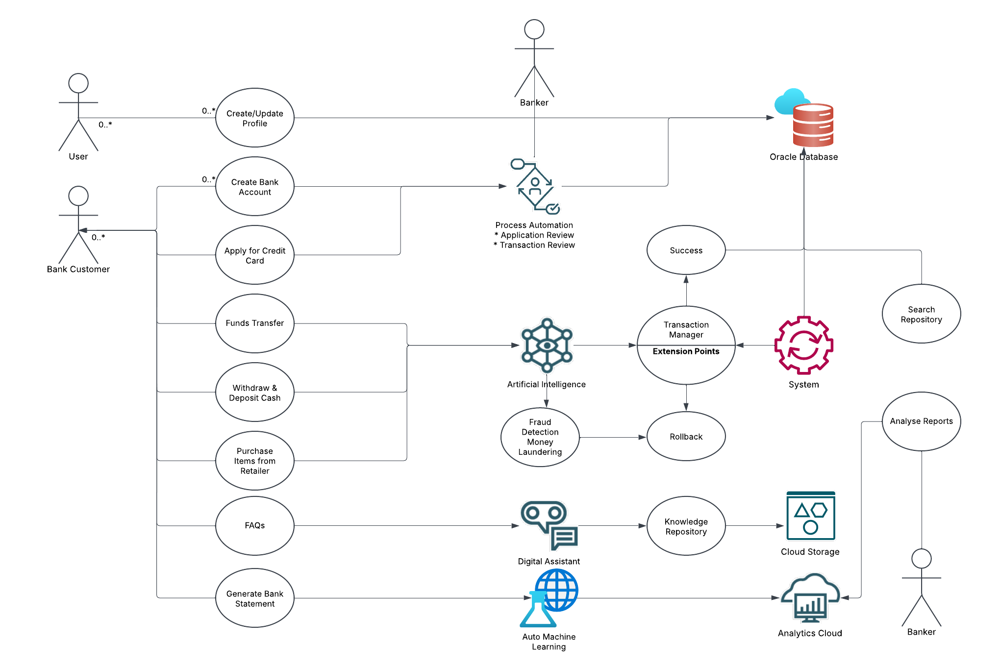
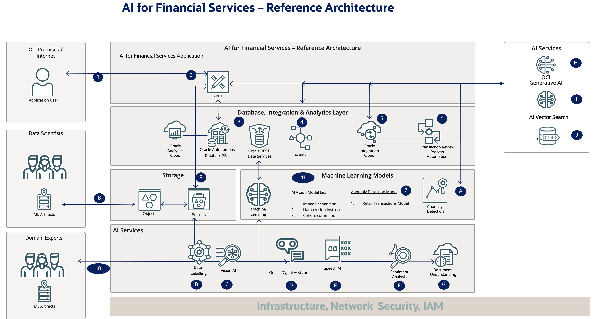

# Introduction to AI for Financial Services

## About this workshop
  
 In today's digital age, the banking and financial services sector has undergone a significant transformation. The rise of online banking, mobile banking apps, and digital payment systems has revolutionized the way customers interact with financial institutions. This workshop provides a comprehensive guide to the digital banking ecosystem, covering various aspects of online banking, from initiating conversations with chatbots to ensuring business continuity through high availability and disaster recovery.

Through 23 labs, this workshop takes readers on a journey through the digital banking landscape, exploring topics such as user profile management, account creation, fund transfers, e-commerce transactions, credit card applications, fraud detection, and spend analytics. The book also delves into the importance of ensuring business continuity, highlighting the need for high availability and disaster recovery measures.

Whether you are a banking professional, a fintech enthusiast, or simply someone interested in understanding the digital banking ecosystem, this book provides valuable insights and knowledge to help you navigate the complex world of digital banking.
 
Estimated Workshop Time: 14 hours to 20 hours (Depends on use cases selected)

<!-- 
[Link to Another Workshop](../workshops/tenancy/index.html?lab=ai-oda-create) 
-->

*Estimated Workshop Time can vary depending upon the Labs that you choose to do, and all labs from lab 5 are Optional.*

---

### Prerequisites 
 
This lab assumes you have the following:

* An Oracle account
* Intermediate developer knowledge of Oracle APEX and Oracle PL/SQL 

---

### Objectives 

**Hands-on Learning Experience: Mastering Cutting-Edge Technologies**

In this comprehensive learning journey, you will gain hands-on experience with the following technologies:

**Oracle APEX and Database Technologies**

* Oracle APEX Custom Authentication and Authorization
* Role-based access and ORDS
* Oracle APEX Workflow/Process and Task Definition
* Transaction Management, Enqueue, and Dequeue
* Security and Oracle Database 23ai & PL/SQL
* Real-time Dashboard Oracle APEX

**AI and Machine Learning Services**

* AI Services: Meta Llama Vision Instruct, Speech AI (TTS), and Anomaly Detection AI Service
* Auto Machine Learning and Oracle Database 23ai
* Select AI & AI Vector Search
* RAG with Gen AI (Cohere)

**Data Management and Analytics**

* Converged Database (JSON, Graphs, Maps & Spatial Data)
* JSON Relational Duality and Data Redaction (Security)
* Oracle Analytics Cloud and Notifications & Analytics

**Integration and Process Management**

* Oracle Integration Cloud (Gen 3)
* Oracle Process Management and PL/SQL Scheduler Jobs
* Property Graphs and Oracle Digital Assistant (FAQs)

**Fraud Detection and Prevention**

* Fraud Detection, Card Blocking, and Push Notifications

By mastering these technologies, you will gain a competitive edge in the industry and be equipped to develop innovative solutions that drive business success.

---
 
### AI for Financial Services - Demo

[Demo video on AI for Financial Services](youtube:xCXb7kOWdqo:large)  
 
---

### AI for Financial Services  

**Major Use Cases**

| Application Roles: Bank Customers | Bank Employees |  Technologies |    
| :-------| :-----|  :-----|   
| Bank FAQ Chatbot   - | Bank FAQ Chatbot   [Lab 3](../workshops/tenancy/index.html?lab=ai-oda-create)   |   Oracle Digital Assistant (FAQs)  |  
| Secure User Authentication System   [Lab 4](../workshops/tenancy/index.html?lab=ai-fs-custom-auth) | Secure User Authentication System   [Lab 4](../workshops/tenancy/index.html?lab=ai-fs-custom-auth) | Oracle APEX Custom Authentication    | Oracle APEX Custom Authentication   Application Authorization    Blockchain | 
| Account Creation: Establishing a New Bank Account   [Lab 5](../workshops/tenancy/index.html?lab=ai-fs-create-account) | - |  Application Authorization    Blockchain | 
| Application Review Business Processes   [Lab 6](../workshops/tenancy/index.html?lab=ai-fs-app-approval)  | - | Business Process - Review Application   Role based access   ORDS   Oracle APEX Workflow/Process   Task Definition   Push Notifications |    
| External Bank fund transfer   [Lab 8](../workshops/tenancy/index.html?lab=ai-fs-ext-fund-transfer) | - | Transaction Management  |   
| Internal Bank fund transfer   [Lab 9](../workshops/tenancy/index.html?lab=ai-fs-int-fund-transfer) | Worklist - Review Fund Transfer  |    Messaging Queue  Security | 
| Withdrawal of cash in ATM   [Lab 11](../workshops/tenancy/index.html?lab=ai-fs-cash-withdrawal) | - |  Oracle Database 23ai & PL/SQL   Realtime Dashboard Oracle APEX   AI Services   Meta Llama Vision Instruct   Speech AI (TTS) | 
| - |  Fraud Detection and Alerts   [Lab 14](../workshops/tenancy/index.html?lab=ai-fs-fraud-detect) |   Oracle Database 23ai & PL/SQL  Realtime Dashboard Oracle APEX  Process Automation   Integration Cloud | 
| - | Anti Money Laundering & Money Mules Detection   [Lab 15](../workshops/tenancy/index.html?lab=ai-fs-anti-money-laundering) |  Graphs  Maps and Spatial Data |    
| - |  Transaction Anomalies   [Lab 16](../workshops/tenancy/index.html?lab=ai-fs-anti-money-laundering) |   Anomaly Detection AI Service   Graphs |  
| -  | Customer Analysis   [Lab 17](../workshops/tenancy/index.html?lab=ai-fs-cust-analysis)  |  Oracle Document Understanding AI  Sentiment Analysis AI Service |   
|   AI Search - (LLM)   [Lab 19](../workshops/tenancy/index.html?lab=ai-fs-search) | AI Search - (DB+LLM+KM)++    | Oracle Database 23ai  Select AI & AI Vector Search  AI Services  RAG with Gen AI (Cohere)  |   

**Optional: Extended Use Cases**

| Application Roles: Bank Customers |  Bank Employees | Technologies |    
| :-------| :-----| :-----|    
| Applying for a New Credit Card   [Lab 7](../workshops/tenancy/index.html?lab=ai-fs-apply-for-card) | - | Converged Database (JSON)   Data Redaction (Security)  |    
| Deposit cheque in ATM   [Lab 10](../workshops/tenancy/index.html?lab=ai-fs-cheque-deposit) | - | Oracle Database 23ai & PL/SQL   Realtime Dashboard Oracle APEX   AI Services   Meta Llama Vision Instruct   Speech AI (TTS) | 
| Generate Bank statement    [Lab 12](../workshops/tenancy/index.html?lab=ai-fs-statement)  | - | Oracle Database 23ai & PL/SQL   Realtime Dashboard Oracle APEX |  
| Home Loan EMI Calculator   [Lab 13](../workshops/tenancy/index.html?lab=ai-fs-emi)  | - | Graphs  Maps and Spatial Data |    
| E-commerce Food Ordering System   [Lab 18](../workshops/tenancy/index.html?lab=ai-fs-retail) | - | Oracle Database 23ai & PL/SQL  Realtime Dashboard Oracle APEX   JSON Relational Duality   Meta Llama Vision Instruct   Speech AI (Text to Speech)  |
| -  | Build a Robust Suspected Transaction Review   Business Process & Analytics   [Lab 20](../workshops/tenancy/index.html?lab=ai-fs-process) | Oracle Analytics Cloud  Auto Machine Learning  Integration Cloud Gen 3  Process Automation | 
 
**Common Labs**

| Role: Developer | Technologies |    
| :-------| :-----|  
| Setup OCI Policies   [Lab 1](../workshops/tenancy/index.html?lab=ai-fs-setup) |  OCI   |  
| Create Oracle Autonomous Database 23ai   [Lab 2](../workshops/tenancy/index.html?lab=ai-fs-provision) |  Oracle Database & Oracle APEX  |   
| Business Continuity (Optional Lab)   [Lab 21](../workshops/tenancy/index.html?lab=ai-fs-cloning) |  High Availability & Disaster Recovery   Autonomous Data Guard   Database Cloning  | 
| Scaling, Sizing, and Performance (Optional Lab)    Lab 22  |  Load Test and Scale the Database Tier  | 

***Where ++ indicates***

* LLM - Large Language Models
* DB - Database Search with Select AI
* KM - Knowledge Management Search (AI Vector Search)

---

  
 
---

### AI for Financial Services - Technology Architecture

  

---

### AI for Financial Services - Table of Contents
 
**Common Labs**

* Introduction
* Get Started
* Lab 1: Setup OCI Policies
* Lab 2: Create an Oracle Autonomous Database

**AI for Financial Services Labs** - Lab 3 to Lab 20 

* Lab 3: Building a Conversational Interface with Oracle Digital Assistant and Oracle APEX
* Lab 4: User Profile Management: Creation and Update 
* Lab 5: Building a Secure User Authentication System with Oracle APEX
* Lab 6: Account Creation: Establishing a New Bank Account  
* Lab 7: Credit Card Applications: Applying for a New Credit Card 
* Lab 8: External Bank fund transfer 
* Lab 9: Internal Bank fund transfer 
* Lab 10: Cheque Deposit: Depositing Cheques at an ATM     
* Lab 11: Cash Withdrawal: Withdrawing Cash from an ATM    
* Lab 12: Statement Generation: Accessing Bank Statements   
* Lab 13: Home Loan Planning: Calculating Equated Monthly Installments (EMIs) 
* Lab 14: Fraud Detection and Alerts: Identifying Suspicious Credit Card Activity
* Lab 15: Anti-Money Laundering and Money Mule Detection
* Lab 16: Suspicious Transaction Alerts and Monitoring
* Lab 17: Customer Analysis
* Lab 18: E-commerce Food Ordering System
* Lab 19: Transaction Search and Knowledge Repository
* Lab 20: Build a Robust Suspected Transaction Review Business Process & Analytics   
* Lab 21: Ensuring Business Continuity: High Availability and Disaster Recovery
  
## Acknowledgements

* **Architect, Author and Developer** - [Madhusudhan Rao B M](https://www.linkedin.com/in/madhusudhanraobm/), Principal Product Manager, Oracle Database
* **Thanks to** - [Bo English-Wiczling](https://www.linkedin.com/in/boenglish/), Senior Director, Database Product Management
* **Last Updated By/Date** - April 29th, 2025
* **Document version** - 1.0 

## Learn more
 
* [Oracle Financial Services](https://www.oracle.com/financial-services/#banking-panel)